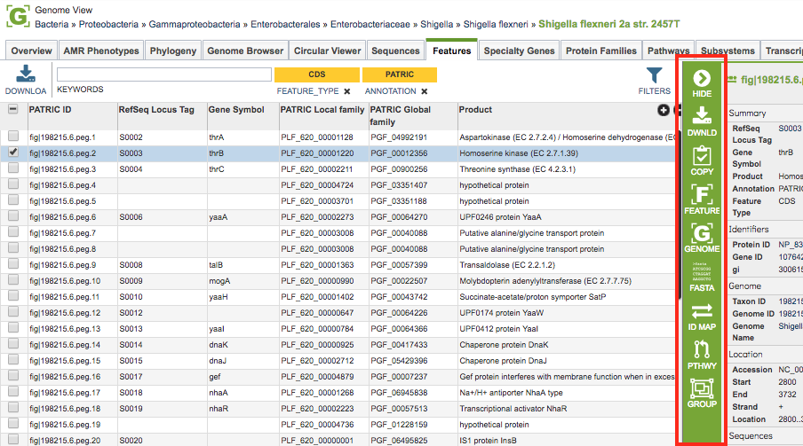
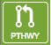

# Selection Action Bar

## Overview
On the right side of all PATRIC tables, there is a vertical, green-colored Selection Action Bar, with buttons that provide a set of available "actions" (data links, tools, etc.) that can be performed on the item or items selected in the table.

### See also:
  * [Website Views](./website_views.html)
  * [Tables](./tables.html)

## Accessing the Selection Action Bar on the PATRIC Website
The Selection Action Bar appears on the right side of all PATRIC tables.  

 

## Section Action Bar Buttons
The action buttons apply to specific data types or multiple data types, depending on the operation. Below is a description of each action button, organized by their application.

### General purpose
 **Hide:** Hides the right-hand side Details Pane (toggles between Hide and Show).

 **Show:** Shows (unhides) the right-hand side Details Pane (toggles between Hide and Show).

 **Download:**  Downloads the selected items (rows).

 **Copy:** Copies the selected items to the clipboard.

 **Group:** Opens a pop-up window to enable adding the selected items to an existing or new group in the private workspace.

### Genomes and Features
 **Genome:** Displays the Genome View Overview page corresponding to the selected genome/feature.  *Available only if a single feature is selected.*

 **Genomes:** Displays the Genomes Table, listing the genomes that correspond to the selected genomes/features. *Available only if multiple features are selected.*

### Features
 **Feature:** Displays the Feature Page for the selected feature. *Available only if a single feature is selected.*

 **Features:** Displays the Features Table for the selected features. *Available only if multiple features are selected.*

 **FASTA:** Provides the FASTA DNA or protein sequence for the selected feature(s).

 **ID Mapping:** Provides the option to map the selected feature(s) to multiple other idenfiers, such as RefSeq and UniProt.

 **MSA:** Launches the PATRIC Multiple Sequence Alignment (MSA) tool and aligns the selected features by DNA or protein sequence in an interactive viewer.

 **Pathway:** Displays the Pathway Summary Table containing a list of all the pathways in PATRIC in which the selected features are found.

### Protein Families
 **Protein Family Members** Displays a list of all of the features in the selected protein family within the current genome or taxonomic level.

### Workspace
 **Venn Diagram:** Displays an interactive Venn diagram showing the intersection of up to 3 groups. Available only when more than one group is selected.

 **Share Folder:** Allows sharing with other registered users.

 **Delete:** Deletes the selected items (rows).

 **Rename:** Allows renaming the selected item. *Available only if a single item is selected.*

 **Move:** Allows moving of the selected item(s) into another folder in the Workspace.

 **Edit Type:** Allows changing the data type of the selected item, thus changing how the Workspace interprets the item.
