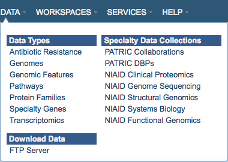

Data
=====
The top-level Data Menu provides direct access to data sets by type or special grouping in PATRIC.

Clicking on one of the menu items will display the corresponding summary-level page in PATRIC, as described below. 

Data Types
-----------
The Data Types submenu items link to summary information pages that provide descriptions and as well as linked examples for the various data elements in PATRIC, along with how we derive, curate, map, and/or integrate the data of that type.

`Antibiotic Resistance
<https://patricbrc.org/view/DataType/AntibioticResistance>`__

`Genomes
<https://patricbrc.org/view/DataType/Genomes>`__

`Genomic Features
<https://patricbrc.org/view/DataType/GenomicFeatures>`__

`Pathways
<https://patricbrc.org/view/DataType/Pathways>`__

`Protein Families
<https://patricbrc.org/view/DataType/ProteinFamilies>`__

`Specialty Genes
<https://patricbrc.org/view/DataType/SpecialtyGenes>`__

`Transcriptomics
<https://patricbrc.org/view/DataType/Transcriptomics>`__
 
Specialty Data Collections
--------------------------
The Specialty Data Collections submenu items link to pages in PATRIC featuring data sets of interest that are related either by collaborations, common programs (e.g., NIAID-funded centers), or other grouping.  Summaries, experimental information, and links to data sets and corresponding publications are provided.  Where appropriate, the data sets have been integrated into PATRIC.

`PATRIC Collaborations
<https://patricbrc.org/webpage/website/data_collections/patric_collaborations.html>`__
 
`PATRIC DBPs
<https://patricbrc.org/webpage/website/data_collections/patric_dbps.html>`__
 
`NIAID Clinical Proteomics
<https://patricbrc.org/webpage/website/data_collections/niaid_clinical_proteomics.html>`__
 
`NIAID Genome Sequencing
<https://patricbrc.org/webpage/website/data_collections/niaid_genome_sequencing.html>`__
 
`NIAID Structural Genomics
<https://patricbrc.org/webpage/website/data_collections/niaid_structural_genomics.html>`__
 
`NIAID Systems Biology
<https://patricbrc.org/webpage/website/data_collections/niaid_systems_biology.html>`__
 
`NIAID Functional Genomics
<https://patricbrc.org/webpage/website/data_collections/niaid_functional_genomics.html>`__
 

Download Data
-------------
Provides a link to the PATRIC FTP server

ftp://ftp.patricbrc.org/
