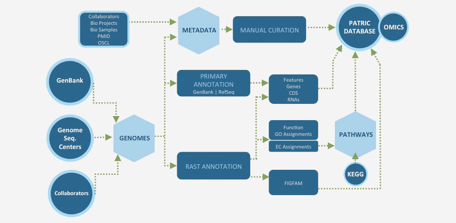

Genomes
=======

Genomes are received on a regular basis from a multitude of sources (GenBank, RefSeq, Collaborator Request, etc.). Our signature PATRIC annotation is generated via the RAST (Rapid Annotation Subsystems Technologies) Pipeline, resulting in a consistently annotated set of genomes in which meaningful comparisons can be made within and across taxonomic boundaries. We also maintain the original annotations from GenBank to allow users to explore and compare annotation differences. In addition, we automatically gather, parse, and curate over 60 various associated metadata attributes, such as isolation source , geographic location, and host.

Find out how to search for genomes of interest in our `Genomes Tab User Guide <https://docs.patricbrc.org/user_guides/organisms_taxon/genome_table.html>`_.

`View all PATRIC genomes <https://www.patricbrc.org/view/Taxonomy/2#view_tab=genomes>`_

**How Do We Process and Clean Up Our Data?**

