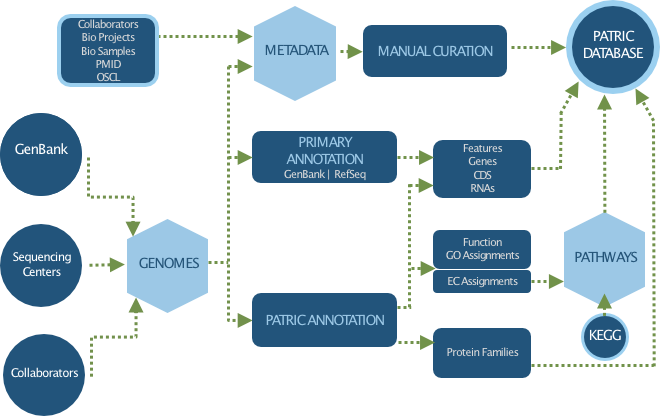

Genomes
=======

PATRIC provides one of the largest collections of high quality microbial genomes, all consistently annotated using RAST (Rapid Annotation Subsystems Technologies) Pipeline, which enables comparative genomic analysis within and across taxionomic boundries. PATRIC also maintain the original annotations from GenBank to allow users to explore and compare annotation differences. In addition, we automatically gather, parse, and curate over 60 different metadata attributes, such as isolation source , geographic location, and host, and other clinical and environmental metadata. 

**What is the source of genomes in PATRIC?**

PATRIC collects new microbial genomes from GenBank/RefSeq every month using automated processes. We also collect genomes sequenced as part of published AMR studies, collect their sequences from the SRA database, assemble and annotate them, and incorporate them into PATRIC, along with curated AMR phenotype data. In addition, PATRIC also provides genomes from NIAID-funded Genomic Centers for Infectious Diseases (GCIDs), Systems Biology Centers, collaborators, and other PATRIC users. 

The collection of genomes in PATRIC include 

- `Bacteria <https://patricbrc.org/view/Taxonomy/2#view_tab=genomes>`_
- `Archaea <https://patricbrc.org/view/Taxonomy/2157#view_tab=genomes>`_ 
- `Plasmids <https://patricbrc.org/view/Taxonomy/2#view_tab=genomes&filter=eq(genome_status,%22Plasmid%22)>`_
- `Bacteriophages <https://patricbrc.org/view/Taxonomy/10239#view_tab=genomes>`_
- `Eukaryotic Hosts <https://patricbrc.org/view/Host/?eq(taxon_lineage_ids,2759)#view_tab=genomes>`_

To learn how to search for genomes of interest, visit `Genomes Tab User Guide <https://docs.patricbrc.org/user_guides/organisms_taxon/genome_table.html>`_.

**How do we process and clean up Genomic Data?**

   
**What are the tools and services available to analyze genomes?**

PATRIC provides numorous tools tp assemble, annotate, and analyze public and/or private user genomes. 

- `Genome Assembly Service <https://patricbrc.org/app/Assembly>`_
- `Genome Annotation Service <https://patricbrc.org/app/Annotation>`_
- `Comprehensive Genome Analysis Service <https://patricbrc.org/app/ComprehensiveGenomeAnalysis>`_
- `Similar Genome Finder <https://patricbrc.org/app/GenomeDistance>`_
- `Genome Alignment <https://patricbrc.org/app/GenomeAlignment>`_
- `Proteome Comparison <https://patricbrc.org/app/SeqComparison>`_

For more services and tools available at PATRIC, visit `Services and Tools User Guide <https://docs.patricbrc.org/user_guides/services_tab.html>`_.
