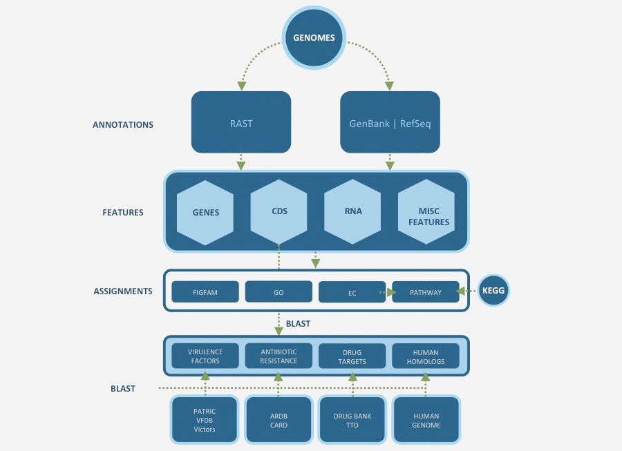

Genomic Features
================

Genomic Features are defined segments of a genome. Most often features will code for proteins or RNAs, however some correspond to pseudogenes or repeat regions. We currently support over 40 `Genomic Feature Types <https://docs.patricbrc.org/user_guides/organisms_taxon/genome_annotations.html>`_.

Learn how to find and use PATRIC Feature Tables in our `Feature Tab User Guide <http://docs.patricbrc.org/user_guides/organisms_taxon/features.html>`_.

Genome Annotation
-----------------
Genome annotation refers to the systematic analysis of a genome to identify all protein and RNA coding genes and characterize their functions. PATRIC supports genome annotations from multiple sources, including:

- Original annotations from GenBank / RefSeq
- Consistent annotations across all bacterial genomes using RAST anotation pipeline

Genomic Features
----------------
Genomic Features refer to defined segments of a genome, which often code for proteins and RNAs. Common feature types include:

- Gene
- CDS
- rRNA
- tRNA
- Misc RNA
- Pseudogene

Functional Properties
---------------------
Functional properties refer to the description and ontological terms used to characterize protein functions. Common functional properties assigned to proteins include:

- Gene name
- Function
- GO terms
- EC numbers
- Protein families
- Subsystems
- Metabolic pathways

Specialty Genes
---------------
Specialty genes refer to the genes possessing properties that are of special interest to the infectious disease researchers. Classes of specialty genes include:

- Antibiotic resistant genes
- Virulence factors
- Transporters
- Essential genes
- Drug and vaccine targets
- Human homologs

Data Processing and Clean up
----------------------------

Relevant Services and Tools
---------------------------

- `BLAST <https://patricbrc.org/app/BLAST>`_
- `Protein Family Sorter <https://patricbrc.org/app/ProteinFamily>`_
- `Proteome Comparison <https://patricbrc.org/app/SeqComparison>`_

