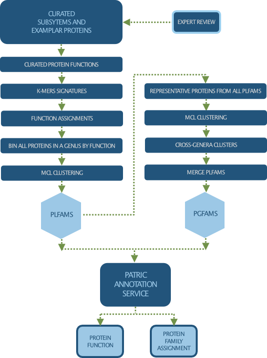

Protein Families
================

As part of the genome annotation process, protein are mapped to protein families, which allows users to quickly identify the homologs of a proteiun in other closely related organisms and enable comparative genomic analysis across multiple genomes of the same or different taxonomic groups. 

There are 3 types of protein families computed in PATRIC:

- **Genus-specific families(PLfams):** The genus-specific protein families are computed using only proteins within a genus and more stringent criteria (MCL inflation = 3.0). This provides higher sequence similarity and better specificity while performing within-genus/species or close strain comparisons.

- **Cross-genus families(PGfams):** The cross-genera protein families are computed by clustering representative proteins from the genus-specific families with slightly relaxed criteria (MCL inflation = 1.1). This allows cross-genera or distant homologs to cluster together, which is necessary to support cross-genera comparative analysis across all microbial genomes.

- **FIGFams:** FIGfams are sets of isofunctional homologs, i.e., a set of protein sequences that are similar along their full length and believed to implement the same function. FIGfams are derived from a collection of functional subsystems, as well as correspondences between genes in closely related strains.

Our `Protein Family Sorter Tool <http://docs.patricbrc.org/user_guides/organisms_taxon/protein_families.html>`_ allows researchers to compare protein families across closely related or diverse groups of genomes, visualize them using an interactive Heatmap, and generate multiple sequence alignments (with phylogenetic trees) for individual families.

**How Do We Process and Clean Up Our Data?**

   

Assessing Protein Family Data
-----------------------------

Protein families are accesible from the "Protein Families" tab available at the taxon and genome levels on the website. For more information on how to access and use protein families, visit `Protein Families Tab User Guide <https://docs.patricbrc.org/user_guides/organisms_taxon/protein_families.html>`_.

Relevant Services and Tools
----------------------------

- `Genome Annotation Service <https://patricbrc.org/app/Annotation>`_
- `Protein Family Sorter <https://patricbrc.org/app/ProteinFamily>`_
