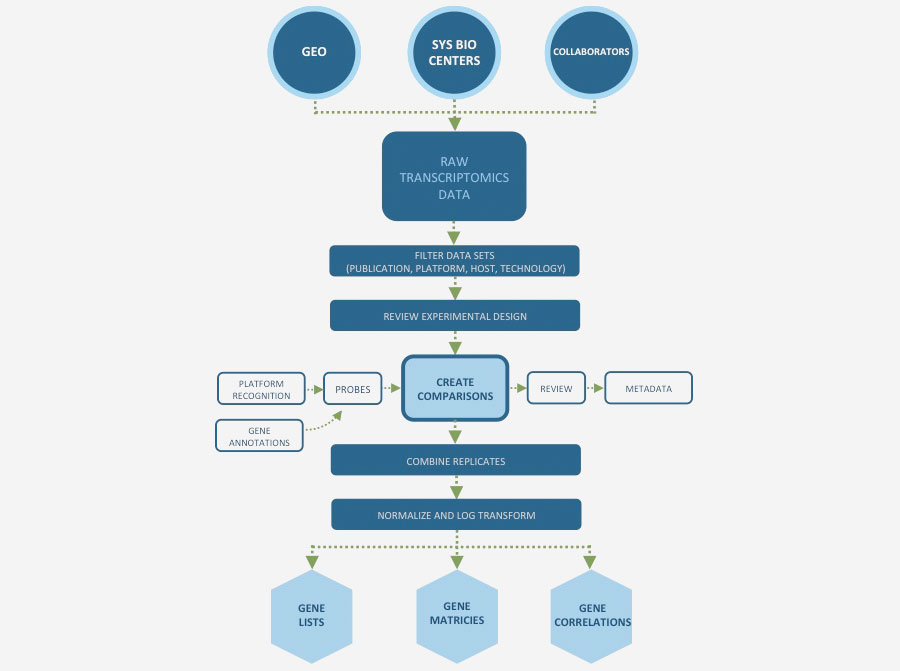

Transcriptomics
===============

View and Compare Curated Microarray Datasets from Repositories and Other Sources

Our manual curation includes a review of the experiment description and the related publication to understand experimental design; combines data from replicates; and creates pair-wise comparisons or contrasts as described in the publication to identify differential gene expression, data normalization and log-transformation. Available analyses consist of a suite of integrated tools to explore, visualize and compare a large number of published transcriptomics datasets.

PATRIC also allows researchers to upload and analyze their own gene expression data in their private workspace and compare it to existing data. Learn more in our `Transcriptomics User Guide <http://docs.patricbrc.org/user_guides/organisms_taxon/transcriptomics.html>`_.

**How Do We Process and Clean Up Our Data?**

