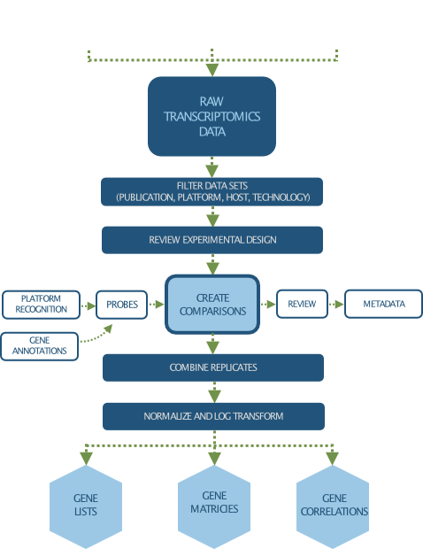

Transcriptomics
===============

PATRIC provides large collection of manually curated transcriptomics datasets, which are collected from publications and NCBI GEO database. Our manual curation process includes a review of the experiment description and the related publication to understand experimental design; combines data from replicates; and creates pair-wise comparisons or contrasts as described in the publication to identify differential gene expression, data normalization and log-transformation. Available analyses consist of a suite of integrated tools to explore, visualize and compare a large number of published transcriptomics datasets.

In addition, PATRIC also allows researchers to upload and analyze their own gene expression data in their private workspace and compare it to public datasets. 

Data Processing and Clean Up Process
------------------------------------

   
Accessing Transcriptomics Data
------------------------------

Public transcriptomics datasets are accessible from the "Transcriptomics" Tab available at the taxon, genome and gene levels. 
To learn more about how to access and use transcriptomics data, visit `Transcriptomics Tab User Guide <https://docs.patricbrc.org/user_guides/organisms_taxon/transcriptomics.html>`_.

- `Transcriptomics datasets for Bacteria <https://patricbrc.org/view/Taxonomy/2#view_tab=transcriptomics>`_
- `Transcriptomics datasets for Eukaryotic hosts <https://patricbrc.org/view/GenomeList/?in(genome_id,(10090.24,10116.5,6239.6,9031.4,9669.1,9823.5,9544.2,7227.4,7955.5,9606.33))#view_tab=transcriptomics>`_

Relevant Services and Tools
---------------------------

- `RNA-seq Analysis Service <https://patricbrc.org/app/Rnaseq>`_
- `Expression Import Service <https://patricbrc.org/app/Expression>`_
- `BLAST Against Genes with Transcriptomics Data <https://patricbrc.org/app/BLAST>`_
