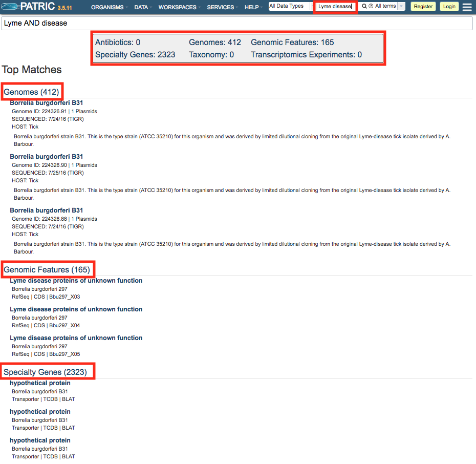
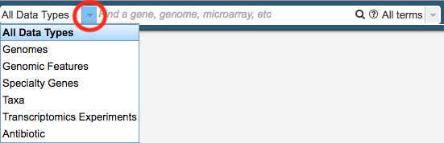
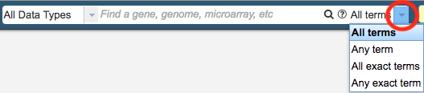
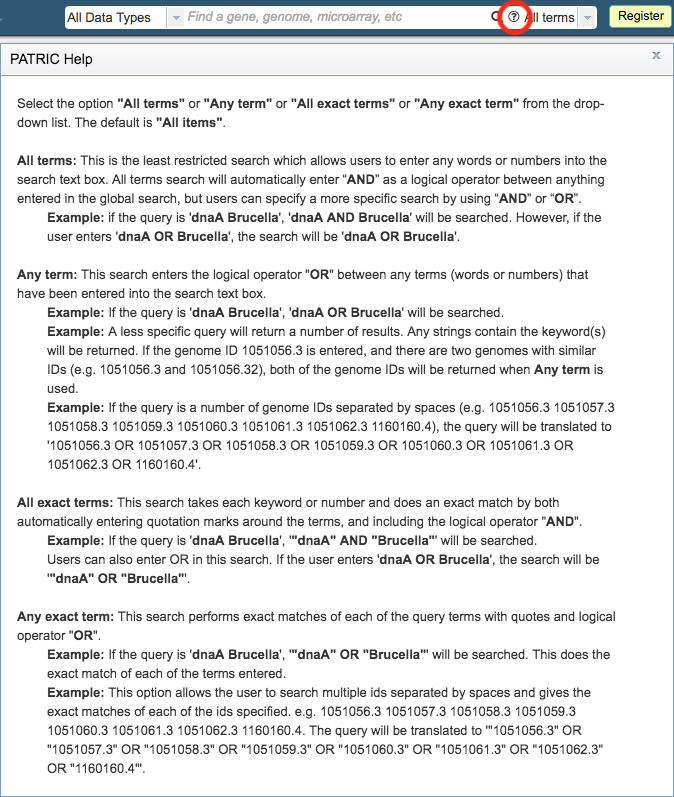

Global Search
=============

Overview
--------

PATRIC provides a Global Search capability to quickly locate data of interest. Searches return top matches grouped by data type. Searches can be restricted to specific data types and combinations of search terms

Accessing the Global Search on the PATRIC Website
-------------------------------------------------

The Global Search box is available on the right side of the menu bar at the top of each PATRIC page. 

Using the Global Search
-----------------------
Entering a search term in the Global Search box and either pressing <Enter> or clicking the magnifying glass icon will start the search. Matching results are returned with a summary information box at the top of the page, and matching top results grouped by data type further down the page. Clicking on the summary result numbers will display page(s) containing those results.  Clicking on a specific item will display that particular result.

Refining Searches
-----------------

**Limiting by Data Type:** Clicking the drop-down list on the left side of the Global Search box allows filtering to a particular data type, such as Genomes, Features, Specialty Genes, Taxa, Transcriptomics Experiments, and Antibiotics

**Matching Any/Exact Terms:** Clicking the drop-down list on the right side of the Global Search box facilitates changing how the search tool interprets the entered terms, including matching Any, All Exact, or Any Exact.

**More Information:** Additional help for using the Global Search can be found by clicking the "?" icon in the search bar.

