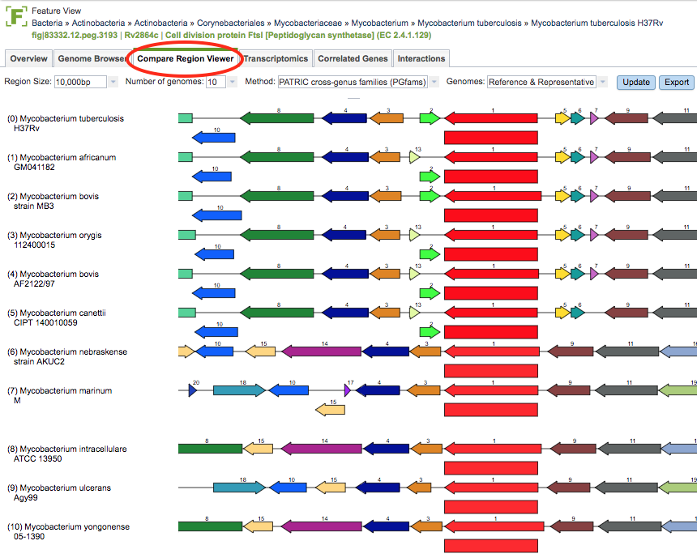

# Compare Region Viewer

## Overview
The Compare Region Viewer tool uses PATRIC protein families to identify proteins in other genomes from the same family as the protein associated with the feature.  It displays the feature along with the other proteins in the same family with flanking regions for the corresponding genomes.

### See also
  * [Protein Families](../organisms_taxon/protein_families.html)
  * [Genome Annotations](../organisms_taxon/genome_annotations.html)
  * [Feature Overview Tab](../organisms_gene/overview.html)

## Accessing the Compare Region Viewer on the PATRIC Website
Clicking on the Compare Region Viewer tab in a Feature View displays the viewer, shown below.

### Compare Region Viewer Features and Functionality

* **Region Size:** Clicking the dropdown list provides options for changing the base pair display window size from 5,000 to 100,000 bp.

* **Number of Genomes:**  Clicking the dropdown list provides options for changing the number of genomes included in the display.  Genomes are sorted in descending order of BLAST similarity of the focus protein.

* **Method:**  Clicking the dropdown list provides options for changing the protein family used for finding matching proteins/genomes.

* **Genomes:**  Clicking the dropdown list provides options for toggling between Reference/Representative and all Public genomes in PATRIC.

* **Update Button:** Clicking this button updates the display based on the current selections in the dropdown boxes to the left.

* **Export Button:** Clicking this button allows saving the display as an SVG image file. 

* **Hovering over a Feature:** Displays a text box that contains the PATRIC ID, Function, and Location of the feature.

* **Clicking on a Feature:** Displays a feature summary window with detailed information and links to corresponding information in PATRIC and NCBI regarding the gene, protein, and associated genome, similar to the data provided on the [Feature Overview Tab](../organisms_gene/overview.html).
