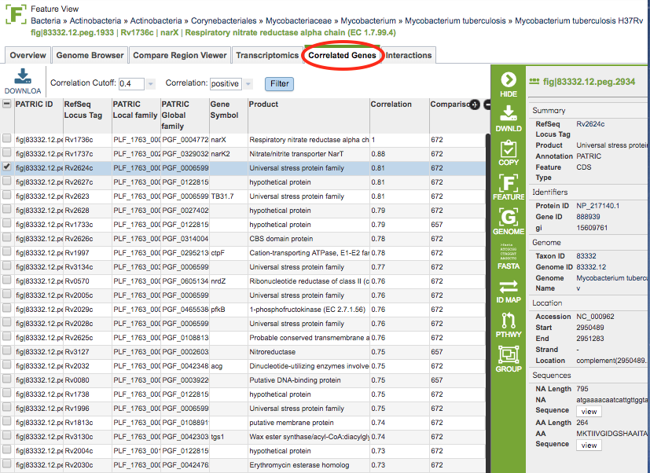

# Correlated Genes Tab

## Overview
The Correlated Genes Tab shows the genes that are either up or down-regulated with respect to selected gene in the Feature View. The values are based on the public transcriptomics data that are available in PATRIC. 

### See also
  * [Examining Transcriptomics Data Tutorial](https://docs.patricbrc.org//tutorial/examining_transcriptomics_data/examining_transcriptomics_data.html)
  * [Transcriptomics Gene List](../organisms_taxon/transcriptomics_gene_list.html)
  * [Transcriptomics Gene List Heatmap](../organisms_taxon/transcriptomics_gene_heatmap.html)
  * [Transcriptomcs Tab, Gene-Level](../organisms_gene/transcriptomics.html)
  * [Expression Data Import Service](../services/expression_data_import_service.html)

Most of the PATRIC transcriptomics data have been curated from published gene expression datasets related to bacterial pathogens in [NCBI's GEO database](http://www.ncbi.nlm.nih.gov/geo/). Some additional data sets have been incorporated from the NIAID-funded [Systems Biology](https://patricbrc.org/webpage/website/data_collections/niaid_systems_biology.html) and [Functional Genomics](https://patricbrc.org/webpage/website/data_collections/niaid_functional_genomics.html) Centers and other sources.

## Accessing the Correleated Genes on the  PATRIC Website
Clicking the Correlated Genes tab in the Feature View displays a table showing all the genes with expression data in PATRIC that are either up or down-regulated with respect to selected gene. 

### Correlated Genes Table Tools
You may do the following with the table:

* **Download** the entire contents of the data used to create the charts in text, CSV, or Excel format by clicking the Download button above the table on the left side.

* **Filter** the correlated genes based on positive or negative correlation and cutoff value using the dropdown boxes above the table and clicking the Filter button. 

The columns in the table include the following: 

* **PATRIC ID:** Unique PATRIC identifier for the gene, usually of the form fig|#####.##.peg.####
* **RefSeq Locus Tag:** RefSeq locus tag for the gene, if available
* **PATRIC Local Family:** PATRIC Local Protein Family containing the gene
* **PATRIC Global Family:** PATRIC Global Protein Family containing the gene
* **Gene Symbol:** Gene symbol, if available
* **Product:** Gene product, as annotated by PATRIC
* **Correlation:** Correlation value of the gene compared to the gene in the Feature View
* **Comparisons:** 

### Action buttons

After selecting one or more of the experiments by clicking the checkbox beside the Title column in the table, a set of options becomes available in the vertical green Action Bar on the right side of the table.  These include

* **Hide/Show:** Toggles (hides) the right-hand side Details Pane.
* **Download:**  Downloads the selected items (rows).
* **Copy:** Copies the selected items to the clipboard.
* **Feature:** Loads the Feature Page for the selected feature. *Available only if a single feature is selected.*
* **Features:** Loads the Features Table for the selected features. *Available only if multiple features are selected.*
* **Genome:** Loads the Genome View Overview page corresponding to the selected feature.  *Available only if a single feature is selected.*
* **Genomes:** Loads the Genomes Table, listing the genomes that correspond to the selected features. *Available only if multiple features are selected.*
* **FASTA:** Provides the FASTA DNA or protein sequence for the selected feature(s).
* **ID Map:** Provides the option to map the selected feature(s) to multiple other idenfiers, such as RefSeq and UniProt.
* **MSA:** Launches the PATRIC Multiple Sequence Alignment (MSA) tool and aligns the selected features by DNA or protein sequence in an interactive viewer.
* **Pathway:** Loads the Pathway Summary Table containing a list of all the pathways in PATRIC in which the selected features are found.
* **Group:** Opens a pop-up window to enable adding the selected sequences to an existing or new group in the private workspace.
