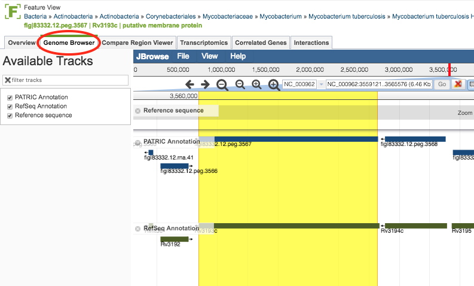

# Genome Browser, Feature View

## Overview
The Genome Browser provides an interactive graphical representation of the alignment of genes and other genomic features depicted along a horizontal axis of genome coordinates.

### See also
  * [Genome Browser](../organisms_genome/genome_browser.html)

## Accessing the Genome Browser on the PATRIC Website
Clicking the Genome Browser Tab in a Feature View displays the interactive Genome Browser, zoomed in to the feature with highlighting.  shown below. 

From this point, it works the same as it does in the Genome View of the [Genome Browser](../organisms_genome/genome_browser.html)
