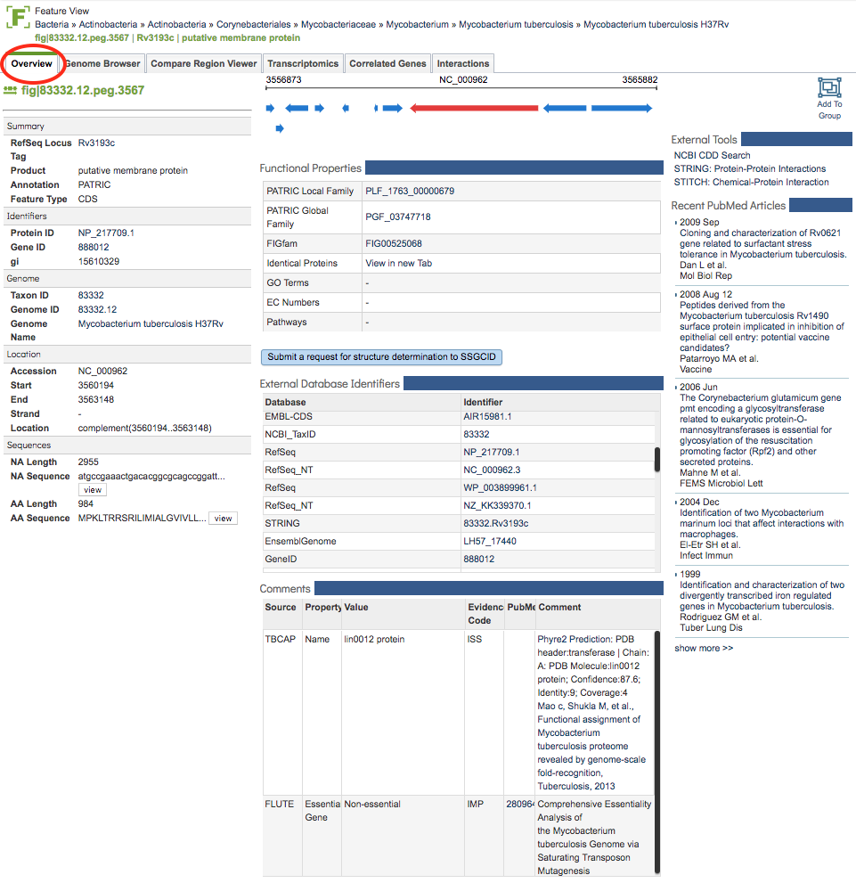

# Feature (Gene) Overview Tab

## Overview
The Feature Overview Tab provides summary information for the selected genomic feature including identifiers, associated Genome information, Location, Sequence, Functional Properties, Special Properties, External Identifiers, Comments, and relevant PubMed articles.  

### See also
  * [Genome Annotations](../organisms_taxon/genome_annotations.html)
  * [Protein Families Tab](../organisms_taxon/protein_families.html)  
  * [Data, Specialty Genes](../data.html#data-types)

## Accessing the Feature Overview on the PATRIC Website
Clicking the Overview Tab in a Feature View displays the Feature Overview Page, shown below. 

Each section of the page is described in more detail below.

## Left-hand column: 
* **PATRIC ID:** The PATRIC identifier for the feature, of the form fig|#####.##.peg.####.
* **Summary:** Provides associated RefSeq Locus tag (if available), Product, Annotation Source, and Feature Type.
* **Identifiers:**
Provides associated identifiers including Protein ID (with link to NCBI protein page), Gene ID (with link to NCBI gene page), and gi number.
* **Genome:** Provides associated genome information including Taxon ID, Genome ID, and Genome Name (with link to genome in PATRIC.
* **Location:** Provides location information for the feature including Accession, Start, End, Strand, and Location.
* **Sequences:** Provides information about the associated sequences including the NA Length, NA Sequence (with link to the full sequence), AA Length, and AA Sequence (with link to the full sequence).

## Middle column: 
* **Genomic Region:** Displays a small segment of the genome and other features that are nearby that display information about the feature when hovering over them.
* **Functional Properties:** Includes associated Local protein family (genus-specific, called PLfam), Global protein family (cross-genus, called PGfam), and FIGFam (set of isofunctional homologs), with links to associated pages in PATRIC. Also includes links to, where available, Identical Proteins, GO Terms, EC Numbers, and Pathways. 
* **Structure determination request:** Provides a link to the Seattle Structural Genomics Center for Infectious Disease (SSGCID) target request form pre-populated with the protein information, with additional information fields.  Submission on this page sends a request to SSGCID to solve the associated protein structure.
* **External Database Identifiers:** Provides links to multiple associated identifiers such as UniProtKB, RefSeq, KEGG, EMBL, etc.
* **Comments:** Additional information including, when available, annotations from other sources such as derived from experimental data and predictions using external tools. 

## Right-hand column
* **External Tools:** links to associated tools such as NCBI CDD Search , STRING protein-protein interations, and STITCH chemical-protein interactions.
* **Recent PubMed Articles:** Displays recent articles from PubMed directly in real time query (via PubMed API) for literature related to the selected feature. The title links directly to the article on PubMed.