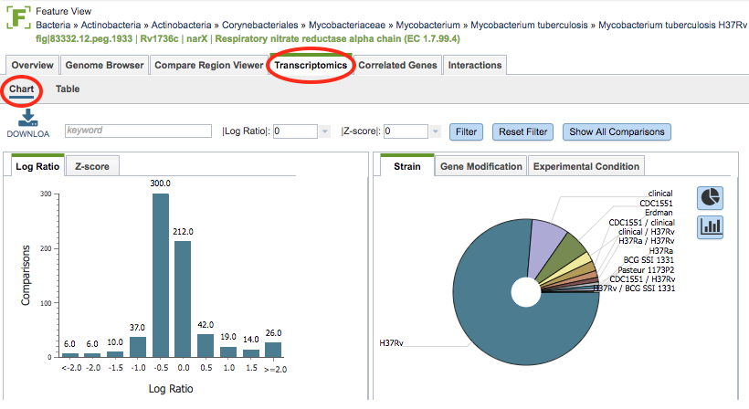
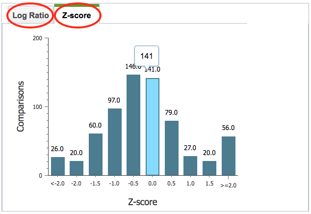
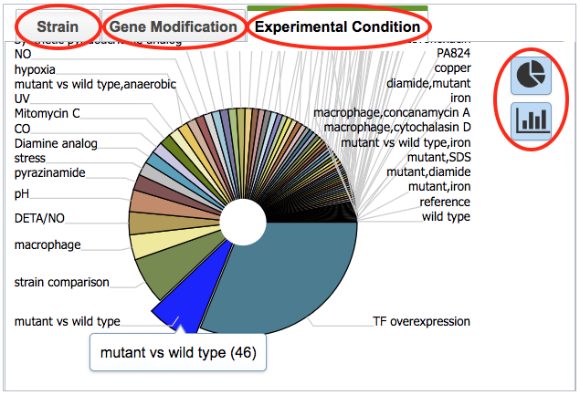
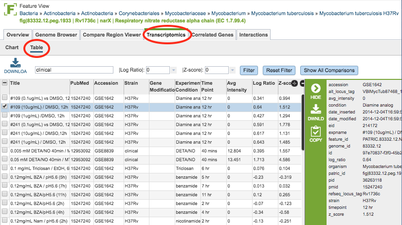

# Transcriptomics Tab, Gene-Level

## Overview
The Transcriptomics Tab in the Feature View provides expression data for the selected gene from all of the transcriptomics datasets in PATRIC in which the gene appears, including levels of expression based on Log ratio or Z score and the strains, gene modification, or experimental conditions. 

### See also
  * [Examining Transcriptomics Data Tutorial](https://docs.patricbrc.org//tutorial/examining_transcriptomics_data/examining_transcriptomics_data.html)
  * [Transcriptomics Gene List](../organisms_taxon/transcriptomics_gene_list.html)
  * [Transcriptomics Gene List Heatmap](../organisms_taxon/transcriptomics_gene_heatmap.html)
  * [Correlated Genes](../organisms_gene/correlated_genes.html)
  * [Expression Data Import Service](../services/expression_data_import_service.html)

Most of the PATRIC transcriptomics data have been curated from published gene expression datasets related to bacterial pathogens in [NCBI's GEO database](http://www.ncbi.nlm.nih.gov/geo/). Some additional data sets have been incorporated from the NIAID-funded [Systems Biology](https://patricbrc.org/webpage/website/data_collections/niaid_systems_biology.html) and [Functional Genomics](https://patricbrc.org/webpage/website/data_collections/niaid_functional_genomics.html) Centers and other sources.

## Accessing the Gene-Level Transcriptomics Data on the  PATRIC Website
Clicking the Transcriptomics Tab in the Feature View displays a histogram of the expression levels of the gene by log ratio or Z score based on all the available data. A pie chart showing the strains, gene modification, or experimental conditions is also presented.

 
### Transcriptomics Chart Tools
Within the Chart view you may do the following:

* **Download** the entire contents of the data used to create the charts in text, CSV, or Excel format by clicking the Download button above the table on the left side.

* **Filter** the included expression levels based on the experimental conditions that meet the search criteria entered in the Keyword text box. Filtering on the Log ratio or Z score will also filter the results to the specified cut-off score. Clicking the Filter button sets the filter, clicking the Reset Filter sets the charts back to the original display with all values.

In the histogram on the left of the page, the view can be switched from Log Ratio to Z-score by clicking the corresponding tab.

In the pie chart on the right of the page, the view can be switched between Strain, Gene Modification, and Experimental Condition by clicking the corresponding tab. Hovering over one of the pie chart "slices" displays the incidence number for the gene in that category. The display can also be toggled to a bar chart view.

### Transcriptomics Table

Within the Table view (displayed by clicking the Table sub-menu option) the expression values of the gene across all experiments/conditions in PATRIC are listed. The same download and filtering functionality are available as is for the Chart view. The columns in the table include the following: 

* **Title:** The title of the transcriptomics experiment
* **PubMed:** The PubMed ID of the experiment
* **Accession:** The accession number (typically GEO) of the experiment
* **Strain:** The strain name of the genome
* **Gene Modification:** Modification of the gene, if any
* **Experimental Condition:** The experimental condition
* **Time Point:** Time point during the experiment, if time course
* **Avg Intensity:** 
* **Log Ratio:** Log ratio value of the expression level based on all available data
* **Z-score:** Z-score of the expression level based on all available data
 
### Action buttons

After selecting one or more of the experiments by clicking the checkbox beside the Title column in the table, a set of options becomes available in the vertical green Action Bar on the right side of the table.  These include

* **Hide/Show:** Toggles (hides) the right-hand side Details Pane.
* **Download:**  Downloads the selected items (rows).
* **Copy:** Copies the selected items to the clipboard.
