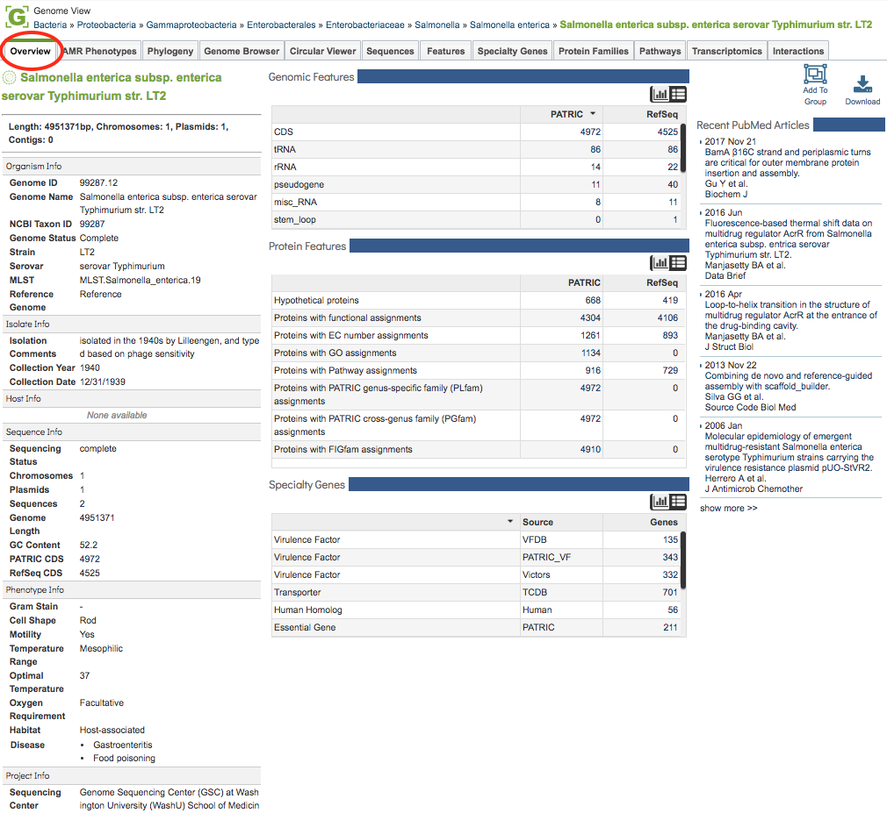

# Genome Overview Tab

## Overview
The Genome Overview Tab provides summary information for the selected genome including  genome sequence information, Genome Metadata, Genomic Features, Protein Features, Specialty Genes, and related PubMed Articles.  

### See also
  * [Genome Metadata](../organisms_taxon/genome_metadata.html) 
  * [Genome Annotations](../organisms_taxon/genome_annotations.html)
  * [Protein Families Tab](../organisms_taxon/protein_families.html)  
  * [Data, Specialty Genes](../data.html#data-types)

## Accessing the Genome Overview on the PATRIC Website
Clicking the Overview Tab in a Genome View displays the Genome Overview Page, shown below. 

The Genome Overview Page summarizes information regarding the genome sequence information, Genome Metadata, Genomic Features, Protein Features, Specialty Genes, and related PubMed Articles. Each section of the page is described in more detail below.

## Sequence Information 
The top left section of the page provides a summary including genome length (in basepairs) and numbers of chromosomes, plasmids, and contigs.

## Genome Metadata
The left-hand column on the page provides a complete listing of all available genome metadata, including information regarding the Organism, Isolate, Host, Sequence, Phenotype, (Sequencing) Project, and Other. See [Genome Metadata](../organisms_taxon/genome_metadata.html) for a more detailed description of PATRIC genome metadata.

## Features, Proteins, Specialty Genes
The middle column provides summary tables (or histogram charts, selectable using the Chart/Table buttons on the top left of the section) for Genomic Features, Protein Features, and Specialty Genes associated with the genome. See [Genome Annotations](../organisms_taxon/genome_annotations.html), [Protein Families Tab](../organisms_taxon/protein_families.html), and [Data, Specialty Genes](../data.html#data-types), respectively for more details on these annotated feature types.

## Recent PubMed Articles
The right-hand column displays recent articles from PubMed directly in real time query (via PubMed API) for literature related to the selected genome. The title links directly to the article on PubMed.

## Tools
The upper right-hand side of the page (above the Recent PubMed Articles column) provides buttons for adding the genome to a group and downloading the genome sequence, features, etc., in several formats.