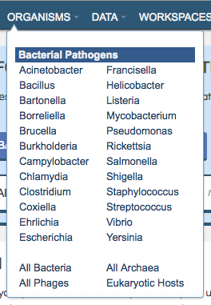

Organisms
===========
The top-level Organisms Menu provides direct access to genus-level data for bacteria in PATRIC corresponding to `NIAID's Priority Pathogens <https://www.niaid.nih.gov/research/emerging-infectious-diseases-pathogens>`_. It also provides direct access to summary-level data for all bacteria, archaea, phages, and eukaryotic hosts in PATRIC.

Clicking on one of the menu items will display the corresponding taxon-level Overview page in PATRIC. From there, data are accessible at the taxon, genome, and feature levels, as described in the User Guides below. 

Browsing PATRIC by Taxon
-------------------------

.. toctree::
   :maxdepth: 1

   organisms_taxon/overview
   organisms_taxon/phylogeny
   organisms_taxon/taxonomy
   organisms_taxon/genomes 
   organisms_taxon/amr_phenotypes
   organisms_taxon/sequences
   organisms_taxon/features
   organisms_taxon/specialty_genes
   organisms_taxon/protein_families
   organisms_taxon/pathways
   organisms_taxon/subsystems_tab
   organisms_taxon/transcriptomics
   organisms_taxon/interactions

Browsing PATRIC by Genome
--------------------------

.. toctree::
   :maxdepth: 1

   organisms_genome/overview
   organisms_genome/genome_browser
   organisms_genome/circular_genome_viewer

Browsing PATRIC by Gene
------------------------

.. toctree::
   :maxdepth: 1

   organisms_gene/overview
   organisms_gene/genome_browser
   organisms_gene/compare_region_viewer
   organisms_gene/transcriptomics
   organisms_gene/correlated_genes
   organisms_gene/interactions
