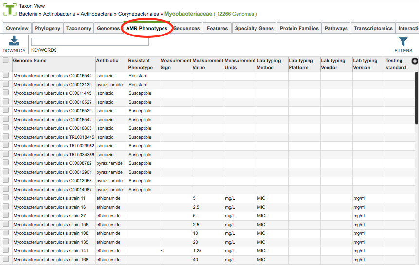
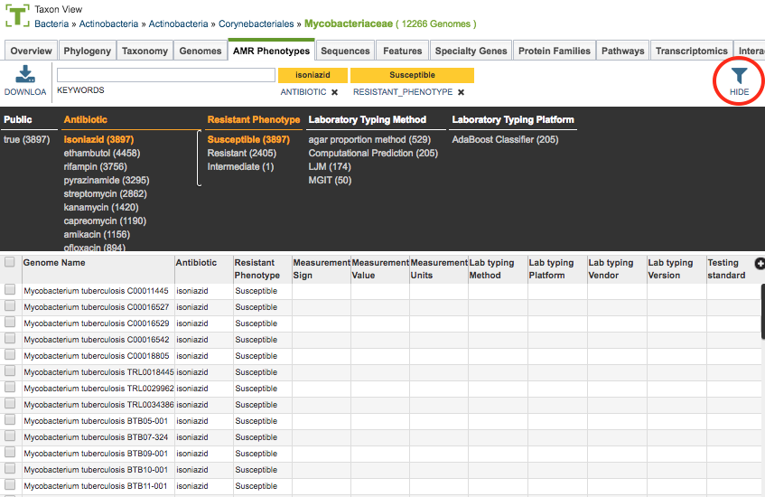

# AMR Phenotypes Tab

## Overview
The AMR Phenotypes Tab provides a tabular view of all of the AMR phenotype data in PATRIC for the selected taxon level, including the resistance phenotype (Resistant, Susceptible, Intermediate) and/or the minimum inhibitory concentration (MIC) value as measured by antibiogram (AMR panel) assay.

### See also

  * [Antibiotic Resistance Data](../data/antibiotic_resistance.html)
  * [Antibiotics Data](../data/antibiotics.html)

## Accessing AMR Phenotypes on the PATRIC Website
Clicking the AMR Phenotypes Tab in a Taxon View displays a table with rows for each genome/antibiotic combination for which there is an AMR phenotype designation or MIC value in that taxonomic level, as shown below:

### AMR Phenotypes Table

The table provides a listing of Resistance Phenotype **(2)** (Susceptible, Resistant, Intermediate) for each of the tested antibiotics/chemicals **(1)** associated with each genome. Where available, additional panel data are provided such as MIC information **(3)** (Measurement Sign, Measurement Value, Measurement Units, Testing Standard, Testing Standard Year). Additional fields for Lab Typing information (Method, Platform, Vendor, Version) and Source are also available.

### AMR Phenotypes Table Tools
Within this table you may do the following:

* **Download** the entire contents of the table in text, CSV, or Excel format by clicking the Download button above the table on the left side.

* **Rearrange and narrow** the list of genomes in the table via sorting (using column headers), keywords (using the Keyword box), and filtering (using the Filters tool).

### Filter Tool

As with all tables in PATRIC, the Filters tool is available to narrow the display of the items in the table, show below:
  

Clicking on the Filters button at the top right of the table opens the Filter Panel above the table, displaying column names from the table and values for those columns with counts of occurence.  Clicking on the filter values narrows the genomes displayed in the table to those matching the chosen filter values.  Clicking the Hide button closes the Filter Panel.  More details are available in the [Filter Tool](../other/filter_tool.html) user guide.

### Action buttons

After selecting one or more of the genomes by clicking the checkbox beside the Genomes Name in the table, a set of options becomes available in the vertical green Action Bar on the right side of the table.  These include

* **Hide/Show:** Toggles (hides) the right-hand side Details Pane.
* **Download:**  Downloads the selected items (rows).
* **Copy:** Copies the selected items to the clipboard.
* **Genome:** Loads the Genome View Overview page for the selected genome (if only one genome selected).
* **Antibiotic:** Loads the Antibiotic Overview for the corresponding antibiotic selected (available only if one genome/antibiotic row is selected). The Antibiotic Overview provides detailed information regarding the antibiotic.  See [Antibiotics Data](../data/antibiotics.html).
* **Group:** Opens a pop-up window to enable adding the selected genome/antibiotic records to an existing or new group in the private workspace.

More details are available in the [Action Buttons](../other/action_buttons.html) user guide.
