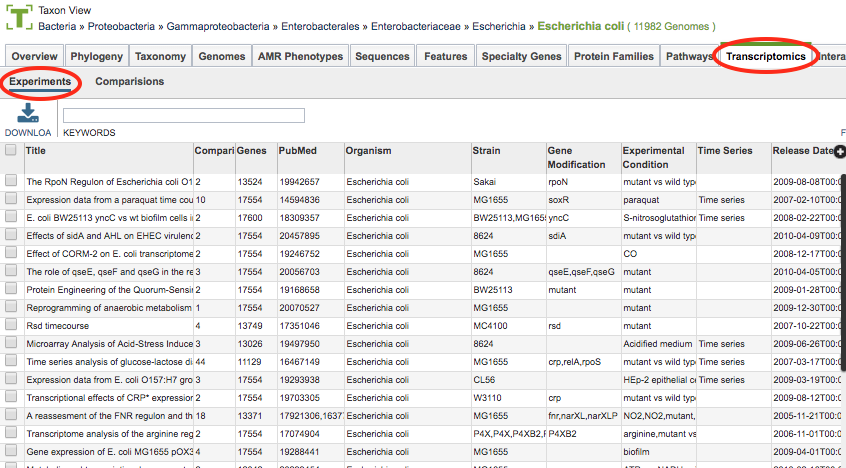
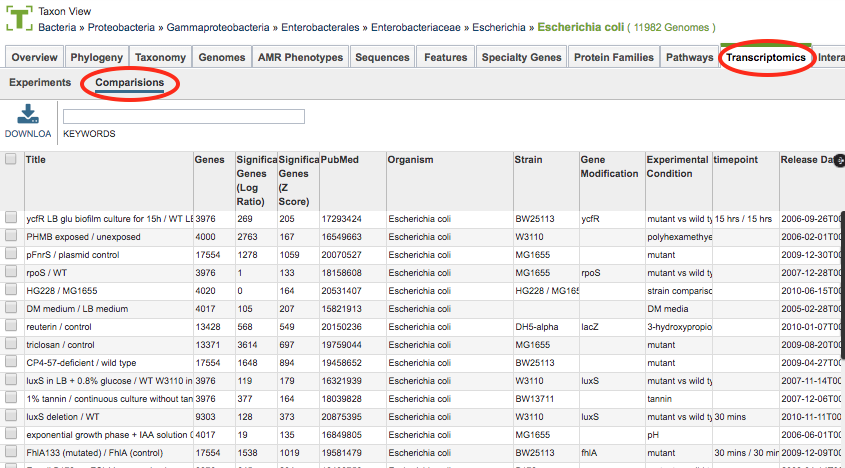

# Experiments and Conditions Tables

## Overview
The Transcriptomics Tab provides a table of all the publicly available transcriptomics experiment datasets that are incorporated into PATRIC, displayed as lists of Experiments and Comparisons. The Experiments Table shows a list of studies or datasets that contain one or more samples or experimental conditions. The Comparisons Table shows a list of curated pair-wise comparisons of two samples or experimental conditions to provide differential gene expression measurements. From these tables, the corresponding genes are available for further examination and comparative analysis.

Most PATRIC transcriptomics data has been curated from published gene expression datasets related to bacterial pathogens in [NCBI's GEO database](http://www.ncbi.nlm.nih.gov/geo/). Some additional data sets have been incorporated from the NIAID-funded [Systems Biology](https://patricbrc.org/webpage/website/data_collections/niaid_systems_biology.html) and [Functional Genomics](https://patricbrc.org/webpage/website/data_collections/niaid_functional_genomics.html) Centers.

### See also
  * [Examining Transcriptomics Data Tutorial](https://docs.patricbrc.org//tutorial/examining_transcriptomics_data/examining_transcriptomics_data.html)
  * [Transcriptomics Genes](../organisms_gene/transcriptomics.html)
  * [Correlated Genes](../organisms_gene/correlated_genes.html)
  * [Expression Data Import Service](../services/expression_data_import_service.html)

## Accessing the Transcriptomics Tab on the PATRIC Website
Clicking the Transcriptomics Tab in a Taxon View displays the Experiments Table (shown below), listing all the studies or datasets in PATRIC that contain one or more samples or experimental conditions corresponding to the selected taxon level.

### Experiments Table

The experiments in the table include associated metadata information including Experiment Title, Number of Comparisons, Number of Genes, PubMed ID (for corresponding publication), Organism, Strain, Gene Modification (mutant, if applicable), Experimental Condition, Time Series designation, and Release Date of the data.

### Experiments Table Tools
Within this table you may do the following:

* **Download** the entire contents of the table in text, CSV, or Excel format by clicking the Download button above the table on the left side.

* **Rearrange and narrow** the list of experiments in the table via sorting (using column headers), keywords (using the Keyword box), and filtering (using the Filters tool).

### Filter Tool

As with all tables in PATRIC, the Filters tool is available to narrow the display of the items in the table, show below:
  

Clicking on the Filters button at the top right of the table opens the Filter Panel above the table, displaying column names from the table and values for those columns with counts of occurence.  Clicking on the filter values narrows the genomes displayed in the table to those matching the chosen filter values.  Clicking the Hide button closes the Filter Panel. More details are available in the [Filter Tool](../other/filter_tool.html) user guide.

### Action buttons

After selecting one or more of the experiments by clicking the checkbox beside the Title column in the table, a set of options becomes available in the vertical green Action Bar on the right side of the table.  These include

* **Hide/Show:** Toggles (hides) the right-hand side Details Pane.
* **Download:**  Downloads the selected items (rows).
* **Copy:** Copies the selected items to the clipboard.
* **Experiment:** Opens the Experiment Overview page that provides a detailed description of the experiment. *Available only if one experiment is selected.*  Also provides a tab for accessing the associated Comparisons.
* **Experiments:** Opens the Experiments Table, containing the selected Experiments.  *Available only if more than one sequence is selected.*  Also provides a tab for accessing the associated Comparisons.
* **Genes:** Opens the Transcriptomics Genes Filter Tool and Table/Heatmap page.  See [Transcriptomics Genes](../organisms_gene/transcriptomics.html) user guide for information on this page.
* **Group:** Opens a pop-up window to enable adding the selected experiments to an existing or new group in the private workspace.

More details are available in the [Action Buttons](../other/action_buttons.html) user guide.

### Comparisons Table

The Comparisons Table (shown below) is accessible by clicking the Comparisons link on the Transcriptomics Tab.  It lists all the comparisons associated with the studies or datasets in PATRIC that contain one or more samples or experimental conditions corresponding to the selected taxon level.

Similar to the Experiments Table, this table contains associated metadata including Experiment Title, Number of Genes, PubMed ID (for corresponding publication), Organism, Strain, Gene Modification (mutant, if applicable), Experimental Condition, Time Series designation, and Release Date of the data. However it also provides columns for numbers of Significant Genes based on Log Ratio (|Log Ratio|>=1) and Z-score (|Z-score|>=2).

### Conditions Table Tools
Like the Experiments Table, tools are available for the following:

* **Download** the entire contents of the table in text, CSV, or Excel format by clicking the Download button above the table on the left side.

* **Rearrange and narrow** the list of experiments in the table via sorting (using column headers), keywords (using the Keyword box), and filtering (using the Filters tool).

### Action buttons

After selecting one or more of the experiments by clicking the checkbox beside the Title column in the table, the following options become available in the Action Bar:

* **Hide/Show:** Toggles (hides) the right-hand side Details Pane.
* **Download:**  Downloads the selected items (rows).
* **Copy:** Copies the selected items to the clipboard.
* **Genes:** Opens the Transcriptomics Genes Filter Tool and Table/Heatmap page.  See [Transcriptomics Genes](../organisms_gene/transcriptomics.html) user guide for information on this page.
