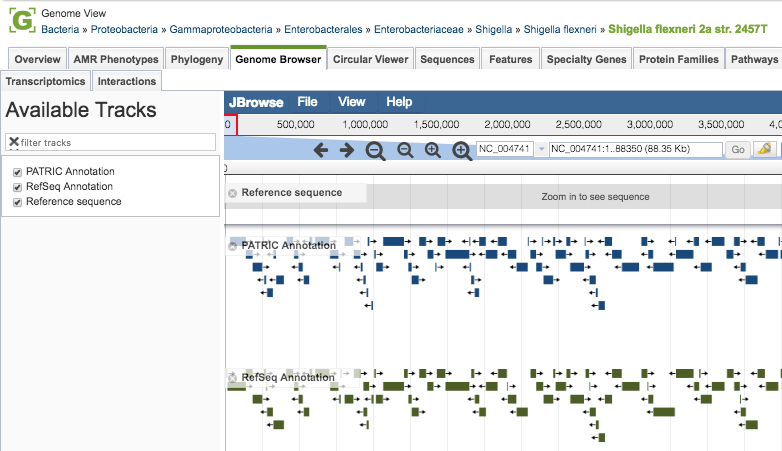
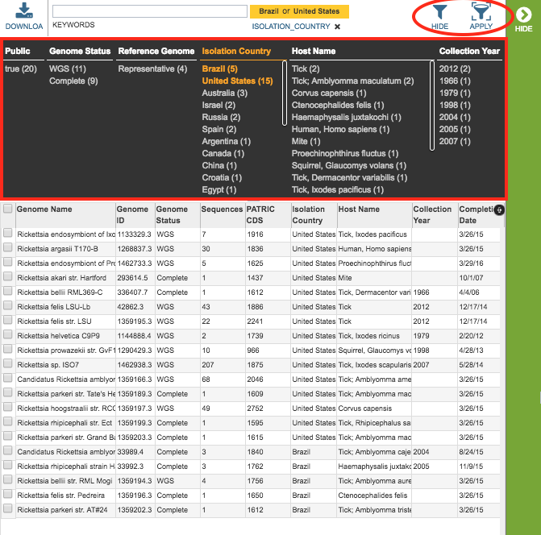

# Genomes Tab

## Overview
The Genomes Browser provides an interactive linear display of the genome and annotated features. The display allows scrolling, zooming, accessing feature information, and adding additional annotation tracks such as RNA-seq data and aligned reads. 

### See also
  * [Genome Annotations](../organisms_taxon/genome_annotations.html)

## Accessing the Genome Browser on the PATRIC Website
Clicking the Genome Browser Tab in a Genome View displays the Genome Browser which provides an interactive linear display of the genome and associated PATRIC annotations. If available, RefSeq annotations are provided as well as an additional track on the browser.  

The genomes in the table include associated metadata information regarding the organism, isolate, host, sequence, phenotype, project, and other.  A complete description of the metadata fields is available in the [Genome Metadata](../organisms_taxon/genome_metadata.html) user guide.

### Genome Browser Tools

Within this viewer you may do the following:

* **Scroll** along the length of the genome using the left and right arrows near the top of the display.

* **Zoom In** by clicking the magnifying glass with the "+" sign.  The larger magnifying glass zooms in larger increments, and likewise the smaller one zooms in smaller increments.

* **Zoom Out** by clicking the magnifying glass with the "-" sign.  The larger magnifying glass zooms in larger increments, and likewise the smaller one zooms in smaller increments.

* **Zoom to particular region** by entering the start and/or stop positions in the text box to the right of the magnifying glass buttons and clicking the "Go" button. 

* **Highlight a particular region** by clicking the highlight button to the right of the "Go" button and then dragging the mouse pointer across the desired length of the genome. 

### Filter Tool

As with all tables in PATRIC, the Filters tool is available to narrow the display of the items in the table, show below:
  

Clicking on the Filters button at the top right of the table opens the Filter Panel above the table, displaying column names from the table and values for those columns with counts of occurence.  Clicking on the filter values narrows the genomes *displayed* in the table to those matching the chosen filter values.  Clicking the Hide button closes the Filter Panel.  Clicking the Apply button removes the non-matching genomes and *resets the scope* in the Taxonomic View to only the genomes matching the filter criteria. More details are available in the [Filter Tool](../other/filter_tool.html) user guide.

### Action buttons

After selecting one or more of the genomes by clicking the checkbox beside the Genomes Name in the table, a set of options becomes available in the vertical green Action Bar on the right side of the table.  These include

* **Hide:** Toggles (hides) the right-hand side Details Pane.
* **Download:**  Downloads the selected items (rows).
* **Copy:** Copies the selected items to the clipboard.
* **Genome:** Loads the Genome View Overview page for the selected genome (if only one genome selected).
* **Genomes:** Reloads the Genomes Table in the Genome List View, listing only the genomes that were selected.
* **Group:** Opens a pop-up window to enable adding the selected genomes to an existing or new group in the private workspace.

More details are available in the [Action Buttons](../other/action_buttons.html) user guide
