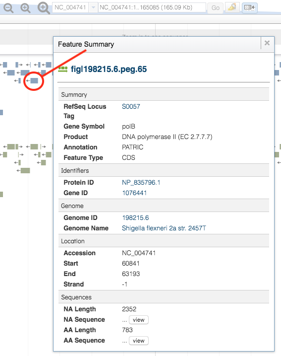

# Genomes Tab

## Overview
The Genomes Browser provides an interactive linear display of the genome and annotated features. The display allows scrolling, zooming, accessing feature information, and adding additional annotation tracks such as RNA-seq data and aligned reads. 

### See also
  * [Genome Annotations](../organisms_taxon/genome_annotations.html)

## Accessing the Genome Browser on the PATRIC Website
Clicking the Genome Browser Tab in a Genome View displays the Genome Browser which provides an interactive linear display of the genome and associated PATRIC annotations. If available, RefSeq annotations are provided as well as an additional track on the browser.  

The genomes in the table include associated metadata information regarding the organism, isolate, host, sequence, phenotype, project, and other.  A complete description of the metadata fields is available in the [Genome Metadata](../organisms_taxon/genome_metadata.html) user guide.

### Genome Browser Tools

Within this viewer you may do the following:

* **Scroll** along the length of the genome using the left and right arrows near the top of the display.

* **Zoom In** by clicking the magnifying glass with the "+" sign.  The larger magnifying glass zooms in larger increments, and likewise the smaller one zooms in smaller increments.

* **Zoom Out** by clicking the magnifying glass with the "-" sign.  The larger magnifying glass zooms in larger increments, and likewise the smaller one zooms in smaller increments.

* **Zoom to particular region** by entering the start and/or stop positions in the text box to the right of the magnifying glass buttons and clicking the "Go" button. 

* **Highlight a particular region** by clicking the highlight button to the right of the "Go" button and then dragging the mouse pointer across the desired length of the genome. 

### Features in the Genome Browser

You can access summary information about a feature by mousing over the feature.  Clicking a feature opens a window with detailed information about the feature including

* Locus Tag
* Gene Symbol
* Product
* Annotation Source
* Feature Type
* Protein ID
* Gene ID
* Genome ID
* Genome Name
* Accession Number
* Start
* End
* Strand 
* NA Length
* NA Sequence (by clicking "view" button
* AA Length
* AA Sequence (by clicking "view" button

