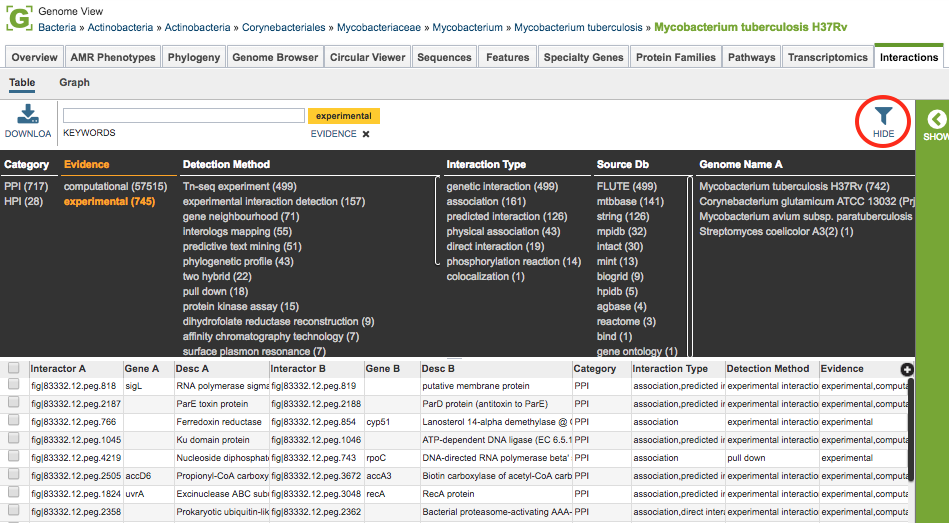
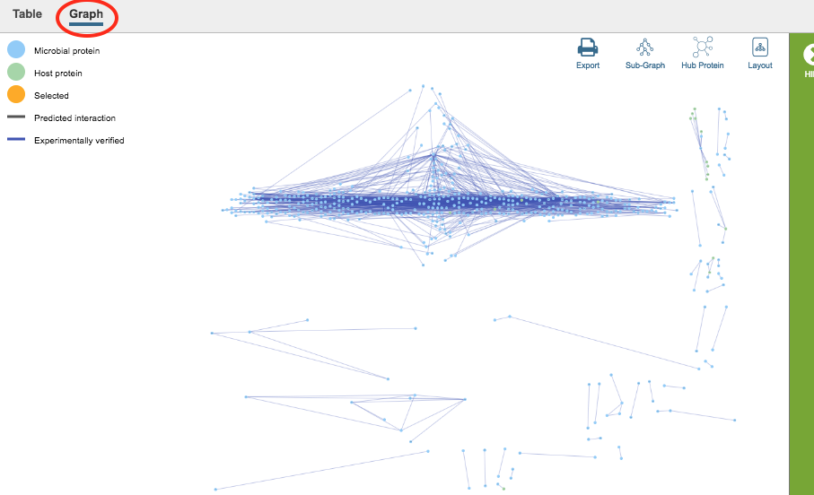
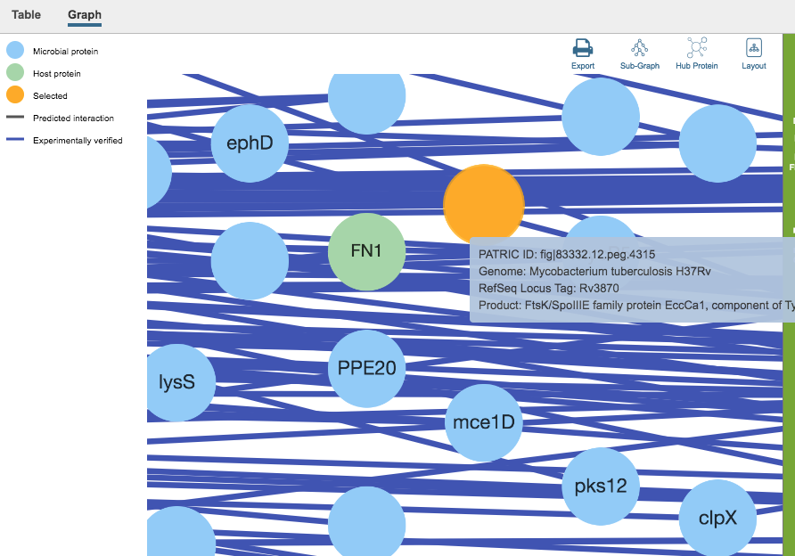

# Interactions Tab, Taxon/Genome-Level

## Overview
The Interactions Tab provides experimentally and computationally derived host-pathogen protein-protein interaction data and visualizations from more than 15 public repositories, including [STRINGDB](https://string-db.org/), with a total of 55 million protein-protein interactions. Interactions are available at both the genome and gene levels, and are presented in tabular and graph format.

### See also
  * [Interactions Tab, Gene-Level](../organisms_gene/interactions.html)

## Accessing the Genome-Level Interactions Table on the PATRIC Website
Clicking the Interactions Tab in a Genome View displays the Interactions Table, listing of all of the interactions in PATRIC associated with the genes in that genome.

The tables include the following columns (fields) for each interaction, and are based on [PSI-MITAB](https://wiki.reactome.org/index.php/PSI-MITAB_interactions) format:

* **Interactor A:** PATRIC ID (unique primary identifier) for one of the two interacting features (protein-coding genes).
* **Gene A:** Gene name for the feature, if available.
* **Desc A:** Protein product (functional annotation) associated with the feature.  
* **Interactor B:** PATRIC ID for the other of the two interacting features.
* **Gene B:** Gene name for the feature, if available.
* **Desc B:** Protein product associated with the feature.  
* **Category:** Category of interaction: 
   * PPI = protein-protein interaction
   * HPI = host-pathogen interaction
* **Interaction Type:** Interaction types, taken from the corresponding [PSI-MI controlled vocabulary](https://www.ebi.ac.uk/ols/ontologies/mi).
* **Detection Method:** Interaction detection method, taken from the corresponding [PSI-MI controlled vocabulary](https://www.ebi.ac.uk/ols/ontologies/mi).
* **Evidence:** Evidence of the interaction:
  * Experimental = identified by laboratory method
  * Computational = predicted by computational method 

## Interactions Table Tools
Within this table you may do the following:

* **Download** the entire contents of the table in text, CSV, or Excel format by clicking the Download button above the table on the left side.
* **Rearrange and narrow** the list of genomes in the table via sorting (using column headers), keywords (using the Keyword box), and filtering (using the Filters tool).

### Filter Tool

As with all tables in PATRIC, the Filters tool is available to narrow the display of the items in the table, show below:
  

Clicking on the Filters button at the top right of the table opens the Filter Panel above the table, displaying column names from the table and values for those columns with counts of occurence.  Clicking on the filter values narrows the genomes *displayed* in the table to those matching the chosen filter values.  Clicking the Hide button closes the Filter Panel.  Clicking the Apply button removes the non-matching genomes and *resets the scope* in the Taxonomic View to only the genomes matching the filter criteria. More details are available in the [Filter Tool](../other/filter_tool.html) user guide.

### Action buttons

After selecting one or more of the interactions by clicking the checkbox beside row on the left side of the table, a set of options becomes available in the vertical green Action Bar on the right side of the table.  These include

* **Hide/Show:** Toggles (hides) the right-hand side Details Pane.
* **Download:**  Downloads the selected items (rows).
* **Copy:** Copies the selected items to the clipboard.
* **Features:** Loads the Features Table for the features corresponding to the selected interaction.
* **FASTA:** Provides the FASTA DNA or protein sequence for the selected feature(s).
* **Group:** Opens a pop-up window to enable adding the selected sequences to an existing or new group in the private workspace.

More details are available in the [Action Buttons](../other/action_buttons.html) user guide.

## Interactions Viewer
Clicking the **Graph** option at the top left of the table displays the [Cytoscape](http://www.cytoscape.org/)-based Interactions Viewer. 

In the graph, proteins (interactors) are displayed as nodes and the interactions between the nodes are displayed as lines. Scrolling with the mouse zooms in/out in the graph.  Clicking and dragging with the mouse moves the graph in the display. Gene names, where available, are displayed on the nodes. Mousing over a node or line displays detailed information about that interactor/interaction. Clicking and dragging on a node moves it in the graph, allowing rearrangement for better visualization.

Additional options are available from the upper right area of the graph.  These include the following:

* **Export:** Creates a png image file of the graph and makes it available for saving to disk.
* **Subgraph:** Auto-selects subgraphs with more than 5, 10, or 20 nodes, or auto-selection of the largest subgraph.
* **Hub Protein:** Auto-selects hub proteins with more than 5, 10, or 20 nodes, or auto-selection of the most connected hub 
* **Layout:** Changes the layout of the display, with several options available
### Action buttons

After selecting one or more of the nodes by clicking it (ctrl-clicking to select multiple nodes), a set of options becomes available in the vertical green Action Bar on the right side of the table.  These include

* **Hide/Show:** Toggles (hides) the right-hand side Details Pane.
* **Download:**  Downloads the selected items (rows).
* **Copy:** Copies the selected items to the clipboard.
* **Feature:** Loads the Feature Page for the selected feature. *Available only if a single feature is selected.*
* **Features:** Loads the Features Table for the selected features. *Available only if multiple features are selected.*
* **FASTA:** Provides the FASTA DNA or protein sequence for the selected feature(s).
* **MSA:** Launches the PATRIC Multiple Sequence Alignment (MSA) tool and aligns the selected features by DNA or protein sequence in an interactive viewer.
* **Group:** Opens a pop-up window to enable adding the selected sequences to an existing or new group in the private workspace.

More details are available in the [Action Buttons](../other/action_buttons.html) user guide.
