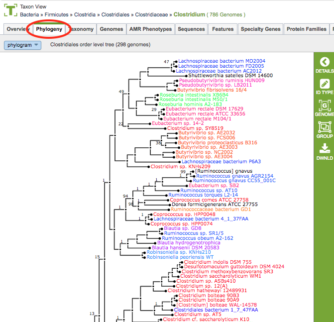

# Phylogeny and Phylogenetic Tree Viewer

## Overview
The Phylogeny page and Phylogenetic Tree Viewer in PATRIC allows you to visualize and interact with genome trees in PATRIC.

### See also
  * [Building Phylogenetic Trees in PATRIC Tutorial](https://docs.patricbrc.org//tutorial/phylogenetic_tree_building/tree_building.html)
  * [Phylogenetic Tree Building Service](../services/phylogenetic_tree_building_service.html)

## Accessing Phylogenetic Trees on the PATRIC Website
Phylogenetic trees can be viewed in PATRIC by either 

* **Clicking the Phylogeny Tab in a Taxon View:** Displays an interactive tree corresponding to the *order* in which the taxon or genome exists.

* **Launching the Phylogenetic Tree Building Service:** Returns, among other files, a Newick file for the tree.  Clicking on the (tree) View button opens the tree in the Phylogenetic Tree Viewer.

### Phylogenetic Tree Viewer

### Phylogenetic Tree Viewer Features and Functionality

**Color Scheme:** The phylogenetic tree branch color scheme is based on genus. Any genera that occur more than once in the tree are assigned a color and every taxon label within that genus is drawn in the genus color. There are a total of 28 colors that may be used. If more than 28 genera are represented multiple times in the tree, then the most common genera will be assigned colors first. Colors are not re-used therefore any additional taxa will be labeled in black.

**Phylogram/Cladogram View:** Trees can be displayed in either phylogram or cladogram view. In the phylogram view, the tree branches are drawn with lengths based upon the branch lengths in the tree. In the cladogram view, the tree branch lengths are disregarded and branches are drawn so that all branch labels line up on the right side of the display. The phylogram view conveys additional information about the evolutionary divergence, while the cladogram view allows better visual resolution of the branching pattern for very closely related taxa (where the branch lengths are too small to allow the branching pattern to be distinguished in the phylogram view).

**Support Values:** Branch support values below 100% are shown. Support values of 100% are not shown.

**Taxon Labels:** The taxon labels in the trees (leaf nodes) are the names of PATRIC genomes. Clicking the ID Type Button in the vertical green Action Bar enables toggling the labels from genome name to genome ID.

**Accessing Genomes in the Tree:** Clicking on the genome name will add the Genome button to the vertical green Action Bar on the right side of the tree.  Clicking the Genome Button will open the corresponding Genome Page in PATRIC.  If multiple genomes are selected (using ctrl-click), clicking the Genome Button will open a Genome List page. The selected genome(s) can also be added to a group by clicking the Group Button in the Action Bar.

**Downloading Trees:** Clicking the Download Button in the Action Bar will allow downloading the tree as either an SVG (Scalable Vector Graphics) file or a Newick file.

### Phylogenetic Tree Construction
The order-level pre-built trees in PATRIC are constructed by an automated pipeline that begins with amino acid sequence files for each genome. For each order-level tree the genomes from that order are used along with a small set of potential outgroup genomes. Sets of homologous proteins are identified in a two round processes. In the first round, a single genome from each distinct species is selected and these are searched against each other using [BLAT](http://genome.ucsc.edu/FAQ/FAQblat.html). The top scoring hits are clustered with [MCL](http://www.micans.org/mcl/) and these clusters define the initial seed sets for the homology groups. In the second round, the seed sets are aligned using
[MUSCLE](http://www.ebi.ac.uk/Tools/msa/muscle/) and HMMs are built with [hmmbuild](http://www.csb.yale.edu/userguides/seq/hmmer/docs/node19.html). All genomes (including the outgroup pool) are searched with [hmmsearch](http://www.csb.yale.edu/userguides/seq/hmmer/docs/node26.html). The top hits from hmmsearch are used to define the homology groups. Two outgroup genomes are selected from the pool of outgroup candidates based on total hmmsearch score.

Homology groups are filtered for taxon coverage. Groups are aligned using MUSCLE. Poorly aligned, or noisy regions, are removed with [Gblocks](http://molevol.cmima.csic.es/castresana/Gblocks.html). Especially noisy or phylogenetically discordant homology groups are removed and the remaining groups are concatenated into a single long alignment. The main tree is estimated from the concatenated alignment with [FastTree](http://www.microbesonline.org/fasttree/). Branch support values are not standard bootstrap values, which can be overly optimistic for very long alignments. Instead of bootstraps, trees are built from random samples of 50% of the homology groups used for the main tree, in a process referred to as gene-wise jackknifing. 100 of these 50% gene-wise jackknife trees are made using FastTree, and the support values shown indicate the number of times a particular branch was observed in the support trees.
