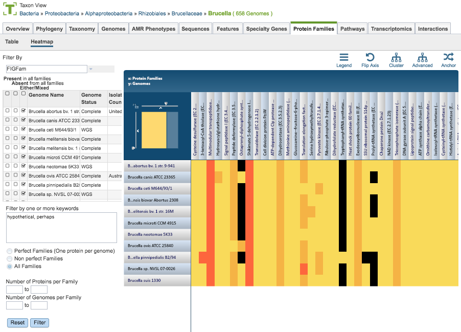

# Protein Families Tab

## Overview
The Protein Families Tab provides access to the Protein Family Sorter, which enables examination of the distribution of PATRIC protein families across sets of genomes. Filters for present, absent, or mixed can be used to refine the selection and an interactive heatmap provides a visual overview of the distribution.

### See also
  * [Comparing Protein Families Across Genomes Tutorial](https://docs.patricbrc.org//tutorial/protein_family_sorter/protein_family_sorter.html)
  * [Protein Family Sorter Service](../services/protein_family_service.html)

## Accessing the Protein Family Sorter on the PATRIC Website
The Protein Family Sorter can be accessed by either of the following:

* **Clicking the Protein Families Tab in a Taxon View:** Displays a list of all of the protein families that have any proteins assigned to them from the genomes in that taxon level.
* **Launching the Protein Family Sorter Service:** Displays the Protein Family Tab for the selected genomes and protein families.

### Protein Families Filter Tool
Results will be shown in a Protein Families Filter Tool and Table, shown below.

The Filter Tool on the left side (also used for the Protein Family Sorter, described below) provides options for selecting protein family type, presence/absence by genome, keyword, perfect/non-perfect families, and number of proteins per family.  These options are described below.

**Protein Family Types**

There are 3 types of protein families computed in PATRIC:

* **Genus-specific families(PLfams):** The genus-specific protein families are computed using only proteins within a genus and more stringent criteria (MCL inflation = 3.0). This provides higher sequence similarity and better specificity while performing within-genus/species or close strain comparisons.

* **Cross-genus families(PGfams):**  The cross-genera protein families are computed by clustering representative proteins from the genus-specific families with slightly relaxed criteria (MCL inflation = 1.1). This allows cross-genera or distant homologs to cluster together, which is necessary to support cross-genera comparative analysis across all microbial genomes.

* **FIGFams:** FIGfams are sets of isofunctional homologs, i.e., a set of protein sequences that are similar along their full length and believed to implement the same function. FIGfams are derived from a collection of functional subsystems, as well as correspondences between genes in closely related strains.

**Presence/Absence by Genome**

The checkboxes to the left side of the list of genomes provides three options for each genome.  

* **Present in all families:** Shows in the table only protein families that include members from those selected genomes.
* **Absent from all families:** Shows in the table only protein families that do not include members from those selected genomes.
* **Either/Mixed:** Shows in the table all protein families with members from those selected genomes. This option is set by default.

Clicking the checkbox in the top header section of the tool selects all the checkboxes in that column. Scrolling to the right in the Filter Tool provides additional genome metadata to aid in selection, including Genome Status, Isolation Country, Host, Disease, Collection Date, and Completion Date. 

**Keywords**

Entering one or more keywords and clicking the Filter button will filter the table down to proteins with matching terms in any of the columns.  If more than one term is used in the filter box, a comma between the table will display proteins with matches to either term  ("OR" condition).  If no comma is used, the table will display only proteins that have all terms in the same order as entered (exact match). 

**Perfect/Non-Perfect Families**

Below the Keyword filter box is the option to select either Perfect Families (one protein per genome), Non-perfect Families (more than one protein per genome), or All Families.

**Number of Proteins/Genomes per Family**

Below the Perfect/Non-Perfect Families option are boxes to allow filtering to specific ranges of proteins or genomes per family.  Clicking the Filter button will update the table display accordingly.

### Protein Families Table
The Protein Families Table to the right of the Filter Tool displays all of the protein families corresponding to the selected taxonomic level or set of genomes (e.g., from a genome group), filtered based on the settings in the Filter Tool. This table provides summary information regarding the protein families: 

* **ID:** Unique identifier for the protein family. By convention, IDs prefaced by "PLF" are PLfams, "PGF_" are PGfams, and "FIG" are FIGFams.

* **Proteins:** Number of proteins in the protein family
* **Genomes:** Number of genomes in the protein family
* **Description:** Description of the protein family, with EC number where available
* **Proteins:** Number of proteins in the protein family
* **Min AA Length:** Length of the shortest amino acid string in the protein family
* **Max AA Length:** Length of the longest amino acid string in the protein family
* **Mean:** Average length amino acid string in the protein family
* **Std Dev:** Standard deviation among lengths of amino acid strings in the protein family

The entire table can be downloaded as text or CSV file by clicking the Download button at the top right of the table.

After selecting one or more of the proteins by clicking the checkbox beside the Protein Family ID in the table, a set of options becomes available in the vertical green Action Bar on the right side of the table.  These include

* **Hide/Show:** Toggles (hides) the right-hand side Details Pane.
* **ID Map:** Launches the ID mapping tool for the selected items. 
* **Pathway:** Launches a new page containing the pathways in which the proteins are found.
* **Download:**  Downloads the selected items (rows).
* **MSA:** Launches the MSA viewer with the alignment of the amino acid sequences for the selected proteins.
* **Members:**  Launches a Features page containing a list of the individual proteins corresponding to the selected protein family(s).
* **Group:** Opens a pop-up window to enable adding the selected proteins to an existing or new group in the private workspace.

## Protein Family Sorter Heatmap

The Heatmap is an interactive visualization tool that provides an overview of the distribution of genomes across the set of protein families that comprise them, subject to the applied filter criteria set by the Protein Family Filter Tool to the left of the heatmap. Patterns visible in a Heatmap can allow for many types of analysis such as a providing a bird's-eye view of the conservation (or lack thereof) of particular genes of interest, discerning how many proteins have the same function within a single genome, and identifying proteins with multiple homologs or paralogs across a set of genomes.

**Color Coding**  

Each cell is colored according to how many proteins from a
specific genome are assigned a particular protein family. 
* **Black:** No proteins from the genome assigned that protein family 
* **Bright yellow:** One protein assigned
* **Dark yellow:** Two proteins assigned
* **Dark orange:** Three or more proteins assigned

**Features and Functionality**

Genomes are listed along the Y (vertical) axis and corresponding Protein Families are listed along the X (horizontal) axis. The scale of these rows and columns may be controlled by sliding the x and/or y slidebars located at the axis intersection in the upper left corner of the Heatmap. Action buttons on the top right of the heatmap provide additional display options:

* **Legend:** Displays a popup box showing the color coding scheme of the heatmap.  Clicking the Legend button again hides the popup box.
* **Flip Axis:** Swaps the positions (horizontal or vertical) of the Genomes and Protein Families.
* **Cluster:** Reorders the Genomes and Protein Families in their respective axes to group individual cells in the heatmap together by value (color), using Pearson Correlation.
* **Advanced:** Provides advanced clustering options including clustering by Protein Families or Genomes separately, choosing alternate clustering algorithms, and choosing alternate clustering types. 
* **Anchor:** Reorders the heatmap display such that all Genomes and Protein Families are baselined ("anchored") against the chosen genome.

In addition to the display options described above, each individual column or row within the Heatmap may be clicked and dragged to any specified position.

The following options may be accessed from a pop-up widow by clicking on any individual colored cell, any Protein Family label, or any Genome label within the Heatmap. The same information can be collected for a whole region of interest within the Heatmap by clicking and dragging to select a group of cells.

* **Download Heatmap Data:** Shows the count of proteins from each Genome assigned to each Protein Family in either a text or excel file. Note: Clicking this button from a Protein Family label will produce a file with the count for each genome assigned to that Protein Family, while clicking on this button from a Genome label will produce a file with the count for that particular genome in every Protein Family.
* **Download Proteins:** Downloads the set of PATRIC features associated with the chosen proteins.  Download available as csv, txt, or Excel file.
* **Show Proteins:** Open a feature list table in PATRIC containing the features associated with the chosen proteins. This view contains the same information as any feature list in PATRIC: Genome Name, Genome ID, RefSeq Locus Tab, Gene Symbol, protein family information, Product, length, start/stop, etc. This view also allows access to sequences, enables building of multiple sequence alignments, map IDs, etc.
* **Add Proteins to Group:** button will save selected items to new, or existing, groups within the Workspace. 
* **Cancel:** Closes the pop-up window.

The [Comparing Protein Families Across Genomes Tutorial](https://docs.patricbrc.org//tutorial/protein_family_sorter/protein_family_sorter.html) provides additional information and guidance in using the Protein Family Sorter.
