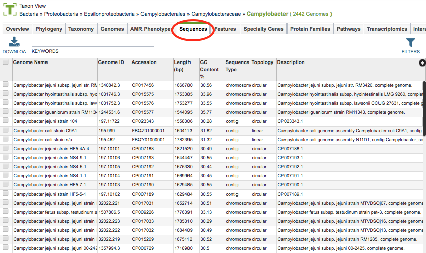
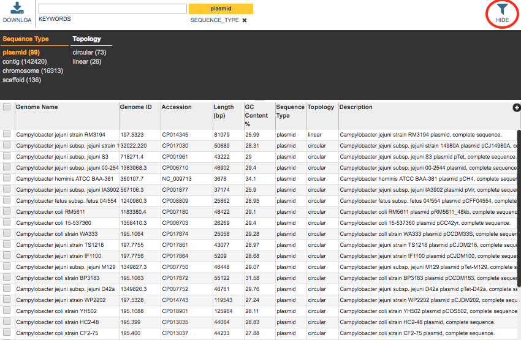

# Sequences Tab

## Overview
The Sequences Tab provides a table of all the contiguous sequences (chromosome, contig, plasmid) that comprise the set of genomes corresponding to the selected Taxon View level or for the user-defined Genome Group. From this page, sequences can be sorted, filtered, collected into groups, and downloaded. 

### See also
  * [Genome Page Overview](../organisms_genome/overview.html)
  * [Genomes Table](../organisms_taxon/genome_table.html)
  * [Genome Browser](../organisms_genome/genome_browser.html)

## Accessing the Sequences Table on the PATRIC Website
Clicking the Sequences Tab in a Taxon View displays the Sequences Table (shown below), listing all the contiguous sequences (chromosome, contig, plasmid) that comprise the set of genomes corresponding to the selected taxon level.

The sequences in the table include associated metadata information including Genome Name, Genome ID, Accession, Length, GC Content %, Sequence Type, Topology, and Description.

### Sequences Table Tools
Within this table you may do the following:

* **Download** the entire contents of the table in text, CSV, or Excel format by clicking the Download button above the table on the left side.

* **Rearrange and narrow** the list of sequences in the table via sorting (using column headers), keywords (using the Keyword box), and filtering (using the Filters tool).

### Filter Tool

As with all tables in PATRIC, the Filters tool is available to narrow the display of the items in the table, show below:
  

Clicking on the Filters button at the top right of the table opens the Filter Panel above the table, displaying column names from the table and values for those columns with counts of occurence.  Clicking on the filter values narrows the genomes displayed in the table to those matching the chosen filter values.  Clicking the Hide button closes the Filter Panel. More details are available in the [Filter Tool](../other/filter_tool.html) user guide.

### Action buttons

After selecting one or more of the sequences by clicking the checkbox beside the Genome Name in the table, a set of options becomes available in the vertical green Action Bar on the right side of the table.  These include

* **Hide/Show:** Toggles (hides) the right-hand side Details Pane.
* **Download:**  Downloads the selected items (rows).
* **Copy:** Copies the selected items to the clipboard.
* **Genome:** Loads the Genome View Overview page corresponding to the selected sequence.  *Available only if one sequence is selected.*
* **Genomes:** Loads the Genomes Table, listing only the genomes that correspond to the selected sequences. *Available only if more than one sequence is selected.*
* **Features:** Loads the Features Table, displaying the features corresponding to the selected sequence, as opposed to all features for the corresponding genome.
* **Browser:** Loads the Genome Browser with only the selected sequence, as opposed to the entire corresponding genome.
* **Group:** Opens a pop-up window to enable adding the selected sequences to an existing or new group in the private workspace.

More details are available in the [Action Buttons](../other/action_buttons.html) user guide.
