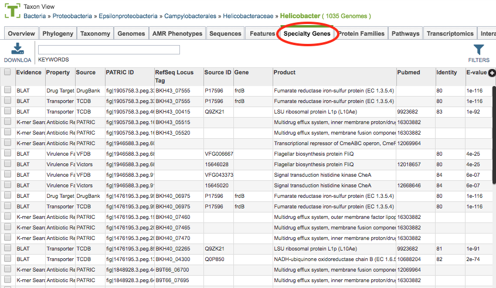
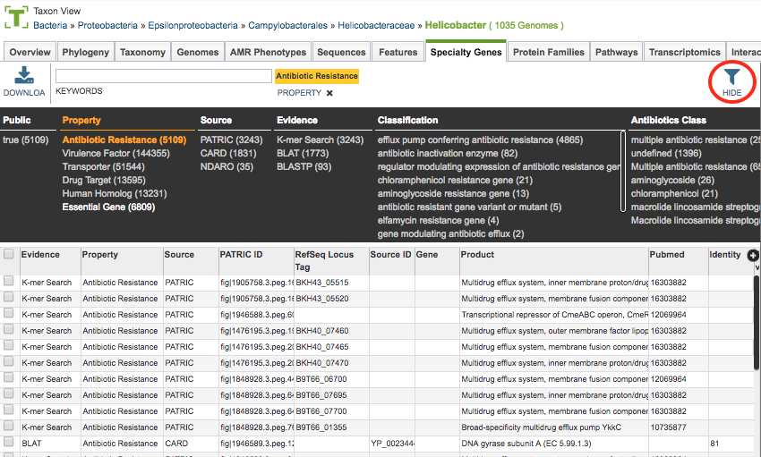

# Speciality Genes Tab

## Overview
The Specialty Genes Tab provides a table of all the annotated "specialty genes" (virulence factors, antibiotic resistance genes, drug targets, human homologs, transporters, and essential genes) corresponding to the set of genomes in the selected Taxon View level or in the user-defined Genome Group.  From this page, features can be sorted, filtered, collected into groups, and downloaded. 

### See also
  * [Specialty Genes](../data/data_types/specialty_genes.html)
  * [Genome Annotations](../organisms_taxon/genome_annotations.html)
  * [Features Tab](../organisms_taxon/features.html)

## Accessing the Specialty Genes Table on the PATRIC Website
Clicking the Specialty Genes Tab in a Taxon View displays the Specialty  table (shown below), listing all the PATRIC features annotated as Specialty Genes corresponding to the set of genomes in the selected taxon level.

PATRIC identifies features as Specialty Genes via BLASTP-based sequence similarity mapping to reference genes are collected from reputed external databases or manually curated by the PATRIC team. These features (genes) include

* **Antibiotic Resistance:** Mapped from [CARD](https://card.mcmaster.ca/), [NDARO](https://www.ncbi.nlm.nih.gov/pathogens/antimicrobial-resistance/), and PATRIC-curated AMR genes.

* **Drug Targets:** Mapped from [DrugBank](https://www.drugbank.ca/) and [TTD](https://db.idrblab.org/ttd/).

* **Human Homologs:** Mapped from [Reference Human Genome at NCBI](https://www.ncbi.nlm.nih.gov/assembly/GCF_000001405.26).

* **Virulence Factors:** Mapped from [VFDB](http://www.mgc.ac.cn/VFs/), [Victors](http://www.phidias.us/victors/), and PATRIC-curated virulence factors.

* **Transporters:** Mapped from [TCDB](http://www.tcdb.org/).

* **Essential Genes:** Mapped to essential genes (using flux-balance for Reference and Representative genomes, predicted using [flux-balance analysis](http://www.nature.com/nbt/journal/v28/n3/abs/nbt.1614.html).

See [Specialty Genes](../data/data_types/specialty_genes.html) for additional information.

### Specialty Gene Table Tools
Within this table you may do the following:

* **Download** the entire contents of the table in text, CSV, or Excel format by clicking the Download button above the table on the left side.

* **Rearrange and narrow** the list of sequences in the table via sorting (using column headers), keywords (using the Keyword box), and filtering (using the Filters tool).

### Filter Tool

As with all tables in PATRIC, the Filters tool is available to narrow the display of the items in the table, show below:
  

Clicking on the Filters button at the top right of the table opens the Filter Panel above the table, displaying column names from the table and values for those columns with counts of occurence.  Clicking on the filter values narrows the features displayed in the table to those matching the chosen filter values.  Clicking the Hide button closes the Filter Panel. More details are available in the [Tables and Filters](../tables.html) user guide.

### Action buttons

After selecting one or more of the features by clicking the checkbox beside the Genome Name in the table, a set of options becomes available in the vertical green Action Bar on the right side of the table.  These include

* **Hide/Show:** Toggles (hides) the right-hand side Details Pane.
* **Download:**  Downloads the selected items (rows).
* **Copy:** Copies the selected items to the clipboard.
* **Feature:** Loads the Feature Page for the selected feature. *Available only if a single feature is selected.*
* **Features:** Loads the Features Table for the selected features. *Available only if multiple features are selected.*
* **Genome:** Loads the Genome View Overview page corresponding to the selected feature.  *Available only if a single feature is selected.*
* **Genomes:** Loads the Genomes Table, listing the genomes that correspond to the selected features. *Available only if multiple features are selected.*
* **FASTA:** Provides the FASTA DNA or protein sequence for the selected feature(s).
* **ID Map:** Provides the option to map the selected feature(s) to multiple other idenfiers, such as RefSeq and UniProt.
* **MSA:** Launches the PATRIC Multiple Sequence Alignment (MSA) tool and aligns the selected features by DNA or protein sequence in an interactive viewer.
* **Pathway:** Loads the Pathway Summary Table containing a list of all the pathways in PATRIC in which the selected features are found.
* **Group:** Opens a pop-up window to enable adding the selected sequences to an existing or new group in the private workspace.

More details are available in the [Selection Action Bar](../action_bar.html) user guide.
