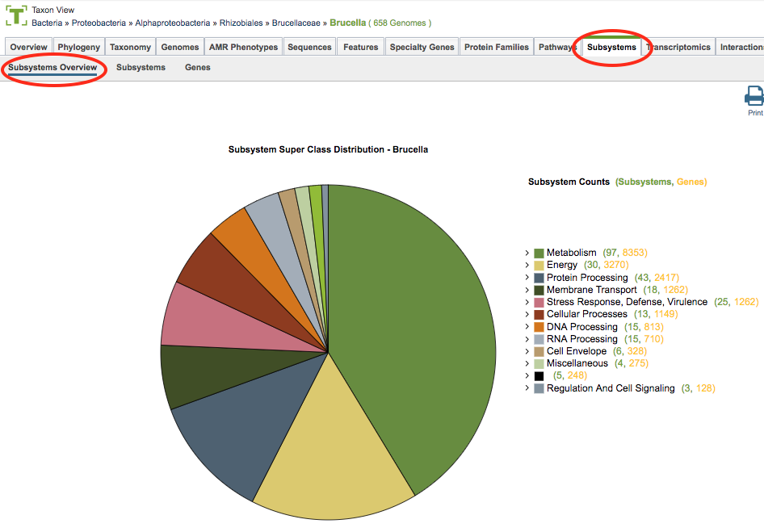
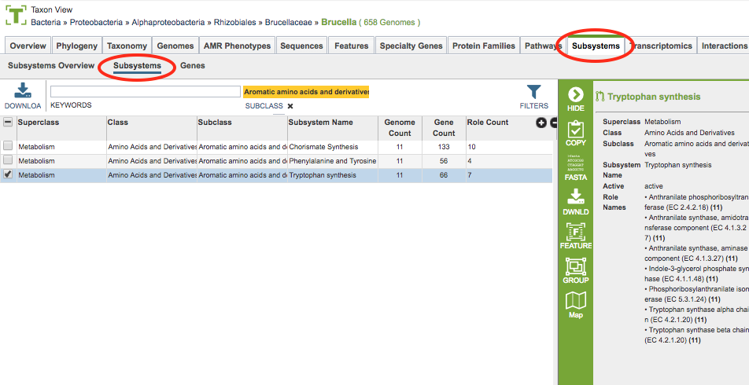
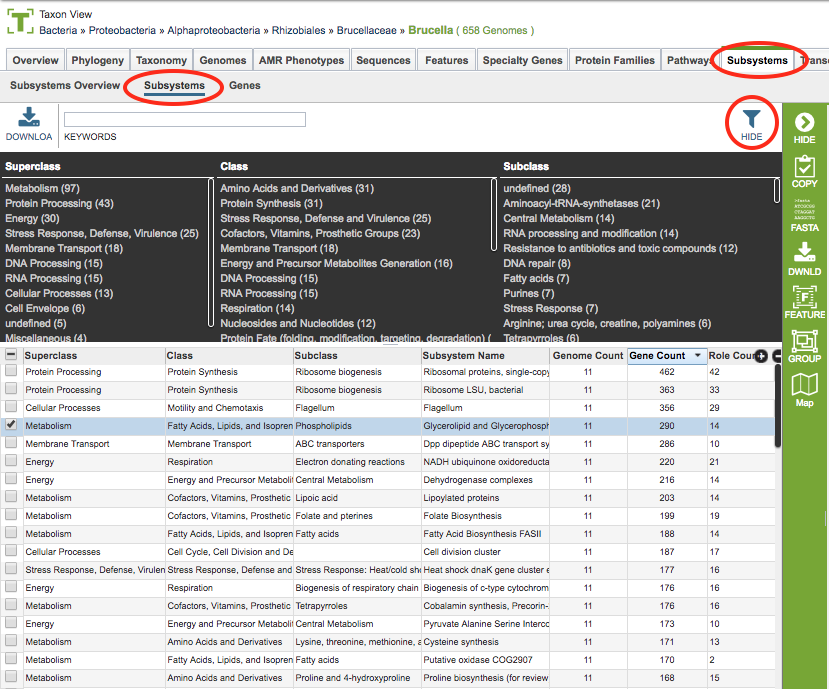

# Subsystems Tab

## Overview
The Subsystems Tab provides access to a graphical display (pie chart) of subsystem superclasses asserted to a genome or a genome group. Each of the 11 superclasses of subsystems (Metabolism, Energy, Protein Processing etc.) can be expanded to their class and subclass levels. The Subsystems (green)- and Gene (yellow) counts provided in parenthesis link to tabular representations of the appropriate data.  

### See also
  * [Subsystems](../organisms_taxon/subsystems.html)

## Accessing Subsystems on the PATRIC Website
The Subsystems Overview can be accessed by

* **Clicking the Subsystems Tab in a Taxon View:** Displays an overview pie chart of the subsystems that comprise the taxon, with additional options to view subsystems or genes in a tabular view, as shown below.

## Subsystems Overview

On the left side, a pie chart displays the subsystem superclasses asserted to taxon group (or genome group if in Genome Group View, or single genome if in Genome View). Clicking on one of the "slices" of the pie displays a table of the associated subsystems in that superclass. The Subsystems Table is described below. 

On the right side an interactive hierarchical display of the 11 superclasses of subsystems (Metabolism, Energy, Protein Processing etc.), with matching colors the corresponding slice in the pie chart. The subsystem superclasses and nested subclasses can be expanded to progressively lower levels by clicking the arrow (>) on the left side of the subsystem name. On the right side of the subsystem name, two numbers are provided in parentheses.  The first is the count of subsystems (green) and the second is the count of senes (yellow) associated with the subsystem name. Clicking on the number displays a table containing all of the associated subsystems or genes, respectively.  These tables are described below.  

## Subsystems Table
Clicking the Subsystems menu option displays a table of all the subsystems associated within the taxon, as shown below.  

The columns in this table provide additional information about each of the subsystems:

* **Subsystem Superclass:** One of the 11 highest level groupings of subsystems
* **Subsystem Class:** Second-level grouping of subsystems
* **Subsystem Subclass:** Third-level grouping of subsystems
* **Subsystem Name:** Name of the subsystem 
* **Genome Count:** Total number of genomes that have been asserted to have an active or likely variant of the subsystem from the set of genomes chosen.
* **Gene Count:** Total of number of unique genes that belong to this subsystem from the set of genomes chosen.
* **Role Count:** Total of number of unique functional roles asserted for an active variant of the subsystem.

Two additional columns (hidden by default) are available by clicking the (+) at the top right of the table.  They are 
* **Variant (formerly named Active):** A subsystem can be asserted to be active or likely if one or more functional roles are missing.
* **Subsystem ID:** Unique identifier for the subsystem (the same as subsystem name by default).	

### Subsystem Table Tools
Within this table you may do the following:

* **Download** the entire contents of the table in text, CSV, or Excel format by clicking the Download button above the table on the left side.

* **Rearrange and narrow** the list of genomes in the table via sorting (using column headers), keywords (using the Keyword box), and filtering (using the Filters tool).

### Filter Tool

As with all tables in PATRIC, the Filters tool is available to narrow the display of the items in the table, show below:
  

Clicking on the Filters button at the top right of the table opens the Filter Panel above the table, displaying column names from the table and values for those columns with counts of occurence.  Clicking on the filter values narrows the genomes *displayed* in the table to those matching the chosen filter values.  Clicking the Hide button closes the Filter Panel.  Clicking the Apply button removes the non-matching genomes and *resets the scope* in the Taxonomic View to only the genomes matching the filter criteria. More details are available in the [Filter Tool](../other/filter_tool.html) user guide.

### Action buttons

After selecting one or more of the genomes by clicking the checkbox beside the Genomes Name in the table, a set of options becomes available in the vertical green Action Bar on the right side of the table.  These include

* **Hide:** Toggles (hides) the right-hand side Details Pane.
* **Download:**  Downloads the selected items (rows).
* **Copy:** Copies the selected items to the clipboard.
* **Genome:** Loads the Genome View Overview page for the selected genome (if only one genome selected).
* **Genomes:** Reloads the Genomes Table in the Genome List View, listing only the genomes that were selected.
* **Group:** Opens a pop-up window to enable adding the selected genomes to an existing or new group in the private workspace.

More details are available in the [Action Buttons](../other/action_buttons.html) user guide.

Comparative Subsystems Heatmap

The Heatmap is an interactive visualization tool, which provides an overview of the distribution of genomes across the set of functional roles defined by a subsystem. Patterns visible in a Heatmap can allow for many types of analysis such as, a bird’s-eye view of the conservation (or lack thereof) of particular functional roles of interest, discerning how many proteins have the same function within a single genome, and identifying proteins with multiple homologs or paralogs across a set of genomes.

Color Coding: Each cell is colored according to how many genes are annotated to perform the specific functional role within a specific genome. Note that fragments of a gene can be presented as separate enteties.

    Black: No genes from the genome have the specific functional role assigned.
    Bright yellow: One gene with the specific functional role
    Dark yellow: Two genes with the specific functional role
    Dark orange: Three or more genes with the specific functional role

Features and Functionality

•	Functional roles needed for an “active” subsystem are listed along the Y (vertical) axis. Note that not all functional roles are always needed for a functional variant of a subsystem. Depending on a given genome one specific functional role or another can be present (non orthologous gene displacement). Also some subsystems are collections of similar functional roles for the purpose of disambiguation of paralogous genes. 
The corresponding Genomes are listed along the X (horizontal) axis. The scale of these rows and columns may be controlled by sliding the x and/or y slidebars located at the axis intersection in the upper left corner of the Heatmap. The "Flip Axis" button at the top left of the heatmap will swap the positions (horizontal or vertical) of the Genomes and EC Numbers.
•	Each individual column or row within the Heatmap may be clicked and dragged to any specified position.
•	The following options may be accessed from a pop-up widow by clicking on any individual colored cell, any EC label, or any Genome label within the Heatmap. The same information can be collected for a whole region of interest within the Heatmap by clicking and dragging to select a group of cells.
o	Download Heatmap Data: Shows the count of representative features from each genome assigned to each EC Number in either a text or excel file. Note: Clicking this button from an EC label will produce a file with the count for each genome assigned to that EC number, while clicking on this button from a Genome label will produce a file with the count for that particular genome in every EC number associated for this selected pathway.
o	Download Proteins: Downloads the set of PATRIC features associated with the chosen proteins. Download available as csv, txt, or Excel file.
o	Show Proteins: Open a feature list table in PATRIC containing the features associated with the chosen proteins. This view contains the same information as any feature list in PATRIC: Genome Name, Genome ID, RefSeq Locus Tab, Gene Symbol, protein family information, Product, length, start/stop, etc. This view also allows access to sequences, enables building of multiple sequence alignments, map IDs, etc.
o	Add Proteins to Group: button will save selected items to new, or existing, groups within the Workspace.
o	Cancel: Closes the pop-up window.

