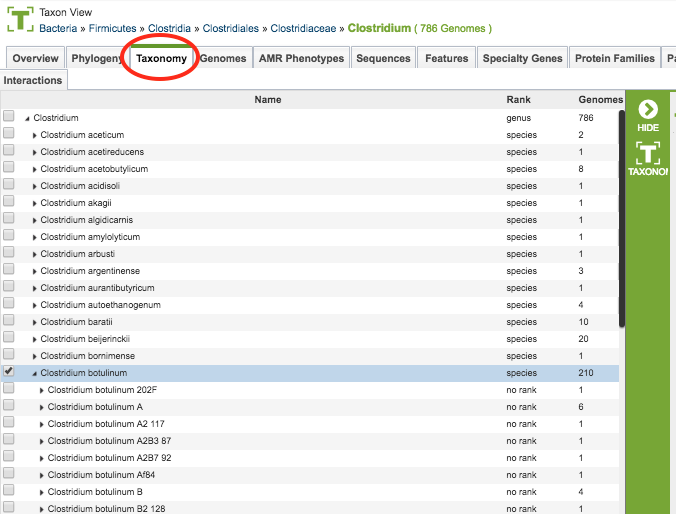

# Taxonomy Tab

## Overview
The Taxonomy Tab in PATRIC allows you to navigate through the taxonomic tree structure and access genomes at any level. PATRIC uses the [NCBI Taxonomy](https://www.ncbi.nlm.nih.gov/taxonomy) for taxonomic classification of bacterial genomes. In the event that a genome does not have a taxon id, it retains its genus and species names, but is assigned to Candidatus pending subsequent classification. For genomes where the exact strain is not known, e.g., for some clinical isolates, they are mapped to the closest species or genus levels and assigned the corresponding taxon ID.

## Accessing Taxonomies on the PATRIC Website
Clicking the Taxonomy Tab in a Taxon View displays an interactive taxonomic tree structure, rooted at the taxonomic level corresponding to the current Taxonomic View.

### Taxonomy Viewer

### Taxonomy Viewer Features and Functionality
The taxonomic structure is presented levels that can be expanded or collapsed by clicking the triangle next to the name of the taxon.  Clicking the checkbox next to the taxon selects it and adds a Taxonomy Button on the vertical green Action Bar to the left of the taxonomy viewer.  Clicking the Taxonomy Button will re-orient the Taxonomic View to the level (taxonomic scope) corresponding to the chosen taxon, displaying the Overview page (Overview Tab).
