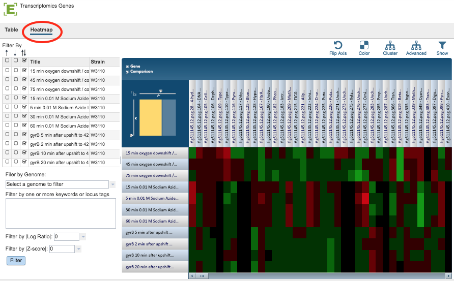

# Transcriptomics Gene List Heatmap

## Overview
The Transcriptomics Gene List Heatmap visually displays expression levels of all the genes in a Gene List across all selected comparisons using a heatmap viewer where coloring is based on the log ratio value of a gene in a given comparison. It allows quick visual identification of genes with similar expression patterns across one or more comparisons, including clustering and other options.

### See also
  * [Examining Transcriptomics Data Tutorial](https://docs.patricbrc.org//tutorial/examining_transcriptomics_data/examining_transcriptomics_data.html)
  * [Transcriptomics Experiments and Comparisons](../organisms_taxon/experiments_comparisons_tables.html)
  * [Transcriptomics Gene Page](../organisms_gene/transcriptomics.html)
  * [Correlated Genes](../organisms_gene/correlated_genes.html)
  * [Expression Data Import Service](../services/expression_data_import_service.html)

## Accessing/Creating Transcriptomics Gene List Heatmap on the PATRIC Website
The heatmap may be accessed while under the Transcriptomics Tab (available on any Taxonomy or Genome level landing page) in the following ways:

* **Clicking the Genes Action Button with one or more rows selected in the Experiments Table:** Opens the Transcriptomics Genes Filter Tool and Table/Heatmap page, loaded with the genes corresponding to the selected experiments. Clicking the **Heatmap** option switches the view to the heatmap. See [Transcriptomics Experiments and Comparisons](../organisms_taxon/experiments_comparisons_tables.html) for more information.

* **Clicking the Genes Action Button with one or more rows selected in the Comparisons Table:** Opens the Transcriptomics Genes Filter Tool and Table/Heatmap page, loaded with the genes corresponding to the selected comparisons. Clicking the **Heatmap** option switches the view to the heatmap. See [Transcriptomics Experiments and Comparisons](../organisms_taxon/experiments_comparisons_tables.html) for more information.

### Gene List Table and Filter
Clicking the Heatmap option displays the heatmap, shown below.

### Gene List Filter Tools
The Filter Tool on the left hand side of the heatmap provides the following functionality:

* **Filter by up- or down-regulation** by clicking the corresponding up, down, or up/down (^, v, or ^v) checkbox beside the condition Title.

* **Filter by Gnome** by selecting a genome in the dropdown list and clicking the Filter Button.

* **Filter by Keyword or Locus Tag** by entering the desired keyword(s) in the text box and clicking the Filter Button.

* **Filter by |Log Ratio|** by selecting a value from the dropdown list and clicking the Filter Button. 

* **Filter by |Z-score|** by selecting a value from the dropdown list and clicking the Filter Button. 

### Gene List Heatmap Tools
By default, Genes are displayed along the horizontal (x) axis and Comparisons are displayed along the vertical (y) axis. The default color scheme is Red-Black-Green, where up-regulated genes are red and down-regulated genes are green. The brighter the color, the more differentially expressed a gene is. All the genes that do not pass the current Log Ratio cut-off setting are colored black. 

The heatmap has the following controls to adjust the display and access the underlying data:

* **Scale Axes:** The scale of rows and columns may be controlled by sliding the x and/or y slidebars located at the axis intersection in the upper left corner of the Heatmap.

* **Flip Axes:** The Flip Axis Button on the top right of the heatmap swaps location of the Gene and Comparison axes.

* **Color:** The Color Button provides the option of choosing a Red-White-Blue color scheme (instead of Red-Black-Green) where up-regulated genes are red and down-regulated genes are blue. The brighter the color, the more differentially expressed a gene is. All the genes that do not pass the current Log Ratio cut-off are white.

* **Cluster:** The Cluster button to reorders the Genes and Comparisons in the Heatmap, sorting similar expression values such that they are displayed togethe, allowing for quick visual detection of genes with similar expression patterns across one or more comparisons. This default mode of clustering uses Pearson correlation for distance measure and the pairwise complete-linkage method for hierarchical clustering.

* **Advanced Clustering:** The Advanced Button provides a variety of clustering options including clustering by genes, comparisons, or both; alternative clustering algorithms; and alternative clustering types.

* **Significant/All Genes:** The Show Button allows changing the display to either only Significant Genes passing Log Ratio and Z-score cut-offs or All Genes in the Heatmap. With All Genes selected and ordered based on genomic positions or locus tags, it is possible to quickly find genomic regions that are differentially/similarly expressed across one or more comparisons.

The following options may be accessed from a pop-up widow by clicking on any individual colored cell, any Gene label, or any Comparison label within the Heatmap. The same information can be collected for a whole region of interest within the Heatmap by clicking and dragging to select a group of cells.

* **Download Heatmap (Expression) Data** for selected region.

* **Download Genes** as a list in Excel or txt file format.

* **Show Genes** in an interactive PATRIC Feature Table for sorting, downloading, and various analyses. For more details on how to use the Feature Table, see the [Features Tab](../organisms_taxon/features.html)

* **Add Proteins (Features) to Group** in your personal Workspace for future access.
