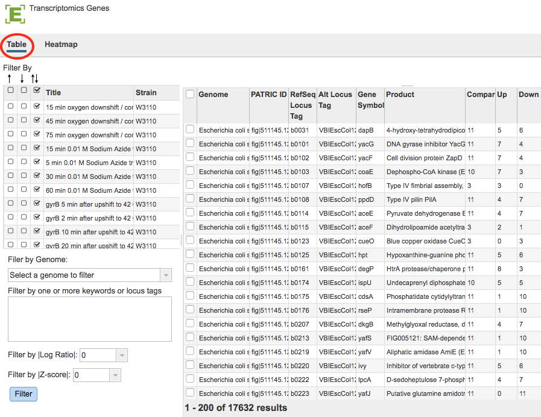

# Transcriptomics Gene List Table

## Overview
A Gene List in PATRIC is a custom user-created list of genes based on the transcriptomics datasets of interest. Each Gene List displays all of the genes present in selected datasets, their functions, and summaries of their expression levels in various samples or comparisons. A Gene List can be dynamically filtered based on the identifiers, product/function, expression levels, or up/down regulation in one or more comparisons. Any subset of genes of interest can be downloaded along with the annotations and expression values as tab-delimited text or Excel file; or saved as a Workspace group for further analysis. A complementary Heatmap Viewer enables quick sorting or clustering of genes and comparisons; and visualization of genes that are similarly expressed across one or more comparisons.

### See also
  * [Examining Transcriptomics Data Tutorial](https://docs.patricbrc.org//tutorial/examining_transcriptomics_data/examining_transcriptomics_data.html)
  * [Transcriptomics Experiments and Comparisons](../organisms_taxon/experiments_comparisons_tables.html)
  * [Transcriptomics Gene Page](../organisms_gene/transcriptomics.html)
  * [Correlated Genes](../organisms_gene/correlated_genes.html)
  * [Expression Data Import Service](../services/expression_data_import_service.html)

## Accessing/Creating Transcriptomics Gene List Table on the PATRIC Website
A Gene List may be accessed while under the Transcriptomics Tab (available on any Taxonomy or Genome level landing page) in the following ways:

* **Clicking the Genes Action Button with one or more rows selected in the Experiments Table:* Opens the Transcriptomics Genes Filter Tool and Table/Heatmap page, loaded with the genes corresponding to the selected experiments. See [Transcriptomics Experiments and Comparisons](../organisms_taxon/experiments_comparisons_tables.html) for more information.

* **Clicking the Genes Action Button with one or more rows selected in the Comparisons Table:* Opens the Transcriptomics Genes Filter Tool and Table/Heatmap page, loaded with the genes corresponding to the selected comparisons. See [Transcriptomics Experiments and Comparisons](../organisms_taxon/experiments_comparisons_tables.html) for more information.

### Gene List Table and Filter
Results will be shown in a Gene List Table and Filter, shown below.

### Gene List Filter Tools
The Filter Tool on the left hand side of the table provides the following functionality:

* **Filter by up- or down-regulation** by clicking the corresponding up, down, or up/down (^, v, or ^v) checkbox beside the condition Title.

* **Filter by Gnome** by selecting a genome in the dropdown list and clicking the Filter Button.

* **Filter by Keyword or Locus Tag** by entering the desired keyword(s) in the text box and clicking the Filter Button.

* **Filter by |Log Ratio|** by selecting a value from the dropdown list and clicking the Filter Button. 

* **Filter by |Z-score|** by selecting a value from the dropdown list and clicking the Filter Button. 

### Gene List Table Tools

The data in the Gene List Table provides summary information for the selected genes including **Genome** name, **PATRIC ID** for the gene, **RefSeq Locus Tag** if available, **Alt**ernate **Locus Tag** if available, **Gene Symbol**, gene **Product**, number of **Comparisons** associated with the gene, number of comparisons with **Up** regulation, number of comparisons with **Down** regulation. 

Within Gene List Table and you may do the following:

* **Sort** the list of genes by clicking on the column headers.

* **Download** the entire contents of the table in CSV (Excel) format by clicking the Download button above the table on the right side.

### Action buttons

After selecting one or more of the genes by clicking the checkbox beside the Genome name in the table, a set of options becomes available in the vertical green Action Bar on the right side of the table.  These include

* **Hide/Show:** Toggles (hides) the right-hand side Details Pane.
* **Download:**  Downloads the selected items (rows).
* **Copy:** Copies the selected items to the clipboard.
* **Feature:** Loads the Feature Page for the selected feature. *Available only if a single feature is selected.*
* **Features:** Loads the Features Table for the selected features. *Available only if multiple features are selected.*
* **Genome:** Loads the Genome View Overview page corresponding to the selected feature.  *Available only if a single feature is selected.*
* **Genomes:** Loads the Genomes Table, listing the genomes that correspond to the selected features. *Available only if multiple features are selected.*
* **FASTA:** Provides the FASTA DNA or protein sequence for the selected feature(s).
* **ID Map:** Provides the option to map the selected feature(s) to multiple other idenfiers, such as RefSeq and UniProt.
* **MSA:** Launches the PATRIC Multiple Sequence Alignment (MSA) tool and aligns the selected features by DNA or protein sequence in an interactive viewer.
* **Pathway:** Loads the Pathway Summary Table containing a list of all the pathways in PATRIC in which the selected features are found.
* **Group:** Opens a pop-up window to enable adding the selected sequences to an existing or new group in the private workspace.

More details are available in the [Action Buttons](../other/action_buttons.html) user guide.
