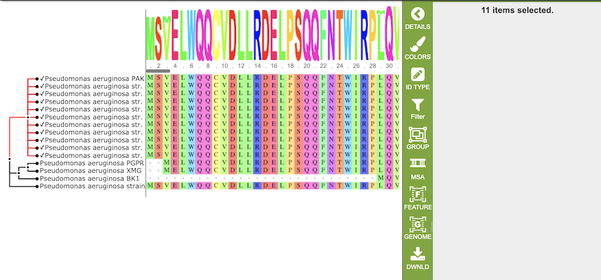

# Mulitiple Sequence Alignment Viewer

## Overview
The Multiple Sequence Alignment (MSA) Viewer provides an interactive visualization of a nucleic acid or amino acid multiple sequence alignment with a linked interactive tree viewer. 

### See also
  * [Features Tab](../organisms_taxon/features.html)

## Accessing the MSA Viewer on the PATRIC Website
The MSA can be accessed by selecting a set of features in the Features Tab or any other table that contains features/genes (nucleotide sequences) or proteins (amino acid sequences), then clicking the MSA button in the vertical green Action Bar to the right of the table, as shown below: 

Results, whether nucleotide or amino acid, will be shown in the MSA Viewer, as shown in the figures below:

**Nucleotide MSA**

**Amino Acid MSA**

## Features and Functionality

The visualization has 3 main components:
  1. Gene tree on the left-hand side that is constructed based on the alignment
  2. Sequence logo across the top wherein the hight of the letter corresponds to the amount of conservation of the corresponding nucleotide or amino acid
  3. The multiple sequence alignment in the main body of the visualization.

### Gene tree
The gene tree on the left-hand side is generated using FastTree (Price 2009) and Gblocks (Castresana 2002). Clicking on a single sequence item in the tree selects that item, as indicated with a small check mark and a red line in the tree branch.  A set of corresponding actions becomes available in the vertical green Action Bar on the right side of the visualization.  Also, additional information and metadata about the selected item will be displayed in the information panel on the far right.  See figure below.

Clicking on a node in the treee selects all items in that branch, as indicated by check marks and red lines in that branch of the tree. 

### Sequence Logo

### Multiple Sequence Alignment

### Action buttons

After selecting one or more of the experiments by clicking the checkbox beside the Title column in the table, a set of options becomes available in the vertical green Action Bar on the right side of the table.  These include

* **Hide/Show:** Toggles (hides) the right-hand side Details Pane.
* **Download:**  Downloads the selected items (rows).
* **Copy:** Copies the selected items to the clipboard.
* **Feature:** Loads the Feature Page for the selected feature. *Available only if a single feature is selected.*
* **Features:** Loads the Features Table for the selected features. *Available only if multiple features are selected.*
* **Genome:** Loads the Genome View Overview page corresponding to the selected feature.  *Available only if a single feature is selected.*
* **Genomes:** Loads the Genomes Table, listing the genomes that correspond to the selected features. *Available only if multiple features are selected.*
* **FASTA:** Provides the FASTA DNA or protein sequence for the selected feature(s).
* **ID Map:** Provides the option to map the selected feature(s) to multiple other idenfiers, such as RefSeq and UniProt.
* **MSA:** Launches the PATRIC Multiple Sequence Alignment (MSA) tool and aligns the selected features by DNA or protein sequence in an interactive viewer.
* **Pathway:** Loads the Pathway Summary Table containing a list of all the pathways in PATRIC in which the selected features are found.
* **Group:** Opens a pop-up window to enable adding the selected sequences to an existing or new group in the private workspace.## References
* Castresana, J. (2002). Gblocks, v. 0.91 b. Online version available at: http://molevol. cmima. csic. es/castresana. Gblocks_server. html.
* Edgar, R.C. (2004) MUSCLE: multiple sequence alignment with high accuracy and high throughput
  Nucleic Acids Res. 32(5):1792-1797.
* Price, M. N., Dehal, P. S., & Arkin, A. P. (2009). FastTree: computing large minimum evolution trees with profiles instead of a distance matrix. Molecular biology and evolution, 26(7), 1641-1650.

