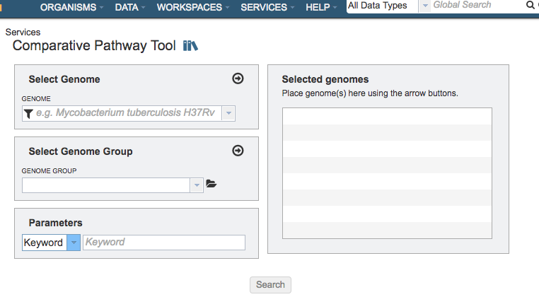

# Comparative Pathway Service

## Overview
The Comparative Pathway Service allows users to identify a set of pathways based on taxonomy, EC number, pathway ID, pathway name and/or specific annotation type. 

### See also
* [Comparative Pathway Service](https://patricbrc.org/app/ComparativePathway)
* [Comparing Pathways Across Genomes Tutorial](https://docs.patricbrc.org//tutorial/comparative_pathways/comparative_pathways.html)
* [Comparative Pathway Tool User Guide](../organisms_taxon/pathways.html)

## Using the Comparative Pathway Service
The **Comparative Pathway** submenu option under the **Services** main menu (Metabolomics category) opens the Comparative Pathway input form (*shown below*).

## Options
 

## Select Genome
Input box for selecting genomes to include in the comparison. Click the arrow icon (->) to add to the set of Selected Genomes.

## Select Genome Group
Input box for selecting genome group(s) to include in the comparison.  Click the folder icon to navigate through the workspace to locate the genome group(s) of interest. Click the arrow icon (->) to add to the set of Selected Genomes. *Note: You must be logged into PATRIC to access genome groups in your private workspace.*

## Selected Genomes
List of genomes or genome groups that will be used in the comparison

## Parameters

### Keyword
Dropdown list of filter options to use refine the results. A specific keyword, Pathway ID, or EC Number can be used as a filter. 

## Buttons

### Search
Launches the Comparative Pathway Service and, upon completion, displays a page in PATRIC showing all the pathways that have any genes assigned to them from the genomes that have been chosen.

## Output Results
Results from the service will be shown in a table in the Pathways Tab, shown below. See [Protein Families Tab](../organisms_taxon/pathways.html) for a detailed description of how to use the Pathway filters, KEGG maps, and heatmap.

