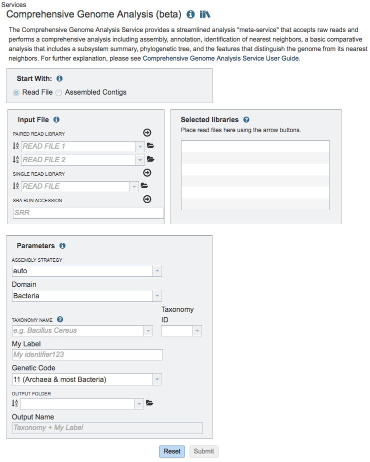

# Comprehensive Genome Analysis Service

## Overview
The Comprehensive Genome Analysis Service provides a streamlined analysis **"meta-service"** that accepts raw reads and performs a comprehensive analysis including assembly, annotation, identification of nearest neighbors, a basic comparative analysis that includes a subsystem summary, phylogenetic tree, and the features that distinguish the genome from its nearest neighbors.

### See also
  * [Genome Assembly Service](./genome_assembly_service.html)
  * [Genome Annotation Service](./genome_annotation_service.html)
  * [Phylogenetic Tree Building Service](./phylogenetic_tree_building_service.html)

## Using the Comprehensive Genome Analysis Service
The **Comprehensive Genome Analysis** submenu option under the **Services** main menu (Genomics category) opens the Comprehensive Genome Analysis input form (shown below). *Note: You must be logged into PATRIC to use this service.*

## Options
 

## Start with
The service can accept either read files or assembled contigs. If the "Read Files" option is selected, the Assembly Service will be invoked automatically to assemble the reads into contigs before invoking the Annotation Service. If the "Assembled Contigs" option is chosen, the Annotation Service will automatically be invoked, bypassing the Assembly Service.

## Read Input File
Depending on the option chosen above (Read File or Assembled Contigs), the Input File section will request read files or assembled contigs, respectively.

### Paired read library
**Read File 1 & 2:**  Many paired read libraries are given as file pairs, with each file containing half of each read pair. Paired read files are expected to be sorted such that each read in a pair occurs in the same Nth position as its mate in their respective files. These files are specified as READ FILE 1 and READ FILE 2. For a given file pair, the selection of which file is READ 1 and which is READ 2 does not matter.

### Single read library
**Read File:** The fastq file containing the reads.

### SRA run accession
Allows direct upload of read files from the [NCBI Sequence Read Archive](https://www.ncbi.nlm.nih.gov/sra) to the PATRIC Assembly Service. Entering the SRR accession number and clicking the arrow will add the file to the selected libraries box for use in the assembly. 

## Selected libraries
Read files placed here will contribute to a single assembly.

## Parameters

### Assembly Strategy
*Note: Available only when "Read File" is selected above.*

#### auto
  * For short reads:
    1. Runs BayesHammer on reads
    2. Assembles with Velvet, IDBA and SPAdes
    3. Sorts assemblies by ARAST quality score

  * For long reads (PacBio or Nanopore):
    1. Assembles with MiniASM

#### fast
  1. Assembles with MEGAHIT and Velvet.
  2. Results are sorted by ARAST quality score.

#### full_spades
1. Runs BayesHammer on reads
2. Assembles with SPAdes.

#### kiki
1. Runs the Kiki assembler

#### miseq
1. Runs Velvet with hash length 35.
2. Runs BayesHammer on reads and assembles with SPAdes with k up to 99.
3. Results are sorted by ARAST quality score.
4. Works for Illumina MiSeq reads.

#### plasmid
1. Runs BayesHammer on reads and assembles with plasmidSPAdes.

#### smart
- For short reads:
  1. Runs BayesHammer on reads, Kmergenie to choose hash-length for Velvet
  2. Assembles with Velvet, IDBA and SPAdes
  3. Sorts assemblies by ALE score
  4. Merges the two best assemblies with GAM-NGS

- For long reads (PacBio or Nanopore):
  1. Assembles with MiniASM

### Domain
The taxonomic domain of the target organism: bacteria or archaea.

### Taxonomy Name
Taxon must be specified at the genus level or below to get the latest
protein family predictions.

### Taxonomy ID
Auto-populated after entering Taxonomy Name. If a Taxonomy ID is entered, auto-populates the Taxonomy Name 

### Genetic Code
The codon translation used in calling genes.

### Output Folder
The workspace folder where results will be placed.

### Output Name
Name used to uniquely identify results.
