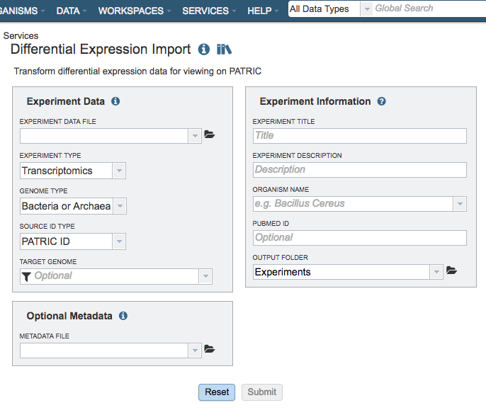
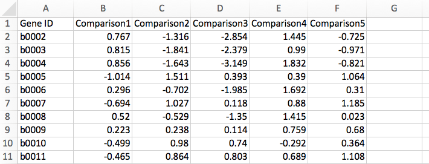
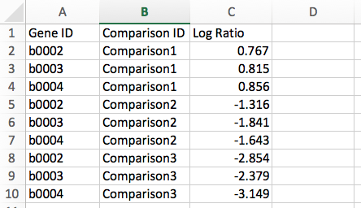

# Expression Data Import Service

## Overview
The Differential Expression Import Service facilitates upload of user-provided, pre-processed differential expression datasets generated by microarray, RNA-Seq, or proteomic technologies to the user's private workspace. From there the data sets can be analyzed using annotations and analysis tools for comparison with other expression data sets in PATRIC. Currently, PATRIC only supports differential gene expression data in the form of log ratios, generated by comparing samples/conditions/time points.

### See also
  * [Expression Import Service](https://patricbrc.org/app/Expression)
  * [Expression Import Service Tutorial](https://docs.patricbrc.org/tutorial/expression_import/expression_import.html)

## Using the Expression Import Service
The **Expression Import** submenu option under the **Services** main menu (Transcriptomics category) opens the Expression Import input form (*shown below*). *Note: You must be logged into PATRIC to use this service.* The Expression Data Import Service can also be accessed via the PATRIC Command Line Interface (CLI).

## Options
 

## Data information

### Experiment Data File
Allows upload a data file containing differential gene expression values in the form of log ratios. The file should be in one of the supported formats described below. Optionally, you may also upload metadata related to sample comparisons in the prescribed format to provide additional context for data analysis. See Optional Metadata.

**File Format:**  Currently, PATRIC allows you to upload your transcriptomics datasets in
the form of differential gene expression measured as log ratios. Data can be uploaded in multiple file formats: comma separated values (.csv), tab delimited values (.txt), or Excel (.xls or .xlsx). Click to download the [Sample Data template](https://docs.patricbrc.org/_static/Sample-Genes.xlsx) in Gene Matrix Format.
Files should contain data in one of the following formats:

*Gene Matrix:* Gene IDs are represented in the first column with extra columns for each of the comparisons in the form of log ratio, i.e., log2(test/control). Below is an example of transcriptomics data in Gene Matrix format:

*Gene List:* Data are represented in three columns: Gene ID, Comparison ID, and Log Ratio of expression value, i.e., log2(test/control). Below is an example of transcriptomics data in Gene List format:

### Experiment Type
Dropdown list specifying the the experiment type, either Transcriptomics, Proteomics, or Phenomics.

### Genome Type
Option for specifying if the data set is for bacteria/archea, or alternatively, eukaryotic host. 

### Source ID Type
Dropdown list for specifying the source ID type, e.g., PATRIC ID, NCBI Gene ID, RefSeq Locus Tag. Used to map genes to genes in PATRIC, allowing integration of other PATRIC data in PATRIC into the analysis. Due to differences in annotation that may exist, some genes may go unmapped. Unmapped genes will be excluded from subsequent analysis.

**Supported IDs:**
1. RefSeq Locus Tag
2. PATRIC Feature ID
3. NCBI GI Number
4. NCBI Protein ID
5. SEED ID
6. PATRIC Legacy ID

### Target Genome
Option for mapping the expression data to a particular genome in PATRIC.  This will facilitate inclusion of other expression data in PATRIC for that genome in subsequent analysis.

## Experiment Information
Metadata to specify the experiment title, description, organism, and Pubmed ID (optional) for providing contextual information for the uploaded data in PATRIC. 

### Experiment Title
Title for the experiment (required).

### Experiment Description
Description of the experiment (required).

### Organism Name
Taxonomic name of the organism associated with the uploaded data.

### Pubmed ID
Pubmed ID associated with the uploaded data, if available (optional).

### Output Folder
Folder in the Workspace where the uploaded data file will be located.  The default is /home/Experiments.

## Optional Metadata
Allows upload of an additional file containing key metadata attributes about the comparisons. This will enhance your analysis when using the heatmap and clustering tools. The metadata table can be uploaded as a tab/comma-delimited or Excel file. *Note: The column names should be the same as in the example template. Also, comparison IDs in
the metadata file should match those in the data file.* Click to download the [Metadata Template](https://docs.patricbrc.org/_static/Sample-Metadata.xlsx).

## Buttons
**Reset:** Resets the input form to default values.

**Submit:** Starts the upload.
