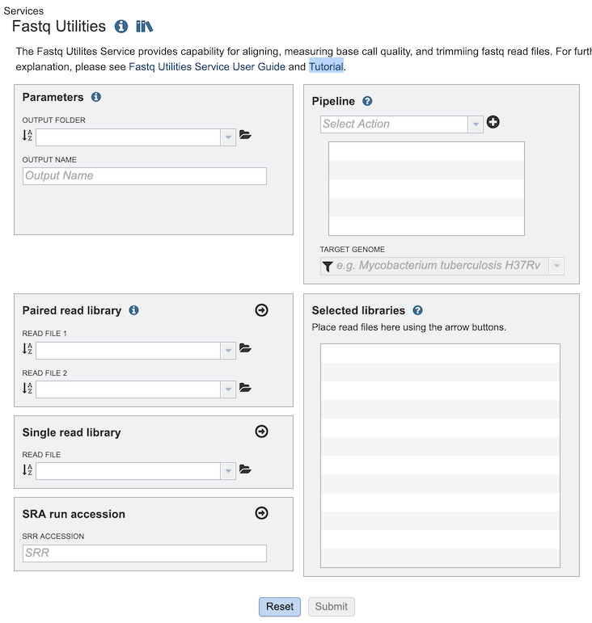
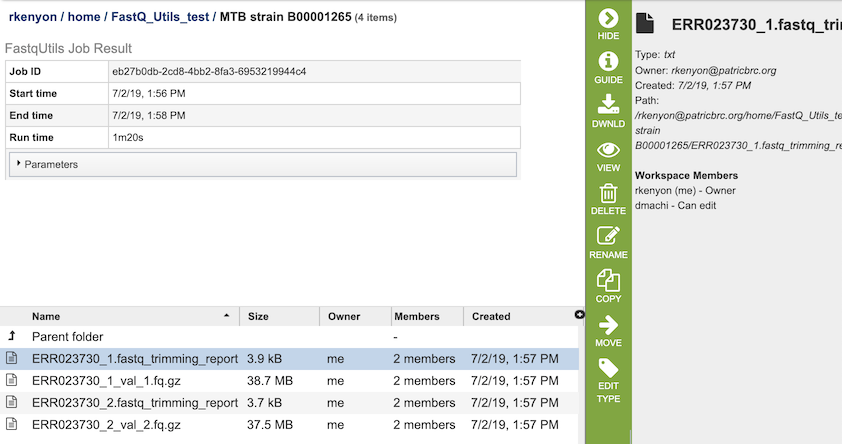

# Fastq Utilities Service

## Overview
The Fastq Utilities Service provides the capability for aligning, measuring base call quality, and trimming fastq read files to estimate quality. Fastq reads (paired-or single-end, long or short, zipped or not), as well as Sequence Read Archive accession numbers are supported.  The three components (trim, fastqc and align) can be used independently, or in any combination.

### See also
* [Fastq Utilities Service](https://patricbrc.org/app/FastqUtil)
* [Fastq Utilities Service Tutorial](https://docs.patricbrc.org/tutorial/rna_seq_submission/submitting_fastq_utilites.html)

## Using the Fastq Utilities Service
The **Fastq Utilities** submenu option under the **Services** main menu (Genomics category) opens the Fastq Utilities input form (*shown below*). *Note: You must be logged into PATRIC to use this service.*

## Options
 

## Parameters

**Output Folder:** The workspace folder where results will be placed.

**Output Name:** User-provided name used to uniquely identify results.

## Pipeline

**Select Action** Dropdown box with options for specifying the steps for processing the reads.  Each step can be added in any desired order:

  * Trim - Uses Trim Galore to find and remove adapters, leaving the relevant part of the read.
  * Fastqc - Uses FastQC to do quality checks on the raw sequence data.
  * Align - Aligns genomes using Bowtie2 to generate BAM files, saving unmapped reads, and generating SamStat reports of the amount and quality of alignments.

## Paired read library

**Read File 1 & 2:**  Many paired read libraries are given as file pairs, with each file containing half of each read pair. Paired read files are expected to be sorted such that each read in a pair occurs in the same Nth position as its mate in their respective files. These files are specified as READ FILE 1 and READ FILE 2. For a given file pair, the selection of which file is READ 1 and which is READ 2 does not matter.

## Single read library

**Read File:**
The fastq file containing the reads

## SRA run accession
Allows direct upload of read files from the [NCBI Sequence Read Archive](https://www.ncbi.nlm.nih.gov/sra) to the service. Entering the SRR accession number and clicking the arrow will add the file to the selected libraries box for use in the service. 

## Selected libraries
Read files placed here will contribute to a single assembly.

## Buttons

**Reset:** Clicking this button resets the input form to default values

**Assemble:** Clicking this button launches the assembly job.

## Output Results

### Trim
 

The Trim option generates several files that are deposited in the Private Workspace in the designated Output Folder. These include, for each read file, 

* **xxx.fastq_trimming_report.txt** - Report file with information on parameters used, adaptor sequences found, reads / base pairs processed, removed sequences, and statistics.
* **xxx_val_1.fq.gz** - trimmed read files.

### Action buttons
After selecting one of the output files by clicking it, a set of options becomes available in the vertical green Action Bar on the right side of the table.  These include

* **Hide/Show:** Toggles (hides) the right-hand side Details Pane.
* **Guide** Link to the corresponding User Guide
* **Download:**  Downloads the selected item.
* **View** Displays the content of the file, typically as plain text or rendered html, depending on filetype.
* **Delete** Deletes the file.
* **Rename** Allows renaming of the file.
* **Copy:** Copies the selected items to the clipboard.
* **Move** Allows moving of the file to another folder.
* **Edit Type** Allows changing of the type of the file in terms of how PATRIC interprets the content and uses it in other services or parts of the website.  Allowable types include unspecified, contigs, nwk, reads, differential expression input data, and differential expression input metadata.

More details are available in the [Action Buttons](../action_buttons.html) user guide.

## References
