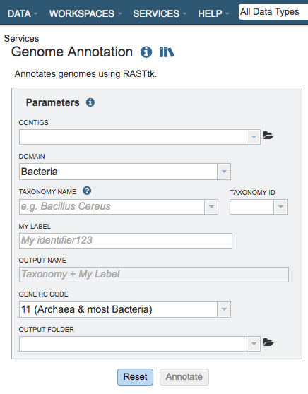

# Genome Annotation Service

## Overview
The Genome Annotation Service uses the RAST tool kit, [RASTtk](https://www.ncbi.nlm.nih.gov/pmc/articles/PMC4322359/), to provide annotation of genomic features. Once the annotation process has started by clicking the Annotate button, the genome is queued as a "job" for the Annotation Service to process, and will increment the count in the Jobs information box on the bottom right of the page. Once the annotation job has successfully completed, the output file will appear in the workspace, available for use in the PATRIC comparative tools and downloaded if desired.

### See also
* [Genome Annotation Service](https://patricbrc.org/app/Annotation)
* [Genome Annotation Service Tutorial](https://docs.patricbrc.org/tutorial/genome_annotation/annotation.html)

## Using the Genome Annotation Service
The **Annotation** submenu option under the **Services** main menu (Genomics category) opens the Genome Annotation input form (*shown below*). *Note: You must be logged into PATRIC to use this service.*

*Note:* RASTtk also accommodates the batch submission of genomes and the ability to customize annotation protocols for batch submissions, available via the PATRIC Command Line Interface (CLI).

## Parameters

**Contigs:** The target FASTA file containing the genome sequence to annotate.

**Domain** The taxonomic domain of the target organism: bacteria or
archaea.

**Taxonomy Name:** The user-entered or selected taxonomic name for the organism. If the target species or strain is not listed, select the most specific, accurate taxonomic level available. 

**My Label:** The user-provided name to identify the annotation result.

**Output Name:** The taxonomy name concatenated with the chosen label.  This name will appear in the workspace when the annotation job is complete.

**Genetic Code:** The codon translation used in calling genes.

**Output Folder:** The workspace folder where results will be placed.

## Taxon information
Taxon must be specified at the genus level or below to get the latest
protein family predictions.

## Buttons

**Reset:** Resets the input form to default values

**Assemble:** Launches the assembly job.
