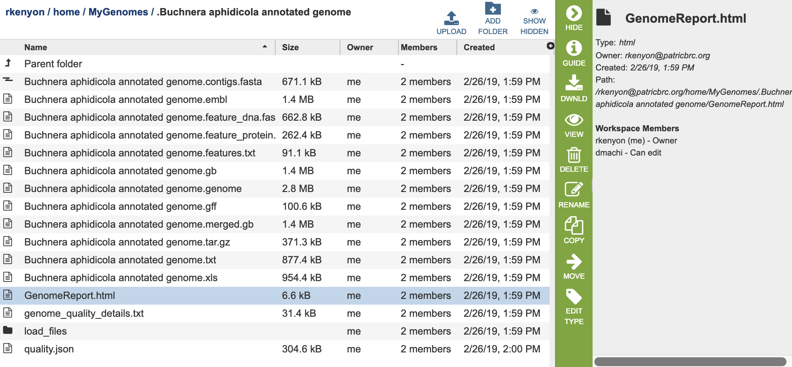

# Genome Annotation Service

## Overview
The Genome Annotation Service uses the RAST tool kit, [RASTtk](https://www.ncbi.nlm.nih.gov/pmc/articles/PMC4322359/), to provide annotation of genomic features. Once the annotation process has started by clicking the Annotate button, the genome is queued as a "job" for the Annotation Service to process, and will increment the count in the Jobs information box on the bottom right of the page. Once the annotation job has successfully completed, the output file will appear in the workspace, available for use in the PATRIC comparative tools and downloaded if desired.

### See also
* [Genome Annotation Service](https://patricbrc.org/app/Annotation)
* [Genome Annotation Service Tutorial](https://docs.patricbrc.org/tutorial/genome_annotation/annotation.html)

## Using the Genome Annotation Service
The **Annotation** submenu option under the **Services** main menu (Genomics category) opens the Genome Annotation input form (*shown below*). *Note: You must be logged into PATRIC to use this service.*

*Note:* RASTtk also accommodates the batch submission of genomes and the ability to customize annotation protocols for batch submissions, available via the PATRIC Command Line Interface (CLI).

## Parameters

**Contigs:** The target FASTA file containing the genome sequence to annotate.

**Domain** The taxonomic domain of the target organism: bacteria or
archaea.

**Taxonomy Name:** The user-entered or selected taxonomic name for the organism. If the target species or strain is not listed, select the most specific, accurate taxonomic level available. 

**My Label:** The user-provided name to identify the annotation result.

**Output Name:** The taxonomy name concatenated with the chosen label.  This name will appear in the workspace when the annotation job is complete.

**Genetic Code:** The codon translation used in calling genes.

**Output Folder:** The workspace folder where results will be placed.

## Taxon information
Taxon must be specified at the genus level or below to get the latest
protein family predictions.

## Buttons

**Reset:** Resets the input form to default values

**Annotate:** Launches the annotation job. A message will appear below the box to indicate that the job is now in the queue.

## Results
Clicking on the Jobs indicator at the bottom of the PATRIC page open the Jobs Status page that displays all current and previous service jobs and their status. 

Once the job has completed, selecting the job by clicking on it and clicking the "View" button on the green vertical Action Bar on the right-hand side of the page displays the results files.

The results page will consist of a header describing the job and a list of output files,
as shown below.

The Genome Annotation Service generates several files that are deposited in the Private Workspace in the designated Output Folder. These include

* **contigs.fasta** - contains the assembled contigs of the genome in DNA FASTA format.
* **embl** - contains an EMBL dump of the annotated genome.
* **feature_dna.fasta** - contains all the feature sequences of the genome in DNA FASTA format.
* **feature_protein.fasta** - contains all the protein sequences of the genome in protein FASTA format.
* **features.txt** - is a tab-delimited text file listing all the features of the genome. For each feature, it contains the PATRIC ID, the location string, the feature type, the functional assignment, any alternated IDs found, and (for protein-coding genes) the protein MD5 checksum.
* **.gb** - contains the annotated genome in GENBANK format.
* **.genome** - contains a special "Genome Typed Object (GTO)" JSON-format file that encapsulates all the data from the annotated genome. See [Extracting and Mining Genome Typed Objects](https://docs.patricbrc.org/cli_tutorial/cli_getting_started.html#extracting-and-mining-genome-typed-objects-gtos) for more information.
* **.gff** - lists all the features of the genome in General Feature Format.
* **GenomeReport.html** - contains summary report of the genome qualtiy, described in [Analyzing Genome Quality](/tutorial/genome_quality_report/genome_quality_report.html). Also contains a link to the genome in the PATRIC Genome Browser.
* **.tar.gz** - a compressed tarfile of the SEED form of the exported genome
* **.txt** - plain text form of the features in the genome
* **.xls** - Excel tabular form of the features in the genome
* **load_files** - folder containing the data files as imported into the backend Solr database
* **quality.json** - result of the genome quality analysis in JSON format.

### Action buttons
After selecting one of the output files by clicking it, a set of options becomes available in the vertical green Action Bar on the right side of the table.  These include

* **Hide/Show:** Toggles (hides) the right-hand side Details Pane.
* **Guide** Link to the corresponding User Guide
* **Download:**  Downloads the selected item.
* **View** Displays the content of the file, typically as plain text or rendered html, depending on filetype.
* **Delete** Deletes the file.
* **Rename** Allows renaming of the file.
* **Copy:** Copies the selected items to the clipboard.
* **Move** Allows moving of the file to another folder.
* **Edit Type** Allows changing of the type of the file in terms of how PATRIC interprets the content and uses it in other services or parts of the website.  Allowable types include unspecified, contigs, nwk, reads, differential expression input data, and differential expression input metadata.

More details are available in the [Action Buttons](../action_buttons.html) user guide.

## References
1. Brettin T, Davis JJ, Disz T, Edwards RA, Gerdes S, Olsen GJ, Olson R, Overbeek R, Parrello B, Pusch GD, Shukla M, Thomason JA 3rd, Stevens R, Vonstein V, Wattam AR, Xia F. (2015). RASTtk: a modular and extensible implementation of the RAST algorithm for building custom annotation pipelines and annotating batches of genomes. Scientific reports 5: 8365.

