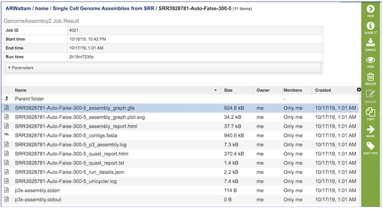

# Genome Assembly Service (Revised Service Dec 2019)

## Overview
The Genome Assembly Service allows single or multiple assemblers to be invoked to compare results. The service attempts to select the best assembly, i.e., assembly with the smallest number of contigs and the longest average contig length. Several assembly workflows or "recipes" are available that have been tuned to fit certain data types or desired analysis criteria such as throughput or rigor. Once the assembly process has started by clicking the Assemble button, the genome is queued as a "job" for the Assembly Service to process, and will increment the count in the Jobs information box on the bottom right of the page. Once the assembly job has successfully completed, the output file will appear in the workspace, available for use in the PATRIC comparative tools and downloaded if desired.

### See also
* [Genome Assembly Service](https://patricbrc.org/app/Assembly2)
* [Genome Assembly Service Tutorial](https://docs.patricbrc.org/tutorial/genome_assembly/assembly2.html)

## Using the Genome Assembly Service
The **Assembly** submenu option under the **Services** main menu (Genomics category) opens the Genome Assembly input form (*shown below*). *Note: You must be logged into PATRIC to use this service.*

## Options
 

## Selected libraries
Read files placed here will contribute to a single assembly.

## Paired read library

**Read File 1 & 2:**  Many paired read libraries are given as file pairs, with each file containing half of each read pair. Paired read files are expected to be sorted such that each read in a pair occurs in the same Nth position as its mate in their respective files. These files are specified as READ FILE 1 and READ FILE 2. For a given file pair, the selection of which file is READ 1 and which is READ 2 does not matter.

**Advanced:**
  * File 1 Interleaved - Some paired libraries are available in a single file where each read in a pair occurs in succession. To specify such a file set this parameter to 'True'.
  
  * Mate Paired- Defines the orientation of read pairs. Setting Mate Paired to true indicates that the sequencing direction of the two reads in each pair is outward facing.
  
  * Platform - The sequencing platform used for each library.
    * Infer Platform: Infer sequencing platform from read files
    * Illumina: Illumina short reads
    * Ion Torrent: Ion Torrent short reads

## Single read library

**Read File:**
The fastq file containing the reads

**Advanced:**

  * Platform - The sequencing platform used for each library.
    * Infer Platform: Infer sequencing platform from read files
    * Illumina: Illumina short reads
    * Ion Torrent: Ion Torrent short reads
    * PacBio: PacBio long reads
    * Nanopore: MinION long reads

## SRA run accession
Allows direct upload of read files from the [NCBI Sequence Read Archive](https://www.ncbi.nlm.nih.gov/sra) to the PATRIC Assembly Service. Entering the SRR accession number and clicking the arrow will add the file to the selected libraries box for use in the assembly. 

## Parameters

**Assembly Strategy:**
  * Auto - Will use Canu if only long reads are submitted. If long and short reads, as or short reads alone are submitted, Unicycler is selected.
  
  * Unicycler - Can assemble Illumina-only read sets where it functions as a SPAdes-optimizer. It can also assembly long-read-only sets (PacBio or Nanopore) where it runs a miniasm plus Racon pipeline. For the best possible assemblies, give it both Illumina reads and long reads, and it will conduct a hybrid assembly.

  * SPAdes - Designed to assemble small genomes, such as those from bacteria, and uses a multi-sized De Bruijn graph to guide assembly.

  * Canu - Long-read assembler which works on both third and fourth generation reads. It is a successor of the old Celera Assembler that is specifically designed for noisy single-molecule sequences. It supports nanopore sequencing, halves depth-of-coverage requirements, and improves assembly continuity. It was designed for high-noise single-molecule sequencing (such as the PacBio RS II/Sequel or Oxford Nanopore MinION).

  * metaSPAdes - Combines new algorithmic ideas with proven solutions from the SPAdes toolkit to address various challenges of metagenomic assembly.

  * plasmidSPAdes - For assembling plasmids from whole genome sequencing data and benchmark its performance on a diverse set of bacterial genomes.

  * MDA (single-cell) - A new assembler for both single-cell and standard (multicell) assembly, and it improves on the recently released E+V−SC assembler (specialized for single-cell data).

 
**Output Folder:** The workspace folder where results will be placed.

**Output Name:** User-provided name used to uniquely identify results.

**Benchmark Contigs:** This optional parameter can be used to specify a FASTA contigs file to evaluate the assembly against.

## Advanced

**Trim reads before assembly:** Trim reads using TrimGalore (True/False)

**Racon iternations** and **Pilon iterations:** Correct assembly errors (or “polish") using racon and/or Pilon. Both racon and Pilon take the contigs and the reads mapped to those contigs, and look for discrepancies between the assembly and the majority of the reads.  Where there is a discrepancy, racon or pilon will correct the assembly if the majority of the reads call for that.  Racon is for long reads (PacBio or Nanopore) and Pilon is for shorter reads (Illumina or Ion Torrent).  Once the assembly has been corrected with the reads, it is still possible to do another iteration to further improve the assembly, but each one takes time. 

**Minimal output contig length:**  Filter out short contigs in final assembly

**Minimal output contig coverage:** Filter out contigs with low read depth in final assembly

## Buttons

**Reset:** Clicking this button resets the input form to default values

**Assemble:** Clicking this button launches the assembly job.

## Output Results
 

The Genome Assembly Service generates several files that are deposited in the Private Workspace in the designated Output Folder. These include

* **assembly_graph.gfa.** - File used to generate the assembly graph plot.
* **assembly_graph.plot.svg** - Image file containing assembly graph shown as a Bandage plot.
* **assembly_report.html** - Web-viewable report of the assembly including information about the submitted reads and assembly process used.
* **contigs.fasta** - File containig contigs for best assembly.
* **p3_assembly.log** - Log file providing steps used in the assembly.
* **quast_report.html** - Web-viewable Quast-generated report providing evaluation information, summary tables, and plots regarding the assembly.
* **quast_report.txt** - Text version of the Quast report.
* **run_details.json** - Json-formatted file containing information about the assembly process.
* **unicycler.log** - Log file generated by the Unicycler assembly .
* **p3x-assembly.stderr** - Standard error file generated by the assembly job process.
* **p3x-assembly.stdout** - Standard output file generated by the assembly job process.

### Action buttons
After selecting one of the output files by clicking it, a set of options becomes available in the vertical green Action Bar on the right side of the table.  These include

* **Hide/Show:** Toggles (hides) the right-hand side Details Pane.
* **Guide** Link to the corresponding User Guide
* **Download:**  Downloads the selected item.
* **View** Displays the content of the file, typically as plain text or rendered html, depending on filetype.
* **Delete** Deletes the file.
* **Rename** Allows renaming of the file.
* **Copy:** Copies the selected items to the clipboard.
* **Move** Allows moving of the file to another folder.
* **Edit Type** Allows changing of the type of the file in terms of how PATRIC interprets the content and uses it in other services or parts of the website.  Allowable types include unspecified, contigs, nwk, reads, differential expression input data, and differential expression input metadata.

More details are available in the [Action Buttons](../action_buttons.html) user guide.

## References
1.	Wick, R.R., et al., Unicycler: resolving bacterial genome assemblies from short and long sequencing reads. PLoS computational biology, 2017. 13(6): p. e1005595.
2.	Bankevich, A., et al., SPAdes: a new genome assembly algorithm and its applications to single-cell sequencing. Journal of computational biology, 2012. 19(5): p. 455-477.
3.	Koren, S., et al., Canu: scalable and accurate long-read assembly via adaptive k-mer weighting and repeat separation. Genome research, 2017. 27(5): p. 722-736.
4.	Nurk, S., et al., metaSPAdes: a new versatile metagenomic assembler. Genome research, 2017. 27(5): p. 824-834.
5.	Antipov, D., et al., plasmidSPAdes: assembling plasmids from whole genome sequencing data. bioRxiv, 2016: p. 048942.
6.	Krueger, F., Trim Galore: a wrapper tool around Cutadapt and FastQC to consistently apply quality and adapter trimming to FastQ files, with some extra functionality for MspI-digested RRBS-type (Reduced Representation Bisufite-Seq) libraries. URL http://www. bioinformatics. babraham. ac. uk/projects/trim_galore/.(Date of access: 28/04/2016), 2012.
7.	Wick, R.R., et al., Bandage: interactive visualization of de novo genome assemblies. Bioinformatics, 2015. 31(20): p. 3350-3352.
8.	Gurevich, A., et al., QUAST: quality assessment tool for genome assemblies. Bioinformatics, 2013. 29(8): p. 1072-1075.
