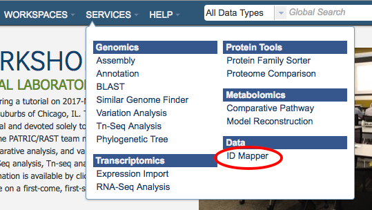

# ID Mapper

## Overview
The ID Mapper tool maps PATRIC identifiers to those from other prominent external databases such as GenBank, RefSeq, EMBL, UniProt, KEGG, etc. Alternatively, it can map a list of external database identifiers to the corresponding PATRIC features. 

## ID Mapping Sources
  * First, PATRIC CDSs (protein coding genes) are mapped to
    corresponding CDSs in RefSeq/GenBank by matching their stop position
    on genome sequences.
  * Second, RefSeq/GenBank CDSs are mapped to corresponding UniProtKB
    Accession.
  * Third, mappings are extended to other prominent external database
    identifiers using [UniProt's ID Mapping Service](http://www.uniprot.org/mapping/).

PATRIC <-> RefSeq/GenBank <-> UniProtKB Accession <-> Other External Databases

## Using the ID Mapper Tool
The **ID Mapper** submenu option under the **Services** main menu option opens the ID Mapper input form (*shown below*). *Note: You must be logged into PATRIC to use this tool.*

## Options
 

### From IDs
(1) This dropdown list selects which ID type (PATRIC, RefSeq, Uniprot-KB, etc.) to map from (source).

### To IDs
(2) This dropdown list selects which ID type (PATRIC, RefSeq, Uniprot-KB, etc.) to map to (target). 

### PATRIC Feature Strategy
(3) This tool uses the Uniprot-KB mapping table to map external IDs to PATRIC. This is done using NCBI IDs. Due to updates over time some NCBI IDs may achieve better mapping results than others. 

### Feature ID Input Box
(4) This is the input box for specifying the IDs to map.  The IDs can be specified in a comma-separated or one-per-line list.

### Map Button
(5) Clicking this button brings up a table below it containing all the matching items (e.g., features, genomes, etc.) that map to the list of IDs provided.
