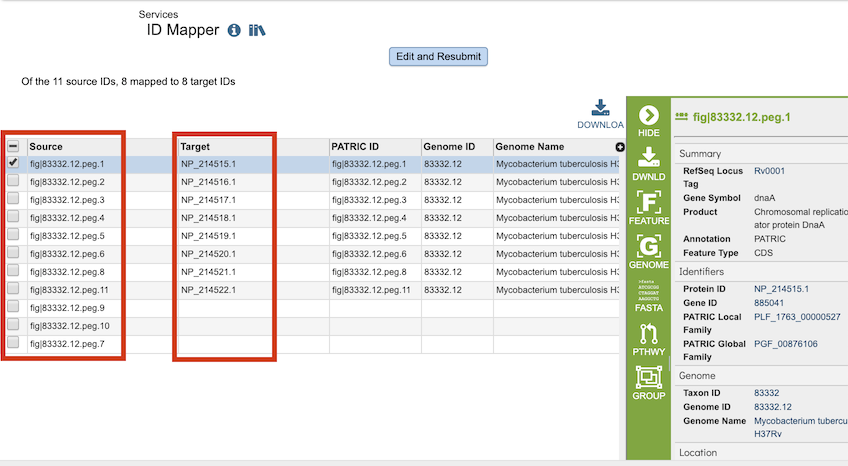

# ID Mapper

## Overview
The ID Mapper tool maps PATRIC identifiers to those from other prominent external databases such as GenBank, RefSeq, EMBL, UniProt, KEGG, etc. Alternatively, it can map a list of external database identifiers to the corresponding PATRIC features. 

### See also
* [ID Mapper Service](https://patricbrc.org/app/IDMapper)

## ID Mapping Sources
  * First, PATRIC CDSs (protein coding genes) are mapped to
    corresponding CDSs in RefSeq/GenBank by matching their stop position
    on genome sequences.
  * Second, RefSeq/GenBank CDSs are mapped to corresponding UniProtKB
    Accession.
  * Third, mappings are extended to other prominent external database
    identifiers using [UniProt's ID Mapping Service](http://www.uniprot.org/mapping/).

PATRIC <-> RefSeq/GenBank <-> UniProtKB Accession <-> Other External Databases

## Using the ID Mapper Tool
The **ID Mapper** submenu option under the **Services** main menu (Data category) opens the ID Mapper input form (*shown below*). *Note: You must be logged into PATRIC to use this tool.*

## Options
 

**From:** Dropdown list for electing which ID type (PATRIC, RefSeq, Uniprot-KB, etc.) to map from (source).

**To:** Dropdown list for selecting which ID type (PATRIC, RefSeq, Uniprot-KB, etc.) to map to (target). 

**IDs:** Input box for specifying the IDs to map.  The IDs can be specified in a comma-separated or one-per-line list.

### PATRIC Feature Strategy 
This tool uses the Uniprot-KB mapping table to map external IDs to PATRIC. This is done using NCBI IDs. Due to updates over time some NCBI IDs may achieve better mapping results than others. 

## Buttons
**Map:** Launches the mapping service, which, upon completion, displays a table below it 

## Output Results
 

The ID Mapper Service generates a table containing all the matching items (e.g., features, genomes, etc.) that map to the list of IDs provided. The input IDs appear in the Source column and matching IDs in the Target column. Every feature may not have a matching ID in the target ID type.

### Action buttons
After selecting one of the output features by clicking it, a set of options becomes available in the vertical green Action Bar on the right side of the table.  These include

* **Hide/Show:** Toggles (hides) the right-hand side Details Pane.
* **Download:**  Downloads the selected items (rows).
* **Copy:** Copies the selected items to the clipboard.
* **FASTA:** Provides the FASTA DNA or protein sequence for the selected feature(s).
* **ID Map:** Provides the option to map the selected feature(s) to multiple other idenfiers, such as RefSeq and UniProt.
* **MSA:** Launches the PATRIC Multiple Sequence Alignment (MSA) tool and aligns the selected features by DNA or protein sequence in an interactive viewer.
* **Pathway:** Loads the Pathway Summary Table containing a list of all the pathways in PATRIC in which the selected features are found.
* **Group:** Opens a pop-up window to enable adding the selected sequences to an existing or new group in the private workspace.
* **Feature:** Loads the Feature Page for the selected feature. *Available only if a single feature is selected.*
* **Features:** Loads the Features Table for the selected features. *Available only if multiple features are selected.*
* **Genome:** Loads the Genome View Overview page corresponding to the selected feature.  *Available only if a single feature is selected.*
* **Genomes:** Loads the Genomes Table, listing the genomes that correspond to the selected features. *Available only if multiple features are selected.*

More details are available in the [Action Buttons](../action_buttons.html) user guide.
