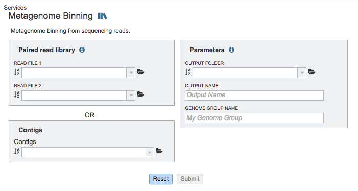
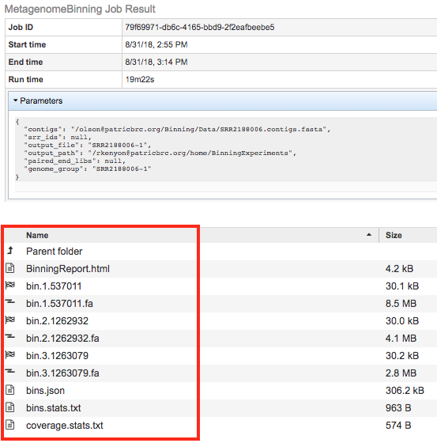
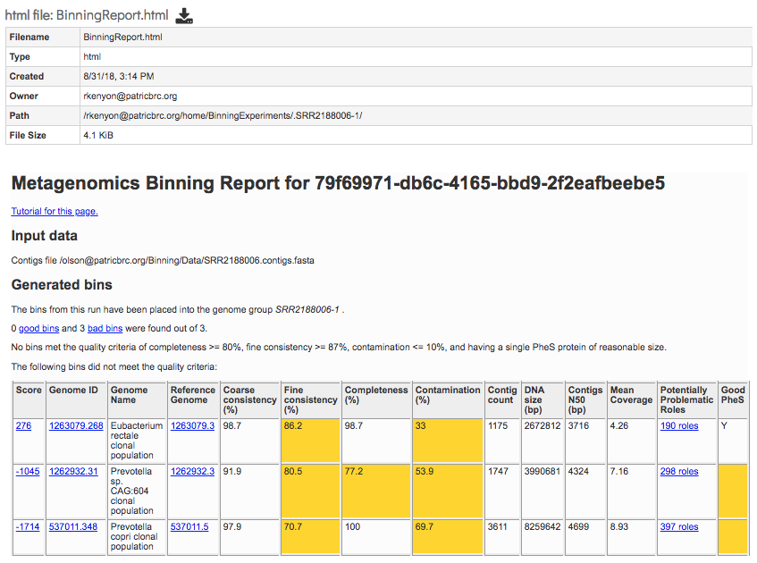

# Metagenome Binning Service

## Overview
The Metagenomic Binning Service accepts either reads or contigs, and attempts to "bin" the data into a set of genomes. This service can be used to reconstruct bacterial and archael genomes from environmental samples.

### See also
* [Metagenome Binning Service](https://patricbrc.org/app/MetagenomeBinning)
* [Metagenome Binning Service Tutorial](https://docs.patricbrc.org//tutorial/metagenomic_binning/metagenomic_binning.html)

## Using the Metagenome Binning Service
The **Metagenome Binning** submenu option under the **Services** main menu (Genomics category) opens the Metagenome Binning Service input form (*shown below*). *Note: You must be logged into PATRIC to use this service.*

## Options
 

## Paired read library

### Read File 1 & 2
Many paired read libraries are given as file pairs, with each file containing half of each read pair. Paired read files are expected to be sorted such that each read in a pair occurs in the same Nth position as its mate in their respective files. These files are specified as READ FILE 1 and READ FILE 2. For a given file pair, the selection of which file is READ 1 and which is READ 2 does not matter.

## Contigs
Alternatively, contigs can be used with the service instead of read files.

## Parameters

### Output Folder
The workspace folder where results will be placed.

### Output Name
Name used to uniquely identify results.

### Genome Group Name
Name used to create genome group with identified genomes.

## Output Results
 

The Metagenomic Binning Service generates several files that are deposited in the Private Workspace in the designated Output Folder. These include

* **BinningReport.html** - Document containing the list of bins and other summary information. Double-clicking on this file to display it.
 
* **bin.#.####** - Annotation job result of bin number #.
* **bin.#.####.fa** - a FASTA file containing the bin’s contigs for bin number #.

