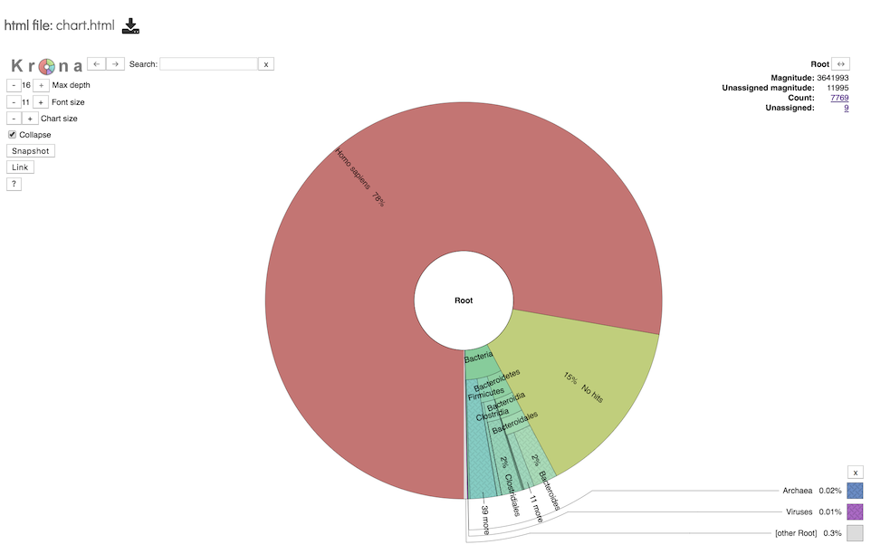

# Metagenomic Read Mapping Service

## Overview
The Metagenomic Read Mapping Service uses [KMA](https://bmcbioinformatics.biomedcentral.com/articles/10.1186/s12859-018-2336-6) to align reads against antibiotic resistance genes, virulence factors, or other custom sets of genes.

### See also
  * [Metagenomic Read Mapping Service](https://patricbrc.org/app/MetagenomicReadMapping)

## Using the Metagenomic Read Mapping Service
The **Metagenomic Read Mapping** submenu option under the **Services** main menu (Metagenomics category) opens the Metagenomic Read Mapping Service input form (shown below). *Note: You must be logged into PATRIC to use this service.*

## Options

## Input File

### Paired read library

**Read File 1 & 2:**  Many paired read libraries are given as file pairs, with each file containing half of each read pair. Paired read files are expected to be sorted such that each read in a pair occurs in the same Nth position as its mate in their respective files. These files are specified as READ FILE 1 and READ FILE 2. For a given file pair, the selection of which file is READ 1 and which is READ 2 does not matter.

### Single read library

**Read File:** FASTQ file containing reads.

### SRA run accession
Allows direct upload of read files from the [NCBI Sequence Read Archive](https://www.ncbi.nlm.nih.gov/sra) to the PATRIC Assembly Service. Entering the SRR accession number and clicking the arrow will add the file to the selected libraries box for use in the assembly. 

## Selected libraries
Read files to be mapped.

## Parameters

**Predefined Gene Set Name:** A pre-built set of genes against which reads are mapped.  Two options are available:
* CARD - Antibiotic resistence gene set from the [Comprehensive Antibiotic Resistance Database](https://www.ncbi.nlm.nih.gov/pubmed/27789705)
* VFDB - Virulence factor gene set from the [Virulence Factor Database](https://www.ncbi.nlm.nih.gov/pubmed/30395255)

**Output Folder:** Workspace folder where the results will be saved.

**Output Name:** User-provided name used to uniquely identify results.

## Output Results

The Metagenomic Read Mapping Service generates several files that are deposited in the Private Workspace in the designated Output Folder. These include

 * **MetagenomicReadMappingReport.html** - A web-browser-friendly report that summarizes the results of the service (see description and image below)
 * **kma.aln** - 
 * **kma.frag.gz** - 
 * **kma.fsa** - 
 * **kma.res** - (https://ccb.jhu.edu/software/kraken2/index.shtml?t=manual#output-formats))

### Metagenomic Read Mapping Report Output

This page is a web-friendly report that summarizes the output of MKA. It provides a link to the input data, an interactive chart view (see description below), and a table of the reference genes mapped.  The columns in the table are as follows: 

* Pct Coverage - Percentage of fragments covered by the clade rooted at this taxon
* Frags in Clade - Number of fragments covered by the clade rooted at this taxon
* Frags in Taxon - Number of fragments assigned directly to this taxon
* Rank - A rank code, indicating (U)nclassified, (R)oot, (D)omain, (K)ingdom, (P)hylum, (C)lass, (O)rder, (F)amily, (G)enus, or (S)pecies. Taxa that are not at any of these 10 ranks have a rank code that is formed by using the rank code of the closest ancestor rank with a number indicating the distance from that rank.  E.g., "G2" is a rank code indicating a taxon is between genus and species and the grandparent taxon is at the genus rank.
* NCBI Taxon ID - NCBI taxonomic ID number
* Scientific Name - Indented scientific name. Clicking on one of these names will display the corresponding taxon page in the PATRIC website.

### Taxonomic Chart

This interactive chart provides a visual representation of the reads mapping to each taxon. Clicking on a taxon within the pie chart will provide a summary of the reads mapping to that specific selection on the upper right corner.

### Action buttons
After selecting one of the output files by clicking it, a set of options becomes available in the vertical green Action Bar on the right side of the table.  These include

* **Hide/Show:** Toggles (hides) the right-hand side Details Pane.
* **Guide** Link to the corresponding User Guide
* **Download:**  Downloads the selected item.
* **View** Displays the content of the file, typically as plain text or rendered html, depending on filetype.
* **Delete** Deletes the file.
* **Rename** Allows renaming of the file.
* **Copy:** Copies the selected items to the clipboard.
* **Move** Allows moving of the file to another folder.

More details are available in the [Action Buttons](../other/action_buttons.html) user guide.

## References
* Jia, Baofeng, et al. "CARD 2017: expansion and model-centric curation of the comprehensive antibiotic resistance database." Nucleic acids research (2016): gkw1004.
* Liu, Bo, et al. "VFDB 2019: a comparative pathogenomic platform with an interactive web interface." Nucleic acids research 47.D1 (2018): D687-D692.
* Philip T.L.C. Clausen, Frank M. Aarestrup & Ole Lund, "Rapid and precise alignment of raw reads against redundant databases with KMA", BMC Bioinformatics, 2018;19:307.
