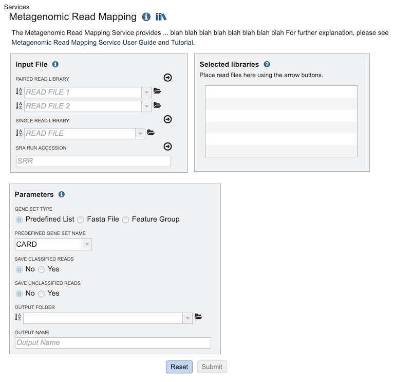

# Metagenomic Read Mapping Service

## Overview
The Metagenomic Read Mapping Service uses [KMA](https://bmcbioinformatics.biomedcentral.com/articles/10.1186/s12859-018-2336-6) to align reads against antibiotic resistance genes, virulence factors, or other custom sets of genes.

### See also
  * [Metagenomic Read Mapping Service](https://patricbrc.org/app/MetagenomicReadMapping)

## Using the Metagenomic Read Mapping Service
The **Metagenomic Read Mapping** submenu option under the **Services** main menu (Metagenomics category) opens the Metagenomic Read Mapping Service input form (shown below). *Note: You must be logged into PATRIC to use this service.*

## Options

## Input File

### Paired read library

**Read File 1 & 2:**  Many paired read libraries are given as file pairs, with each file containing half of each read pair. Paired read files are expected to be sorted such that each read in a pair occurs in the same Nth position as its mate in their respective files. These files are specified as READ FILE 1 and READ FILE 2. For a given file pair, the selection of which file is READ 1 and which is READ 2 does not matter.

### Single read library

**Read File:**
The fastq file containing the reads

### SRA run accession
Allows direct upload of read files from the [NCBI Sequence Read Archive](https://www.ncbi.nlm.nih.gov/sra) to the PATRIC Assembly Service. Entering the SRR accession number and clicking the arrow will add the file to the selected libraries box for use in the assembly. 

### Selected libraries
Read files to be mapped.

## Parameters

**Gene Set Type:** The set of genes against which the reads will be mapped.  Three options are available:
* Predefined List - Pre-built gene set in PATRIC (see Predefined Gene Set Name below)
* FASTA File - User provided FASTA file containing genes
* Feature Group - A user-defined PATRIC feature group

**Predefined Gene Set Name:** A pre-built set of genes against which reads are mapped.  Two options are available:
* CARD - Antibiotic resistence gene set from the [Comprehensive Antibiotic Resistance Database](https://www.ncbi.nlm.nih.gov/pubmed/27789705)
* VFDB - Virulence factor gene set from the [Virulence Factor Database](https://www.ncbi.nlm.nih.gov/pubmed/30395255)

**Output Folder:** Workspace folder where the results will be saved.

**Output Name:** User-provided name used to uniquely identify results.

## Output Results

The Metagenomic Read Mapping Service generates several files that are deposited in the Private Workspace in the designated Output Folder. These include

## References
* Jia, Baofeng, et al. "CARD 2017: expansion and model-centric curation of the comprehensive antibiotic resistance database." Nucleic acids research (2016): gkw1004.
* Liu, Bo, et al. "VFDB 2019: a comparative pathogenomic platform with an interactive web interface." Nucleic acids research 47.D1 (2018): D687-D692.
* Philip T.L.C. Clausen, Frank M. Aarestrup & Ole Lund, "Rapid and precise alignment of raw reads against redundant databases with KMA", BMC Bioinformatics, 2018;19:307.

 
