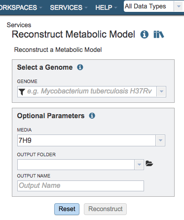

# Model Reconstruction Service

## Overview
The Model Reconstruction Service integrates and augments technologies for genome annotation, construction of gene-protein-reaction (GPR) associations, generation of biomass reactions, reaction network assembly, thermodynamic analysis of reaction reversibility, and model optimization, to generate draft genome-scale metabolic models. The service is capable of generating functioning draft metabolic models of an organism starting from an assembled genome sequence. Additional information is available in [High-throughput generation, optimization and analysis of genome-scale metabolic models](https://www.nature.com/nbt/journal/v28/n9/full/nbt.1672.html).

### See also
* [Model Reconstruction Service](https://patricbrc.org/app/Reconstruct)
* [Metabolic Model Reconstruction Service Tutorial](https://docs.patricbrc.org//tutorial/metabolic_model_reconstruction/metabolic_model_reconstruction.html)

## Using the Model Reconstruction Service
The **Model Reconstruction** submenu option under the **Services** main menu (Metabolomics category) opens the Reconstruct Metabolic Model input form (*shown below*). *Note: You must be logged into PATRIC to use this service.* The Model Reconstruction service is also available via the PATRIC Command Line Interface (CLI).

## Options
 

## Select a Genome
Select a public genome or a genome from workspace

### Genome
**Note:** click the filter icon to the left of the genome input box to help in finding your genomes

## Optional Parameters

### Media
Selection for a predefined media formulation from a dropdown list for this model to be gapfilled and simulated for flux-balance analysis (FBA), e.g., GMM – Glucose Minimal Media, NMS- Nitrate Mineral Salts Medium, LB - Luria-Bertani Medium.

### Output Folder
The workspace folder where results will be placed.

### Output Name
Name used to uniquely identify results.

## Buttons

**Reset:** Resets the input form to default values

**Reconstruct:** Launches the model reconstruction job.
