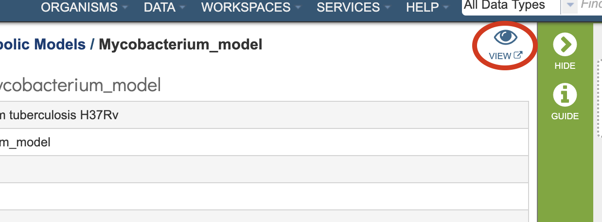
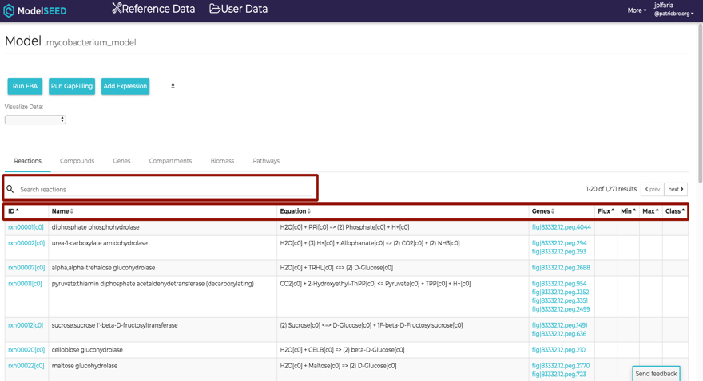

# Model Reconstruction Service

## Overview
The Model Reconstruction Service integrates and augments technologies for genome annotation, construction of gene-protein-reaction (GPR) associations, generation of biomass reactions, reaction network assembly, thermodynamic analysis of reaction reversibility, and model optimization, to generate draft genome-scale metabolic models. The service is capable of generating functioning draft metabolic models of an organism starting from an assembled genome sequence. Additional information is available in [High-throughput generation, optimization and analysis of genome-scale metabolic models](https://www.nature.com/nbt/journal/v28/n9/full/nbt.1672.html).

### See also
* [Model Reconstruction Service](https://patricbrc.org/app/Reconstruct)
* [Metabolic Model Reconstruction Service Tutorial](https://docs.patricbrc.org//tutorial/metabolic_model_reconstruction/metabolic_model_reconstruction.html)

## Using the Model Reconstruction Service
The **Model Reconstruction** submenu option under the **Services** main menu (Metabolomics category) opens the Reconstruct Metabolic Model input form (*shown below*). *Note: You must be logged into PATRIC to use this service.* The Model Reconstruction service is also available via the PATRIC Command Line Interface (CLI).

## Options
 

## Select a Genome
Select a public genome or a genome from workspace

### Genome
**Note:** click the filter icon to the left of the genome input box to help in finding your genomes

## Optional Parameters

### Media
Selection for a predefined media formulation from a dropdown list for this model to be gapfilled and simulated for flux-balance analysis (FBA), e.g., GMM – Glucose Minimal Media, NMS- Nitrate Mineral Salts Medium, LB - Luria-Bertani Medium.

### Output Folder
The workspace folder where results will be placed.

### Output Name
Name used to uniquely identify results.

## Buttons

**Reset:** Resets the input form to default values

**Reconstruct:** Launches the model reconstruction job.

## Output Results

The Metabolic Reconstruction Service generates several files that are deposited in the Private Workspace in the designated Output Folder. These include 

* **gf.0.gftbl** - a Gapfill reactions table containing the list of the reations added to the model by the gapfilling algorithm during reconstruction.
* **gf.0.fbatbl** - a FBA flux distribution for the gapfilling simulation.
* **_model_name_.sbml** - the model in Systems Biology Markup Language (SBML) format.
* **_model_name_.rxntbl** - list of all the reactions in the model.
* **_model_name_.cpdtbl** - list of all the reactions in the model.
* **fba.0.futbl** - FBA flux for all model reactions.
* **fba.0.essentials** - List of genes in the model characterized as essential by the FBA simulation in the specified media.

### Action buttons
After selecting one of the output files by clicking it, a set of options becomes available in the vertical green Action Bar on the right side of the table, listed below. For the Metabolic Reconstruction Service, the only options in the Action Bar are the following:

* **Hide/Show:** Toggles (hides) the right-hand side Details Pane.
* **Guide:** Link to the corresponding User Guide
* **Download:**  Downloads the selected item.

More details are available in the [Action Buttons](../action_buttons.html) user guide.

### ModelSEED Model Viewer

Clicking on the View icon at the upper right portion of the job result page will open a login screen for the ModelSEED Model Viewer consisting of multiple tabs for Reactioons, Compounds, Genes, Compartments of the model, and the weighted components
of the Biomass. Each column in the table is sortable by clicking the column header. Information about the model is searchable by using the search bar at the top left corner of the table.

## References
1.	Orth, J.D., I. Thiele, and B.O. Palsson, What is flux balance analysis? Nat Biotechnol. **28**(3): p. 245-8.
2.	Henry, C.S., et al., High-throughput generation, optimization and analysis of genome-scale metabolic models. Nat Biotechnol, 2010. **28**(9): p. 977-82.
3.	Overbeek, R., et al., The SEED and the Rapid Annotation of microbial genomes using Subsystems Technology (RAST). Nucleic Acids Res, 2014. **42**(Database issue): p. D206-14.
4.	Orth, J.D. and B.O. Palsson, Systematizing the generation of missing metabolic knowledge. Biotechnol Bioeng. **107**(3): p. 403-12.

