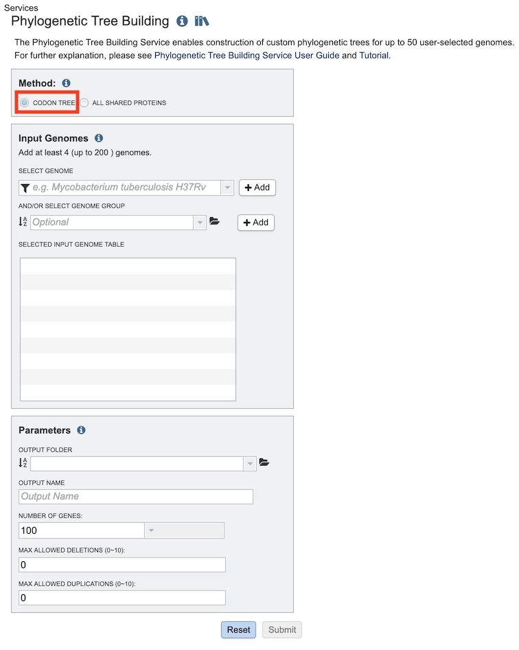
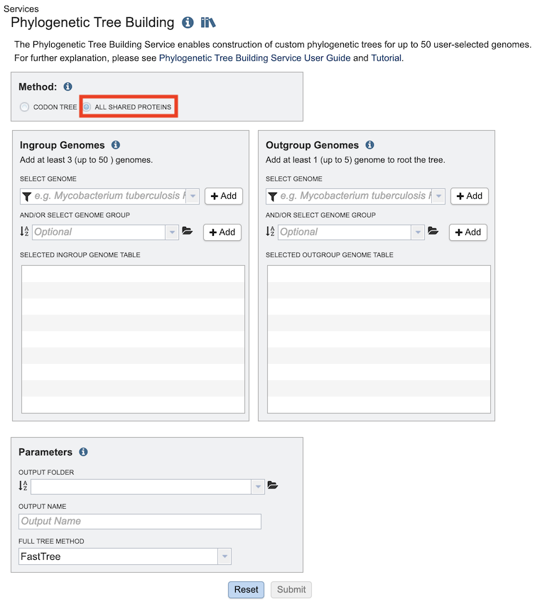

# Phylogenetic Tree Building Service

## Overview
The Phylogenetic Tree Building Service enables construction of custom phylogenetic trees built from user-selected genomes. Two methods are available: Codon Tree and All Shared Proteins. The Codon Tree method selects single-copy PATRIC PGFams and analyzes aligned proteins and coding DNA from single-copy genes using the program RAxML. The All Shared Proteins method discovers single-copy homology groups by BLAST and analyzes protein alignments by the program FastTree. The service returns a Scaled Vector Graphics (SVG) image of the final tree, as well as Nexus and Newick files which can be downloaded or viewed in html or rendered in the interactive Phylogenetic Tree Viewer in PATRIC.

### See also
* [Phylogenetic Tree Building Service](https://patricbrc.org/app/PhylogeneticTree)
* [Building Phylogenetic Trees in PATRIC  Tutorial](https://docs.patricbrc.org//tutorial/phylogenetic_tree_building/tree_building.html)

## Using the Phylogenetic Tree Building Service
The **Phylogenetic Tree** submenu option under the **Services** main menu (Genomics category) opens the Phylogenetic Tree input form (shown below). *Note: You must be logged into PATRIC to use this service.*

## Methods
The tree-building service provides tree construction using one of two methods:

* **Codon Tree** - The codon tree method utilizes PATRIC [PGFams](../organisms_taxon/protein_families.html) as homology groups and analyzes aligned proteins and coding DNA from single-copy genes using the program [RAxML](https://academic.oup.com/bioinformatics/article/22/21/2688/251208). Up to 100 genomes can be analyzed. *Note: This method is typically runs and completes faster than the All Shared Proteins method.*

* **All Shared Proteins** - Discovers single-copy homology groups by BLAST and analyzes protein alignments by the program [FastTree](https://www.ncbi.nlm.nih.gov/pmc/articles/PMC2835736/). Up to 50 genomes can be analyzed.

Depending on which method is selected, the input form and options change. 

## Method: Codon Tree

## Input Genomes
Genomes for inclusion in the tree. Type or select a genome name from the genome list. Alternatively, entire genome groups can be added to the set of genomes to be analyzed. At least 4 and up to 100 genomes can be specified. Use the plus (+) icon to add to the Selected Input Genome Table.

## Parameters (Codon Tree)

### Output Folder
The workspace folder where results will be placed.

### Output Name
Name used to uniquely identify results.

### Number of Genes
The number of genes to analyze can be selected or default used.

### Max Allowed Deletions/Duplications
The selection of “single-copy” genes can be made more lenient by allowing one or more instances of genomes missing a member of a particular homology group (Max Allowed Deletions) or instances of two copies within a single genome (Max Allowed Duplications).

## Method: All Shared Proteins

## Ingroup Genomes Selection
Select at least 3 genome (up to total of 50 genomes) from the genome list and/or a genome group and use the plus buttons to place the genomes to the table. A genome or genome group CANNOT be placed in both ingroup and outgroup table.

### Select Genome
Genomes for inclusion in the **ingroup** for the tree. Type or select a genome name from the genome list. Use the plus (+) icon to add to the Selected Ingroup Genome Table.

### And/Or Select Genome Group
Option for including a genome group from the workspace. Can be included with, or instead of, the Selected Genomes.

### Selected Ingroup Genome Table
Genomes chosen for inclusion in the ingroup. Genomes can be removed by clicking the "x" beside the genome name.

## Outgroup Genomes
Select at least 1 genome (up to total of 5 genomes) from the genome list and/or a genome group and use the plus buttons to place the genomes to the table. A genome or genome group CANNOT be placed in both ingroup and outgroup table.

### Select genome
Genomes for inclusion in the **outgroup** for the tree. Type or select a genome name from the genome list. Use the plus (+) icon to add to the Selected Outgroup Genome Table.

### And/or select genome group
Option for including a genome group from the workspace. Can be included with, or instead of, the Selected Genomes.

### Selected Outgroup Genome Table
Genomes chosen for inclusion in the outgroup. Genomes can be removed by clicking the "x" beside the genome name.

## Parameters (All Shared Proteins)

### Output Folder
The workspace folder where results will be placed.

### Output Name
Name used to uniquely identify results.

### Full Tree Method
This option selects the tree-building method to be used.

**FastTree:** A less rigorous tree inference program that takes much less time than RAxML while often producing similar trees. [FastTree reference](https://www.ncbi.nlm.nih.gov/pmc/articles/PMC2835736/)

**Maximum Likelihood (RAxML):** A maximum likelihood tree estimation program. [RAxML reference](https://academic.oup.com/bioinformatics/article/22/21/2688/251208)

### Automated Progressive Refinement
Option for selecting progressive refinement, which is a method for attempting to improve tree quality by targeted rebuilding of subtrees. Confidently placed subtrees that contain poorly-supported branches are re-analyzed in more detail in an attempt to resolve the less certain branches. Due to the additional rounds of tree building, this option can significantly increase the running time.

## References
* Price, Morgan N., Paramvir S. Dehal, and Adam P. Arkin. "FastTree 2–approximately maximum-likelihood trees for large alignments." PloS one 5.3 (2010): e9490.
* Stamatakis, Alexandros. "RAxML-VI-HPC: maximum likelihood-based phylogenetic analyses with thousands of taxa and mixed models." Bioinformatics 22.21 (2006): 2688-2690.

