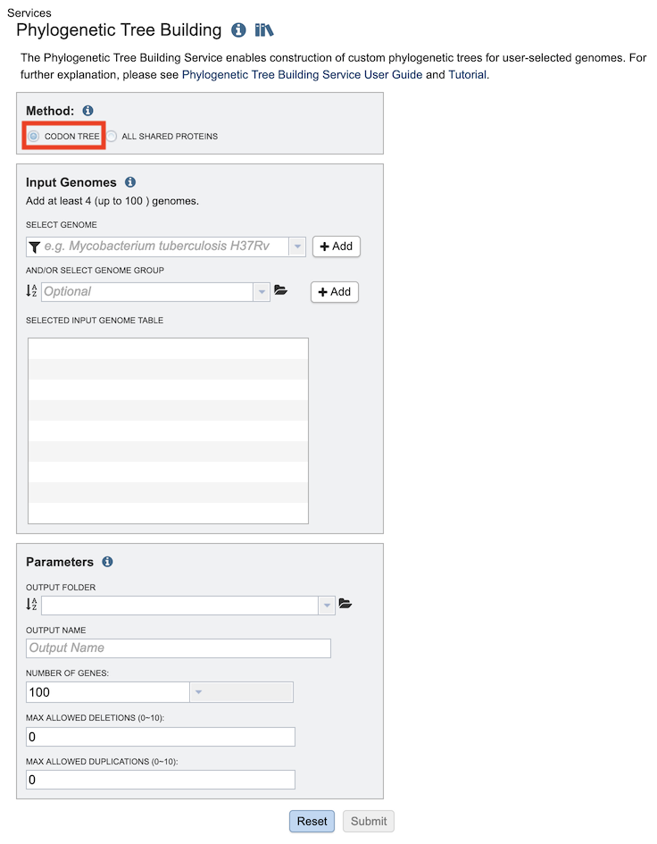
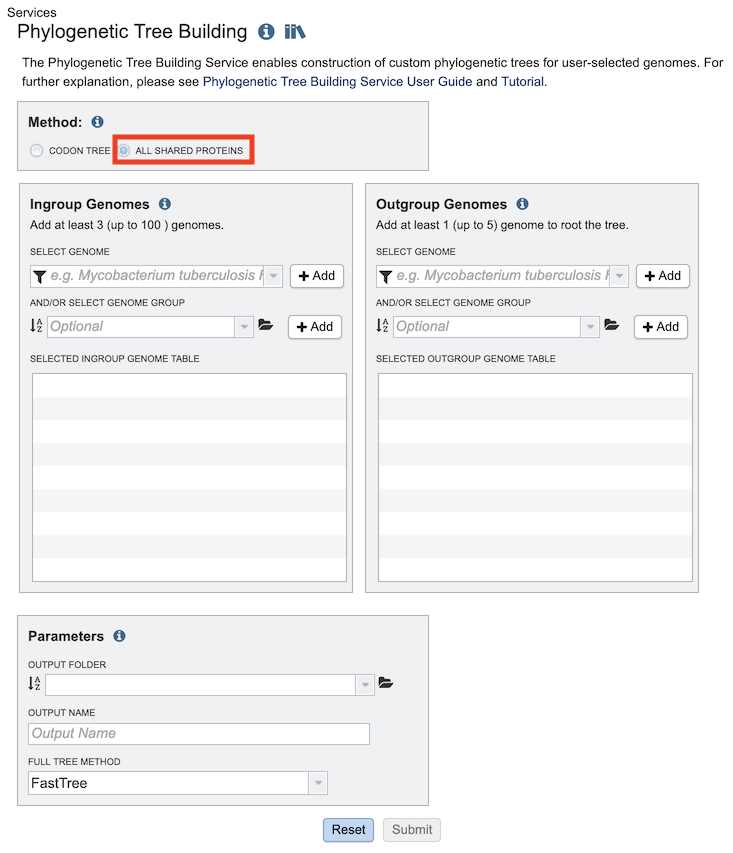
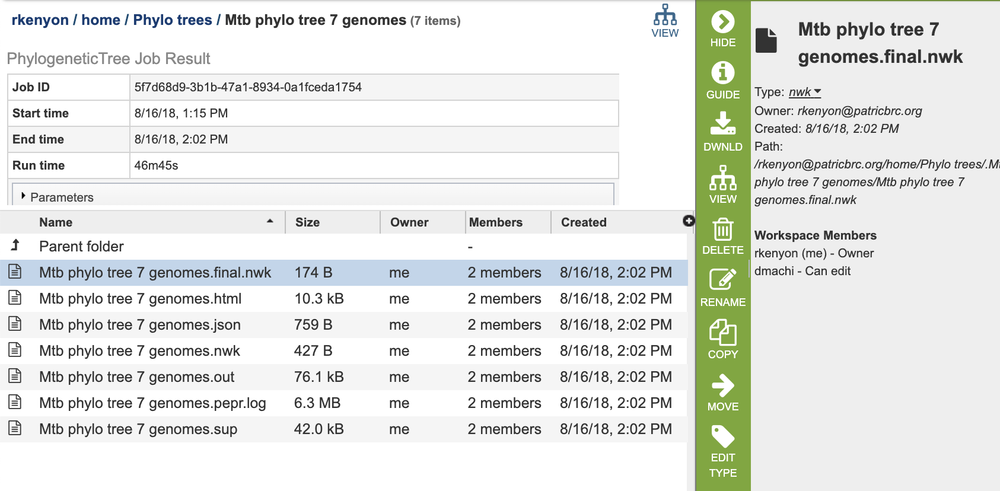

# Phylogenetic Tree Building Service

## Overview
The Phylogenetic Tree Building Service enables construction of custom phylogenetic trees built from user-selected genomes. Two methods are available: Codon Tree and All Shared Proteins. The **Codon Tree** method selects single-copy PATRIC PGFams and analyzes aligned proteins and coding DNA from single-copy genes using the program RAxML. The **All Shared Proteins** method discovers single-copy homology groups by BLAST and analyzes protein alignments by the program FastTree. The service returns a Scaled Vector Graphics (SVG) image of the final tree, as well as a Newick file which can be rendered in the interactive Phylogenetic Tree Viewer in PATRIC or downloaded and viewed in FigTree or other software.

### See also
* [Phylogenetic Tree Building Service](https://patricbrc.org/app/PhylogeneticTree)
* [Building Phylogenetic Trees - Codon Tutorial](https://docs.patricbrc.org/tutorial/codon_tree_building/codon_tree_building.html)
* [Building Phylogenetic Trees - All Shared Proteins Tutorial](https://docs.patricbrc.org//tutorial/phylogenetic_tree_building/tree_building.html)

## Using the Phylogenetic Tree Building Service
The **Phylogenetic Tree** submenu option under the **Services** main menu (Genomics category) opens the Phylogenetic Tree input form (shown below). *Note: You must be logged into PATRIC to use this service.*

## Methods
The tree-building service provides tree construction using one of two methods:

* **Codon Tree** - The codon tree method utilizes PATRIC [PGFams](../organisms_taxon/protein_families.html) as homology groups and analyzes aligned proteins and coding DNA from single-copy genes using the program [RAxML](https://academic.oup.com/bioinformatics/article/22/21/2688/251208). Up to 100 genomes can be analyzed. *Note: This method is typically runs and completes faster than the All Shared Proteins method.*

* **All Shared Proteins** - Discovers single-copy homology groups by BLAST and analyzes protein alignments by the program [FastTree](https://www.ncbi.nlm.nih.gov/pmc/articles/PMC2835736/). Up to 50 genomes can be analyzed.

Depending on which method is selected, the input form and options change. 

## Method: Codon Tree

## Input Genomes
Genomes for inclusion in the tree. Type or select a genome name from the genome list. Alternatively, entire genome groups can be added to the set of genomes to be analyzed. At least 4 and up to 100 genomes can be specified. Use the plus (+) icon to add to the Selected Input Genome Table.

## Parameters (Codon Tree)

### Output Folder
The workspace folder where results will be placed.

### Output Name
Name used to uniquely identify results.

### Number of Genes
The number of genes to analyze can be selected or default used.

### Max Allowed Deletions/Duplications
The selection of “single-copy” genes can be made more lenient by allowing one or more instances of genomes missing a member of a particular homology group (Max Allowed Deletions) or instances of two copies within a single genome (Max Allowed Duplications).

## Method: All Shared Proteins

## Ingroup Genomes Selection
Select at least 3 genome (up to total of 50 genomes) from the genome list and/or a genome group and use the plus buttons to place the genomes to the table. A genome or genome group CANNOT be placed in both ingroup and outgroup table.

### Select Genome
Genomes for inclusion in the **ingroup** for the tree. Type or select a genome name from the genome list. Use the plus (+) icon to add to the Selected Ingroup Genome Table.

### And/Or Select Genome Group
Option for including a genome group from the workspace. Can be included with, or instead of, the Selected Genomes.

### Selected Ingroup Genome Table
Genomes chosen for inclusion in the ingroup. Genomes can be removed by clicking the "x" beside the genome name.

## Outgroup Genomes
Select at least 1 genome (up to total of 5 genomes) from the genome list and/or a genome group and use the plus buttons to place the genomes to the table. A genome or genome group CANNOT be placed in both ingroup and outgroup table.

### Select genome
Genomes for inclusion in the **outgroup** for the tree. Type or select a genome name from the genome list. Use the plus (+) icon to add to the Selected Outgroup Genome Table.

### And/or select genome group
Option for including a genome group from the workspace. Can be included with, or instead of, the Selected Genomes.

### Selected Outgroup Genome Table
Genomes chosen for inclusion in the outgroup. Genomes can be removed by clicking the "x" beside the genome name.

## Parameters (All Shared Proteins)

### Output Folder
The workspace folder where results will be placed.

### Output Name
Name used to uniquely identify results.

### Full Tree Method
This option selects the tree-building method to be used.

* **[FastTree](https://www.ncbi.nlm.nih.gov/pmc/articles/PMC2835736/):** A less rigorous tree inference program that takes much less time than RAxML while often producing similar trees.

* **[Maximum Likelihood (RAxML)](https://academic.oup.com/bioinformatics/article/22/21/2688/251208):** A maximum likelihood tree estimation program.

### Automated Progressive Refinement
Option for selecting progressive refinement, which is a method for attempting to improve tree quality by targeted rebuilding of subtrees. Confidently placed subtrees that contain poorly-supported branches are re-analyzed in more detail in an attempt to resolve the less certain branches. Due to the additional rounds of tree building, this option can significantly increase the running time.

## Output Results

### All Shared Proteins Method

 

The Phylogenetic Tree Building Service generates several files that are deposited in the Private Workspace in the designated Output Folder. These include

* **_output-name_.final.nwk** - Newick tree format file with genome IDs as leaf nodes. Selecting this file and clicking the View icon (described below) will open the tree in the PATRIC interactive Phylogenetic Tree Viewer.  See the [Phylogeny Tab User Guide](../organisms_taxon/phylogeny.html) for details about this viewer.
* **_output-name_.html** - Web-based (html) rendering of the tree.
* **_output-name_.json** - JavaScript Object Notation (JSON) format file of the tree.
* **_output-name_.nwk** - Newick tree format file with genome names as leaf nodes.
* **_output-name_.out** - Text file of raw output from the tree-building code
* **_output-name_.pepr.log** - Details all the steps that occurred in construction of the tree.
* **_output-name_.sup** - Support file that lists branches where progressive refinement was used to help resolve questionable branches.

### Action buttons
After selecting one of the output files by clicking it, a set of options becomes available in the vertical green Action Bar on the right side of the table.  These include

* **Hide/Show:** Toggles (hides) the right-hand side Details Pane.
* **Guide:** Link to the corresponding User Guide
* **Download:**  Downloads the selected item.
* **View:** Displays the content of the file, typically as plain text or rendered html, depending on filetype. Nwk files are rendered in the PATRIC Phylogenetic Tree Viewer.
* **Delete** Deletes the file.
* **Rename** Allows renaming of the file.
* **Copy:** Copies the selected items to the clipboard.
* **Move** Allows moving of the file to another folder.
* **Edit Type** Allows changing of the type of the file in terms of how PATRIC interprets the content and uses it in other services or parts of the website.  Allowable types include unspecified, contigs, nwk, reads, differential expression input data, and differential expression input metadata.

More details are available in the [Action Buttons](../action_buttons.html) user guide.

## References
* Boratyn GM, Camacho C, Cooper PS et al. BLAST: a more efficient report with usability improvements, Nucleic Acids Res 2013;41:W29-33.
* Van Dongren S. Graph Clustering by Flow Simulation. Utrecht,  Netherlands: University of Utrecht, 2001.
* Edgar RC. MUSCLE: multiple sequence alignment with high accuracy and high throughput, Nucleic Acids Res 2004;32:1792-1797.
* Eddy SR. Profile hidden Markov models, Bioinformatics (Oxford, England) 1998;14:755-763.
* Talavera G, Castresana J. Improvement of phylogenies after removing divergent and ambiguously aligned blocks from protein sequence alignments, Systematic biology 2007;56:564-577.
* Price MN, Dehal PS, Arkin AP. FastTree 2–approximately maximum-likelihood trees for large alignments, PLoS One 2010;5:e9490.
* Stamatakis A. RAxML version 8: a tool for phylogenetic analysis and post-analysis of large phylogenies, Bioinformatics 2014;30:1312-1313.
* Rambaut A. FigTree. 2009.
