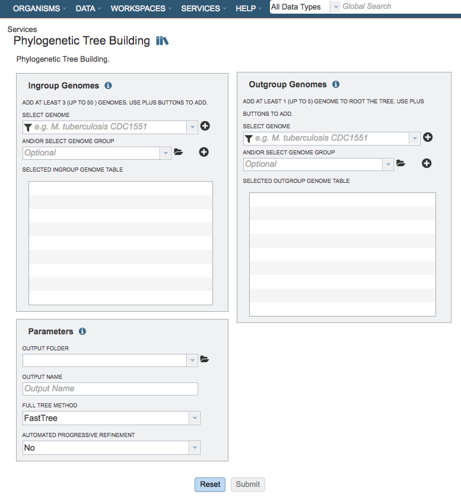

# Phylogenetic Tree Building Service

## Overview
The Phylogenetic Tree Building Service enables construction of custom phylogenetic trees for up to 50 user-selected genomes. The service builds trees using conserved protein sequences, which is the same methodology used to build the public genus-level phylogenetic trees in the PATRIC website.The service returns a Newick file which can be downloaded or viewed in html or rendered in the interactive Phylogenetic Tree Viewer in PATRIC.

### See also
* [Phylogenetic Tree Building Service](https://patricbrc.org/app/PhylogeneticTree)
* [Building Phylogenetic Trees in PATRIC  Tutorial](https://docs.patricbrc.org//tutorial/phylogenetic_tree_building/tree_building.html)

## Using the Phylogenetic Tree Building Service
The **Phylogenetic Tree** submenu option under the **Services** main menu (Genomics category) opens the Phylogenetic Tree input form (*shown below*). *Note: You must be logged into PATRIC to use this service.*

## Options
 

## Ingroup Genomes Selection
Select at least 3 genome (up to total of 50 genomes) from the genome list and/or a genome group and use the plus buttons to place the genomes to the table. A genome or genome group CANNOT be placed in both ingroup and outgroup table.

### Select Genome
Genomes for inclusion in the **ingroup** for the tree. Type or select a genome name from the genome list. Use the plus (+) icon to add to the Selected Ingroup Genome Table.

### And/Or Select Genome Group
Option for including a genome group from the workspace. Can be included with, or instead of, the Selected Genomes.

### Selected Ingroup Genome Table
Genomes chosen for inclusion in the ingroup. Genomes can be removed by clicking the "x" beside the genome name.

## Outgroup Genomes
Select at least 1 genome (up to total of 5 genomes) from the genome list and/or a genome group and use the plus buttons to place the genomes to the table. A genome or genome group CANNOT be placed in both ingroup and outgroup table.

### Select genome
Genomes for inclusion in the **outgroup** for the tree. Type or select a genome name from the genome list. Use the plus (+) icon to add to the Selected Outgroup Genome Table.

### And/or select genome group
Option for including a genome group from the workspace. Can be included with, or instead of, the Selected Genomes.

### Selected Outgroup Genome Table
Genomes chosen for inclusion in the outgroup. Genomes can be removed by clicking the "x" beside the genome name.

## Parameters

### Output Folder
The workspace folder where results will be placed.

### Output Name
Name used to uniquely identify results.

### Full Tree Method
This option selects the tree-building method to be used.

**FastTree:** A less rigorous tree inference program that takes much less time than RAxML while often producing similar trees. [FastTree reference](https://www.ncbi.nlm.nih.gov/pmc/articles/PMC2835736/)

**Maximum Likelihood (RAxML):** A maximum likelihood tree estimation program. [RAxML reference](https://academic.oup.com/bioinformatics/article/22/21/2688/251208)

### Automated Progressive Refinement
Option for selecting progressive refinement, which is a method for attempting to improve tree quality by targeted rebuilding of subtrees. Confidently placed subtrees that contain poorly-supported branches are re-analyzed in more detail in an attempt to resolve the less certain branches. Due to the additional rounds of tree building, this option can significantly increase the running time.
