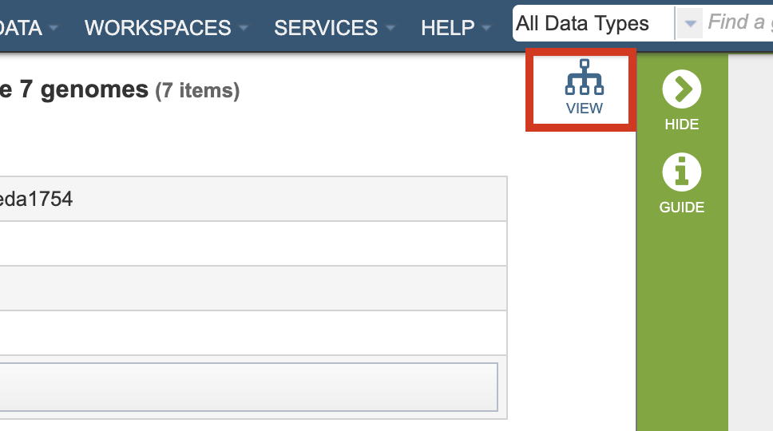
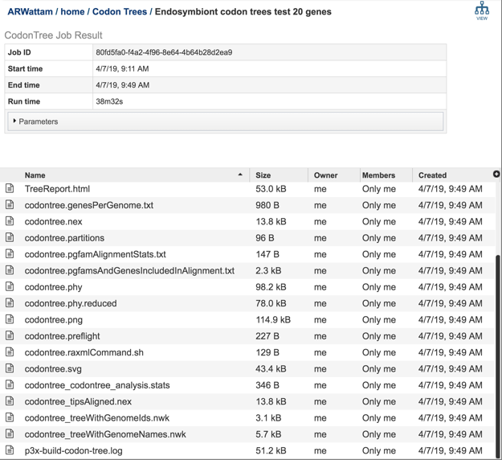

# Phylogenetic Tree Building Service

## Overview
The Phylogenetic Tree Building Service enables construction of custom phylogenetic trees built from user-selected genomes. The **Codon Tree** method selects single-copy PATRIC PGFams and analyzes aligned proteins and coding DNA from single-copy genes using the program RAxML. The service returns a Scaled Vector Graphics (SVG) image of the final tree, as well as a Newick file which can be rendered in the interactive Phylogenetic Tree Viewer in PATRIC or downloaded and viewed in FigTree or other software.

### See also
* [Phylogenetic Tree Building Service](https://patricbrc.org/app/PhylogeneticTree)
* [Building Phylogenetic Trees - Codon Tutorial](https://docs.patricbrc.org/tutorial/codon_tree_building/codon_tree_building.html)
* [Phylogeny Tab User Guide](../organisms_taxon/phylogeny.html)

## Using the Phylogenetic Tree Building Service
The **Phylogenetic Tree** submenu option under the **Services** main menu (Genomics category) opens the Phylogenetic Tree input form (shown below). *Note: You must be logged into PATRIC to use this service.*

## Method: Codon Tree

The **Codon Tree** method utilizes PATRIC [PGFams](../organisms_taxon/protein_families.html) as homology groups and analyzes aligned proteins and coding DNA from single-copy genes using the program [RAxML](https://academic.oup.com/bioinformatics/article/22/21/2688/251208). Up to 100 genomes can be analyzed.

## Input Genomes
Genomes for inclusion in the tree. Type or select a genome name from the genome list. Alternatively, entire genome groups can be added to the set of genomes to be analyzed. At least 4 and up to 100 genomes can be specified. Use the plus (+) icon to add to the Selected Input Genome Table.

## Parameters (Codon Tree)

### Output Folder
The workspace folder where results will be placed.

### Output Name
Name used to uniquely identify results.

### Number of Genes
The number of genes to analyze can be selected or default used.

### Max Allowed Deletions/Duplications
The selection of “single-copy” genes can be made more lenient by allowing one or more instances of genomes missing a member of a particular homology group (Max Allowed Deletions) or instances of two copies within a single genome (Max Allowed Duplications).

## Output Results

### Phylogenetic Tree Viewer

Clicking on the View icon at the upper right portion of the job result page will display the PATRIC Phylogenetic Tree Viewer. See the [Phylogeny Tab User Guide](../organisms_taxon/phylogeny.html) for details about this viewer.  

### Codon Tree Method

 

The Phylogenetic Tree Building Service generates several files that are deposited in the Private Workspace in the designated Output Folder. These include important files in the main output folder and additional files in a subfolder called, 'detail_files.'

* **TreeReport.html** - Web viewable file displaying the rendered tree and tree statistics, including the number of genomes, proteins, and genes using in building the tree. This file will be created even if the tree cannot be built and will provide information to understand what went wrong. For example, inclusion of plasmids can lead to a situation where too few genes are shared to build a tree.
* **_output-name_.png, _output-name_.pdf, _output-name_.svg** - Tree images generated by Figtree in three image formats. The SVG format can be edited to develop publication-quality figures.
* **_output-name_ treeWithGenomeIds.nwk** - Newick tree format file with genome IDs as leaf nodes.

The ‘detail_files’ subfolder has other output files that may be useful under special circumstances:

* **_output-name_.genesPerGenome.txt** - Text file containing the genome ID, the number of genes that genome has, the total single copy genes in that genome, and the number of those genes that were used in the alignment.
* **_output-name_ analysis.stats** - Text file containing the statistics on the tree including the number of genomes in the tree, the number of proteins aligned, the number of amino acids included in the alignment, the number of genes (CDS) in the alignment, the number of nucleotides, and the PGFam IDs associated with the proteins/genes.
* **_output-name_.phy** - The alignment of nucleotides and amino acids for all genes. Input to RAxML.
* **_output-name_.phy.reduced** - The alignment after removing any redundant genomes with identical rows.
* **_output-name_.partitions** - The specification of the regions of the alignment that are 1st vs 2nd vs 3rd codon positions and the amino acids.
* **_output-name_.pgfamAlignmentStats.txt** - A listing of statistics describing the quality of the protein alignment of each PGFam used to build the tree. Includes:
  * gaps – the number of gap characters (‘-‘) in the protein alignment
  * mean_squared_freq  - the average sum of the squared frequencies of each amino acid per position in the alignment. Closer to 1.0 means low variation. Closer to zero mean highly variable. PFFams scoring 1.0 here can still have informative variation at the nucleotide level, especially at 3rd codon positions.
  * Num_pos – the length of the alignment
  * Num_seqs – the number of genomes with a gene for that PGFam. Can be lower than the total number of genomes if the ‘maxGenomesMissing’ parameter is non-zero.
  * Prop_gaps – the proportion of the alignment which is gap characters.
  * Sum_sqared_freq – the sum of the squared amino acid frequencies per column
  * UsedInAnalysis – Whether this PGFam was utilized in the analysis. The system evaluates many alignments and uses the most conserved ones for tree building.
* **_output-name_.pgfamsAndGenesIncludedInAlignment.txt** - Text file containing the PGFam ID and the locus tags for the proteins/genes for each of the genes used in the alignment for each of the genomes that were included in the analysis.
* **_output-name_.raxmlCommand.sh** - The command line used for running RAxML.
* **_output-name_.nex** - NEXUS formatted tree file. Can be visualized in Figtree or other software.
* **_output-name_ tipsAligned.nex.** - NEXUS file to draw tree with names aligned. Can enable viewing bootstrap support values better.
* **_output-name_ treeWithGenomeNames.nwk** - Newick tree format file with genome names as leaf nodes.
* **p3x-build-codon-tree.log** - Log file with information on progress of run.

### Action buttons
After selecting one of the output files by clicking it, a set of options becomes available in the vertical green Action Bar on the right side of the table.  These include

* **Hide/Show:** Toggles (hides) the right-hand side Details Pane.
* **Guide:** Link to the corresponding User Guide
* **Download:**  Downloads the selected item.
* **View:** Displays the content of the file, typically as plain text or rendered html, depending on filetype. Nwk files are rendered in the PATRIC Phylogenetic Tree Viewer.
* **Delete** Deletes the file.
* **Rename** Allows renaming of the file.
* **Copy:** Copies the selected items to the clipboard.
* **Move** Allows moving of the file to another folder.
* **Edit Type** Allows changing of the type of the file in terms of how PATRIC interprets the content and uses it in other services or parts of the website.  Allowable types include unspecified, contigs, nwk, reads, differential expression input data, and differential expression input metadata.

More details are available in the [Action Buttons](../action_buttons.html) user guide.

## References

### Codon Tree Method
* Cock, P.J., et al., Biopython: freely available Python tools for computational molecular biology and bioinformatics. 2009. 25(11): p. 1422-1423.
* Davis, J.J., et al., PATtyFams: Protein families for the microbial genomes in the PATRIC database. 2016. 7: p. 118.
* Edgar, R.C.J.N.a.r., MUSCLE: multiple sequence alignment with high accuracy and high throughput. 2004. 32(5): p. 1792-1797.
* Letunic, I. and P. Bork, Interactive tree of life (iTOL) v3: an online tool for the display and annotation of phylogenetic and other trees. Nucleic acids research, 2016. 44(W1): p. W242-W245.
* Rambaut, A., FigTree, a graphical viewer of phylogenetic trees. 2007.
* Stamatakis, A.J.B., RAxML version 8: a tool for phylogenetic analysis and post-analysis of large phylogenies. 2014. 30(9): p. 1312-1313.
* Stamatakis, A., P. Hoover, and J.J.S.b. Rougemont, A rapid bootstrap algorithm for the RAxML web servers. 2008. 57(5): p. 758-771.
