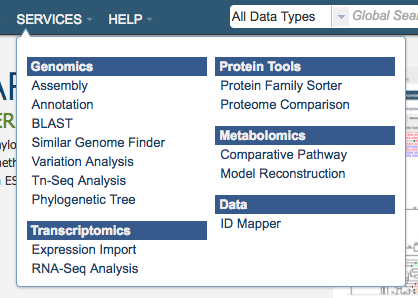
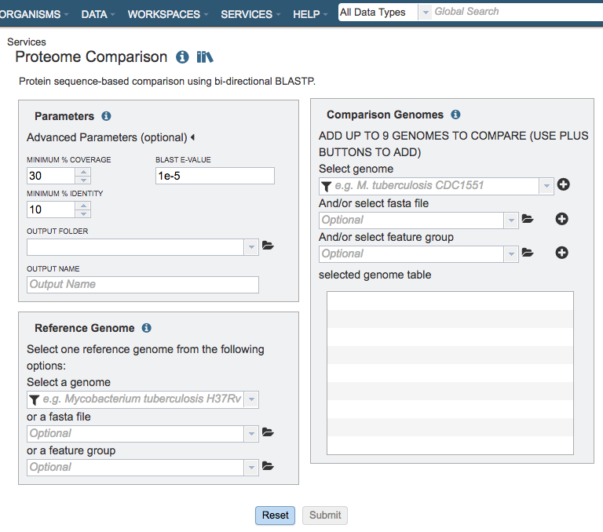

# Proteome Comparison Service

## Overview
The Proteome Comparison Service performs protein sequence-based genome comparison using bidirectional BLASTP. This service allows users to select up to eight genomes, either public or private, and compare them to a user-selected or supplied reference genome. The proteome comparison result is displayed as an interactive circular genome view and is downloadable as a print-quality image or tabular comparison results.

### See also
* [Proteome Comparison Service](https://patricbrc.org/app/SeqComparison)
* [Proteome Comparison Tutorial](https://docs.patricbrc.org//tutorial/proteome_comparison/proteome_comparison.html)

## Using the Proteome Comparison Service
The **Proteome Comparison** submenu option under the **Services** main menu (Protein Tools category) opens the Proteome Comparison input form (*shown below*). *Note: You must be logged into PATRIC to use this service.*

## Options
 

## Parameters

### Advanced parameters:

**Minimum % coverage:** Minimum percent sequence coverage of query and subject in blast. Use up or down arrows to change the value. The default value is 30%.

**BLAST E value:** Maximum BLAST E value. The default value is 1e-5.

**Minimum % Identity:** Minimum percent sequence identity of query and subject in BLAST. Use up or down arrows to change the value. The default value is 10%.

### Output Folder
The workspace folder where results will be placed.

### Output Name
Name used to uniquely identify results.

## Reference Genome Selection
Select a reference genome from the genome list or a FASTA file or a feature group. Only one reference is allowed.

### Select a genome
Type or select a genome name from the genome list.

### Or a FASTA file
Select or upload an external genome file in protein FASTA format.

### Or a feature group
Select a feature group from the workspace to show comparison of specific proteins instead of all proteins in a genome.

## Comparison Genomes Selection
Select up to total of 9 genomes from the genome list or FASTA files or a feature groups and use the plus buttons to place the genomes to the table .

### Select genome
Type or select a genome name from the genome list.

### And/or select FASTA file
Select or upload an external genome file in protein FASTA format.

### And/or select feature group
Select a feature group from the workspace.

## Buttons
**Reset:** Resets the input form to default values

**Submit:** Launches the proteome comparison job. Upon completion, the result is displayed as an interactive circular genome view and is downloadable as a print-quality image or tabular comparison results.
