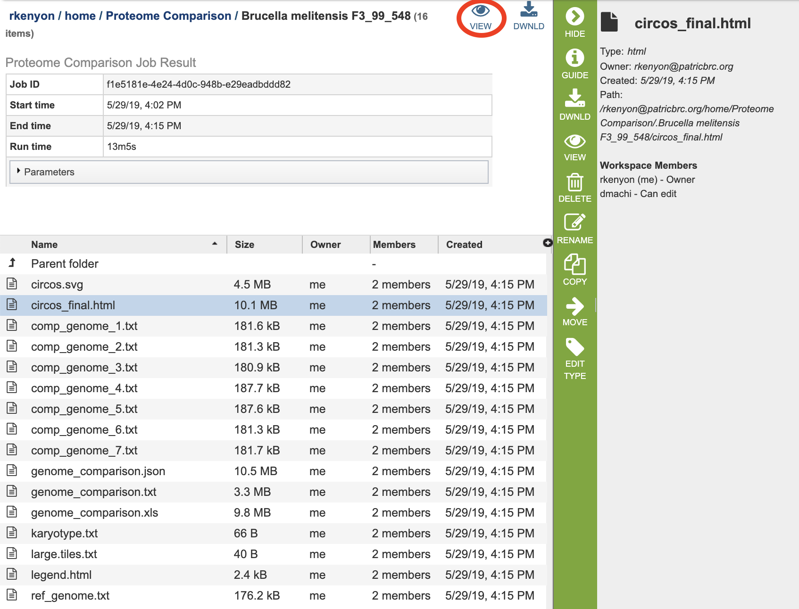

# Proteome Comparison Service

## Overview
The Proteome Comparison Service performs protein sequence-based genome comparison using bidirectional BLASTP. This service allows users to select up to eight genomes, either public or private, and compare them to a user-selected or supplied reference genome. The proteome comparison result is displayed as an interactive circular genome view and is downloadable as a print-quality image or tabular comparison results.

### See also
* [Proteome Comparison Service](https://patricbrc.org/app/SeqComparison)
* [Proteome Comparison Tutorial](https://docs.patricbrc.org//tutorial/proteome_comparison/proteome_comparison.html)

## Using the Proteome Comparison Service
The **Proteome Comparison** submenu option under the **Services** main menu (Protein Tools category) opens the Proteome Comparison input form (*shown below*). *Note: You must be logged into PATRIC to use this service.*

## Options
 

## Parameters

### Advanced parameters:

**Minimum % coverage:** Minimum percent sequence coverage of query and subject in blast. Use up or down arrows to change the value. The default value is 30%.

**BLAST E value:** Maximum BLAST E value. The default value is 1e-5.

**Minimum % Identity:** Minimum percent sequence identity of query and subject in BLAST. Use up or down arrows to change the value. The default value is 10%.

### Output Folder
The workspace folder where results will be placed.

### Output Name
Name used to uniquely identify results.

## Reference Genome Selection
Select a reference genome from the genome list or a FASTA file or a feature group. Only one reference is allowed.

### Select a genome
Type or select a genome name from the genome list.

### Or a FASTA file
Select or upload an external genome file in protein FASTA format.

### Or a feature group
Select a feature group from the workspace to show comparison of specific proteins instead of all proteins in a genome.

## Comparison Genomes Selection
Select up to total of 9 genomes from the genome list or FASTA files or a feature groups and use the plus buttons to place the genomes to the table .

### Select genome
Type or select a genome name from the genome list.

### And/or select FASTA file
Select or upload an external genome file in protein FASTA format.

### And/or select feature group
Select a feature group from the workspace.

## Buttons
**Reset:** Resets the input form to default values

**Submit:** Launches the proteome comparison job. Upon completion, the result is displayed as an interactive circular genome view and is downloadable as a print-quality image or tabular comparison results.

## Results

The Proteome Comparison Service generates several files that are deposited in the Private Workspace in the designated Output Folder. These include 

* **circos.svg** - a Scalable Vector Graphics (SVG) image showing the proteome comparison in a cicular view
* **circos_final.html** - a webpage displaying the SVG file.
* **comp_genome_X.txt** - 
* **genome_comparison.json** - 
* **genome_comparison.txt** - 
* **genome_comparison.xls** - 
* **karyotype.txt** - 
* **large.tiles.txt** - 
* **legend.txt** - 
* **ref_genome.txt** - 

* **bam** - a Binary Alignment/Map (BAM) file which is the companion format of the Sequence Alignment/Map (SAM) format. A SAM file (.sam) is a tab-delimited text file that contains sequence alignment data. The .bam format is compact in size and supports fast retrieval of alignments in specified regions. It is optimal for viewing in a genome browser. A bam file is generated for each of the read libraries that were loaded.
* **tsv** - tab-separated-value file that summarizes the locations of the variants, shows the nucleotide change, and identifies if it was a synonymous or nonsynonymous substitution, or an indel. It also identifies the gene, or intergenic region, where the variation occurred. A tsv file is generated for each of the read libraries that were loaded.
* **libs.txt** - text file that describes the libraries used in the comparison.
* **summary.txt** files. This file provides a summary of the analysis. For each library it shows the number of reads, those that mapped to the reference, the number of bases in the reference, the median base coverage, bases with zero coverage, bases with less than (or equal to) 10 reads coverage, the raw variants that are detected by the variation calling tool, and those variants that have a high quality score.
* **var.snpEFF.vcf** output file of SnpEff which rapidly categorizing the effects of variants in genome sequences. Once a genome is sequenced, SnpEff annotates variants based on their genomic locations and predicts coding effects. Annotated genomic locations include intronic, untranslated region, upstream, downstream, splice site, or intergenic regions. Coding effects such as synonymous or non-synonymous amino acid replacement, start codon gains or losses, stop codon gains or losses, or frame shifts can be predicted. A var.snpEFF.vcf file is generated for each of the read libraries that were loaded.
* **var.snp.vcf** shows the location of the SNP on the genome. A var.snp.vcf file is generated for each of the read libraries that were loaded.
* **.html** - opens a webpage that shows the same data available in the .tsv file. This column definitions are as follows: 
  * Samples - internal library read name. The corresponding user library read name can be found in libs.txt
  * Contig - contig name
  * Pos - position of the variation
  * Ref - reference nucleotide(s) at the variation position
  * Var - variant nucleotide(s) at the variation position
  * Score - quality score from the variant caller tool
  * Var_cov - variant coverage (the average read depth of the variant)
  * Var_frac - variant fraction (the fraction of the variant read depth among the all the reads that cover this region)
  * Type - variant type
  * Ref_nt - reference nucleotide(s)
  * Var_nt - variant nucleotide(s)
  * Ref_nt_pos_change - nucleotide change
  * Ref_aa_pos_change - amino acid change
  * Frameshift - frameshift variant
  * Gene_ID - PATRIC feature (peg) id
  * Locus_tag - RefSeq locus tag
  * Gene_name - gene name
  * Function - function description
  * Upstream_feature - upstream feature
  * Downstream_feature - downstream feature
  * snpEff_type - snpEFF variant type
  * snpEff_impact - snpEFF variant impact
* **var.vcf.gz.tbi** - can be uploaded into a genome browser for viewing. A var.vcf.gz.tbi file is generated for each of the read libraries that were loaded.

### Action buttons
After selecting one of the output files by clicking it, a set of options becomes available in the vertical green Action Bar on the right side of the table, listed below. To find out more about the different options for using these output files, see the [Variation Analysis Service Tutorial](https://docs.patricbrc.org//tutorial/variation_analysis_service/variation_analysis_service.html).

* **Hide/Show:** Toggles (hides) the right-hand side Details Pane.
* **Guide:** Link to the corresponding User Guide
* **Download:**  Downloads the selected item.
* **View:** Displays the content of the file, typically as plain text or rendered html, depending on filetype. Only available for html, txt, and tsv file types.
* **Delete:** Deletes the file.
* **Rename:** Allows renaming of the file.
* **Copy:** Copies the selected items to the clipboard.
* **Move:** Allows moving of the file to another folder.
* **Edit Type:** Allows changing of the type of the file in terms of how PATRIC interprets the content and uses it in other services or parts of the website.  Allowable types include unspecified, contigs, nwk, reads, differential expression input data, and differential expression input metadata.

More details are available in the [Action Buttons](../action_buttons.html) user guide.

## References
1. Li, H. (2014) Towards better understanding of artifacts in variant calling from high-coverage samples. Bioinformatics, btu356.
